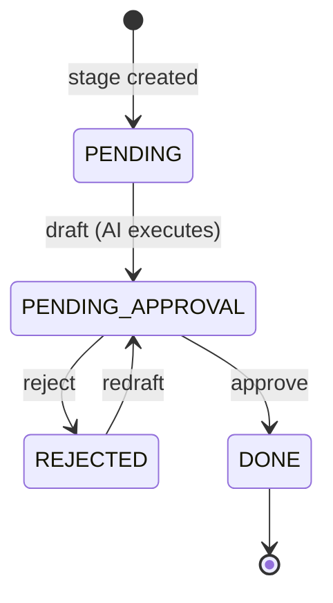
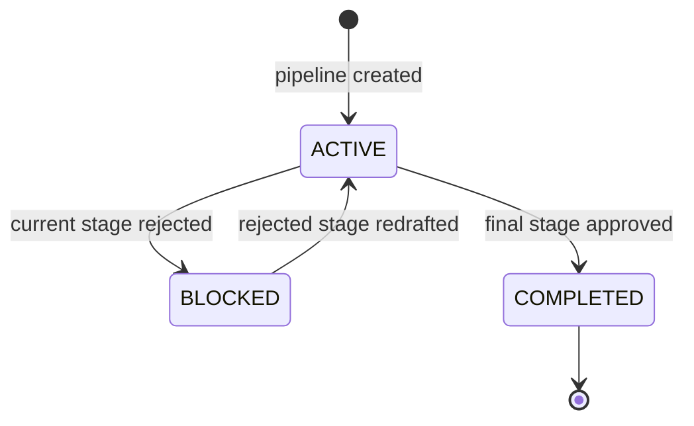
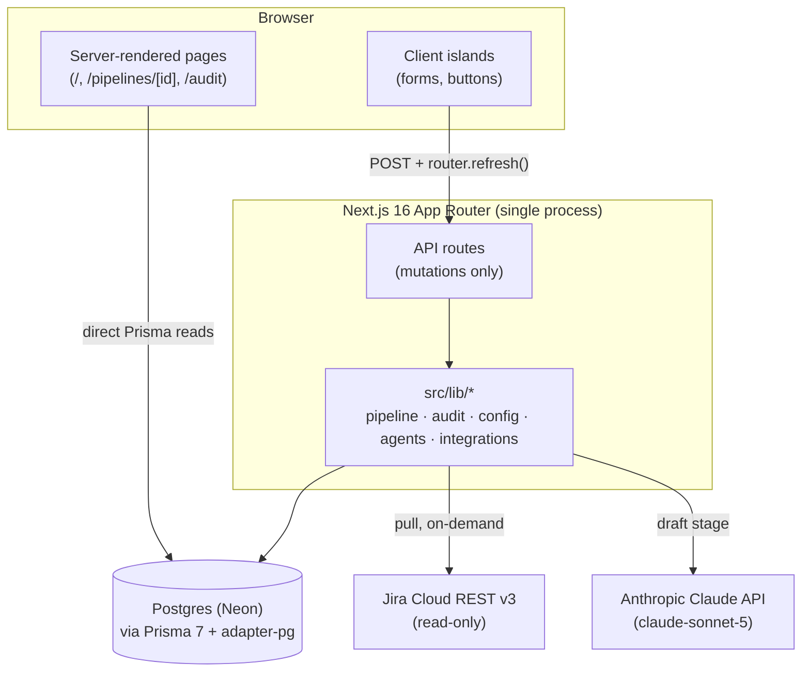

# Delivery Control Center — Product & System Specification

Reverse-engineered from the implementation as of commit `577956c` (2026-08-14).
Every claim below is traceable to a file in this repo. Status tags used
throughout:

- **Implemented** — working, verified.
- **Partial** — exists but incomplete, unused, or only half-wired.
- **Planned/implied** — the architecture clearly anticipates it (an
  interface, an enum value, a config field) but nothing calls it yet.
- **Missing** — not present at all; noted because the product's own stated
  goals imply it should exist.

---

## 1. Product vision and purpose

A transparent, gated, audited delivery-tracking system. Work items (pulled
from an external tracker, or entered by hand) are run through a fixed
five-stage documentation pipeline — **Constitution → SPEC → Plan → Tasks →
Deploy** — where each stage's content is AI-drafted and then must be
explicitly approved by a human before the next stage begins. Every draft,
approval, rejection, and cost is permanently recorded. Source: `README.md`,
`config/workflow.yaml`, `openspec/specs/*/spec.md`.

**It is not a task tracker.** It does not track "in progress / done" work in
the software-engineering sense — it tracks *documentation artifacts about* a
piece of work moving through a fixed governance process. See §30 and
"Current Product Definition" for the precise framing.

## 2. Core product concepts

| Concept | What it means here |
|---|---|
| **Project** | A container for work items from one integration (Jira, manual, or — declared but unimplemented — Azure DevOps). |
| **Work item** | One unit of work, either synced from Jira or typed in by hand. |
| **Pipeline** | The single, 1:1, always-created instance of the 5-stage process for one work item. |
| **Stage** | One of the 5 fixed steps (Constitution/SPEC/Plan/Tasks/Deploy); holds AI-drafted Markdown content and its approval state. |
| **Approval** | A human decision (approve/reject) recorded against a stage. |
| **Audit event** | An immutable, append-only record of one thing that happened, at project, pipeline, or stage scope. |

## 3. Users and roles

**Missing.** There is no `User` model, no login, no session, no role. An
"approver" is a free-text name (`Approval.approverName`, typed into
`ApprovalGate.tsx`) captured at the moment of decision — not a verified
identity. `AuditEvent.actorName` for `USER`-actor events is the same
free-text string. There is currently no way to say who is *allowed* to
approve, sync, or create anything — every API route is callable by anyone
who can reach the server (see §12, §28).

## 4. Main workflows

1. **Add a project** — `AddProjectForm.tsx` → `POST /api/projects`
   (`src/app/api/projects/route.ts`). Integration type: Manual or Jira
   (Azure DevOps is not offered in the form, though the enum exists).
2. **Sync a Jira project** — `SyncButton.tsx` → `POST
   /api/projects/[id]/sync` → pulls issues, upserts `WorkItem`s, creates a
   `Pipeline` for any new one (`src/app/api/projects/[id]/sync/route.ts`).
3. **Add a work item by hand** — `AddWorkItemForm.tsx` → `POST
   /api/work-items` → creates the `WorkItem` and its `Pipeline` in one call
   (`src/app/api/work-items/route.ts`).
4. **Draft a stage** — `DraftButton.tsx` → `POST
   /api/pipelines/[id]/advance` → runs the configured `AgentExecutor`
   against the current stage (`src/lib/pipeline.ts` → `draftStage`).
5. **Approve / reject a stage** — `ApprovalGate.tsx` → `POST
   /api/stages/[id]/approve` or `/reject`. Approving the last stage
   completes the pipeline; approving any other stage creates and advances to
   the next one; rejecting blocks the pipeline until redrafted.
6. **Review the audit trail** — `/audit` (`src/app/audit/page.tsx`), a
   global, cross-project, reverse-chronological feed capped at 200 rows.

## 5. Domain model and entities

Six Prisma models, all in `prisma/schema.prisma`:

```
Project 1───* WorkItem 1───0/1 Pipeline 1───* Stage 1───* Approval
   │                                  │            │
   └──────────* AuditEvent ───────────┴────────────┘
        (optional FK to project / pipeline / stage — see §20)
```

- `Project` — `name`, `key` (globally unique — see §25), `integrationType`,
  `integrationConfig` (JSON, nullable).
- `WorkItem` — `source`, `externalId`, `externalUrl`, `title`,
  `description`, `status` (free string — see §6). Unique on
  `(projectId, source, externalId)`.
- `Pipeline` — `currentStage`, `status`. Unique on `workItemId` (true 1:1).
- `Stage` — `type`, `status`, `content`, `aiModel`, `promptTokens`,
  `completionTokens`, `costUsd`, `startedAt`, `completedAt`. Unique on
  `(pipelineId, type)`.
- `Approval` — `decision`, `approverName`, `comment`, `decidedAt`.
- `AuditEvent` — `actor`, `actorName`, `action` (free text), `detail`
  (JSON), plus optional `projectId`/`pipelineId`/`stageId`.

All IDs are `cuid()`. All child relations cascade-delete on parent delete
except `AuditEvent.stageId`, which `SET NULL`s (so an audit trail entry
survives even if its stage is later gone — though nothing currently deletes
a stage).

## 6. Work item model

A work item is deliberately thin: title, description, a status string
copied verbatim from the source system, and identity fields for dedup on
re-sync. **Partial**: `WorkItem.status` is synced from Jira
(`issue.fields.status.name`, `src/lib/integrations/jira.ts`) and stored, but
is never read or rendered anywhere in the UI (`src/app/page.tsx`,
`src/app/pipelines/[id]/page.tsx`) — it's collected and dead.

There is no work-item type/category, no priority, no assignee, no
labels/tags, no due date, and no relationship between work items (see §15).

## 7. Application architecture

A single Next.js 16 application — no separate backend service. Server
Components read the database **directly via Prisma**, bypassing any API
layer entirely; API routes exist **only for mutations**. This means there is
no read API surface at all (§11) — a non-Next.js client (mobile app, CLI,
another service) has nothing to call to list projects, pipelines, or audit
events.

```
Browser
  │  (Server Components render on request)
  ▼
Next.js App Router  ──reads──▶  Prisma (@prisma/adapter-pg)  ──▶  Postgres (Neon)
  │
  ├─ "use client" islands (forms/buttons) ──POST──▶ API routes ──▶ src/lib/*
  │                                                                    │
  │                                                          pipeline.ts / audit.ts /
  │                                                          config.ts / agents/* / integrations/*
  └─ (mutation succeeds) → router.refresh() re-renders Server Components with fresh data
```

No client-side cache/store (no SWR/React Query/Redux) — `router.refresh()`
after every mutation is the entire state-sync strategy.

## 8. Frontend architecture

3 routes, all under `src/app/`:

| Route | File | Purpose |
|---|---|---|
| `/` | `page.tsx` | Project list, add-project form, per-project work-item list + add-work-item form, Jira sync button |
| `/pipelines/[id]` | `pipelines/[id]/page.tsx` | All 5 stages for one pipeline, content, cost, approvals, draft/approve/reject actions |
| `/audit` | `audit/page.tsx` | Global audit feed, newest first, `take: 200` |

Components (`src/components/`): `AddProjectForm`, `AddWorkItemForm`,
`ApprovalGate`, `DraftButton`, `SyncButton` (all `"use client"`, each doing
its own `fetch` + `router.refresh()`), and `StageBadge` (pure, no
directive — a lookup table of status → Tailwind classes, shared across both
`StageStatus` and `PipelineStatus` string values).

`layout.tsx`: two-link header nav (Projects, Audit Trail), Geist fonts, no
other chrome.

## 9. Backend architecture

The entire backend is 6 route files under `src/app/api/`, all mutation-only
(no `GET` on any of them except `/api/projects`), plus the domain logic they
call into:

| Route | Method | Calls |
|---|---|---|
| `/api/projects` | GET, POST | direct Prisma |
| `/api/projects/[id]/sync` | POST | `getIntegrationAdapter`, `createPipeline`, `recordAuditEvent` |
| `/api/work-items` | POST | `createPipeline` |
| `/api/pipelines/[id]/advance` | POST | `draftStage` |
| `/api/stages/[id]/approve` | POST | `approveStage` |
| `/api/stages/[id]/reject` | POST | `rejectStage` |

No `PATCH`/`PUT`/`DELETE` exists anywhere — nothing created can be edited or
deleted once created, at the API level. No pagination, no request-validation
library (manual `as` casts + null checks), no rate limiting.

Core logic lives in `src/lib/`:
- `pipeline.ts` — the stage/pipeline state machine (§26).
- `audit.ts` — `recordAuditEvent()`, the single write path for `AuditEvent`.
- `config.ts` — loads `config/workflow.yaml` and `config/prompts/*.md`.
- `agents/` — `AgentExecutor` interface + `mockExecutor.ts` +
  `claudeExecutor.ts` + `index.ts` selector.
- `integrations/` — `IntegrationAdapter` interface + `manual.ts` +
  `jira.ts` + `index.ts` selector.

## 10. Database / data model

Postgres (Neon, free tier), Prisma 7 via `@prisma/adapter-pg` — no `url` in
`schema.prisma`'s `datasource`; the connection string is passed to
`PrismaPg` in `src/lib/db.ts` (Prisma 7 requires a driver adapter now, not a
schema-level URL). One migration exists: `20260814065231_init`. One seed
script (`prisma/seed.ts`) creates a demo project/work-item/pipeline,
idempotently (checks before creating).

No soft-delete, no versioning/history on any row besides `Stage`/`Approval`
naturally accumulating rows across redrafts, no row-level tenancy column
(see §21, §30).

## 11. APIs and integrations

| System | Status | Detail |
|---|---|---|
| Jira Cloud | **Implemented**, read-only | `src/lib/integrations/jira.ts`. REST API v3 `/rest/api/3/search`, Basic Auth (`email:apiToken`). Converts Atlassian Document Format descriptions to plain text. Pull-only — no write-back to Jira (no comments, no status transitions). Config resolves from `Project.integrationConfig` first, else `JIRA_*` env vars — but no UI field ever sets `integrationConfig`, so in practice only one global Jira account is reachable. |
| Azure DevOps | **Missing** (declared only) | Enum value `AZURE_DEVOPS` exists; `getIntegrationAdapter()` maps it to the manual adapter. No form option offers it. |
| Anthropic Claude | **Implemented** | `src/lib/agents/claudeExecutor.ts`. `claude-sonnet-5` (overridable via `AI_MODEL`), single-turn, non-streaming, fixed system prompt, `max_tokens: 2048`, no tools/thinking config. Cost computed from real `usage.input_tokens`/`output_tokens` × fixed per-token constants (list price approximation, not exact billing). No retry/backoff — a failure throws and the pipeline is left untouched (verified live). |
| Inbound webhooks | **Missing** | Sync is pull-only, triggered by a button click. Nothing pushes into this app. |
| Outbound notifications | **Missing** | No email/Slack/webhook on any event. |
| Public read API | **Missing** | See §7 — reads only happen inside Server Components. |

## 12. Authentication and authorization

**Missing**, entirely. No login, no session, no API key, no per-route
guard. Every route in §9 is callable by anyone who can reach the server.
`.env` (gitignored) holds one shared `DATABASE_URL`, one shared
`ANTHROPIC_API_KEY`, one shared Jira credential set — there is no
per-client/per-project credential isolation (directly relevant to the
multi-client gap flagged separately).

## 13. AI / agent capabilities

`AgentExecutor` interface (`src/lib/agents/types.ts`):
`executeStage(stageType, context) → {content, aiModel, promptTokens,
completionTokens, costUsd}`.

- `mockExecutor.ts` — fills the *output-template* half of the stage's
  prompt file (`config/prompts/*.md`, below the `<!-- OUTPUT TEMPLATE -->`
  marker) via string substitution. No model call. Token/cost figures are
  estimated from character counts.
- `claudeExecutor.ts` — sends the *instructions* half of the same file,
  filled with work-item context and the previous stage's content, to Claude.
  Real usage-based cost.
- `index.ts` — `getAgentExecutor()` picks Claude iff `ANTHROPIC_API_KEY` is
  set, else mock. **Global switch, not configurable per project/client/stage.**

No agentic tool use, no multi-turn refinement/chat, no memory beyond the
immediately preceding stage's content, no user-editable prompt before
sending, no way to regenerate with feedback other than reject → redraft
(which re-runs the *same* fixed prompt).

## 14. SDD / specification workflow

**Two unrelated SDD-like layers exist — do not conflate them:**

1. **Product feature**: the Constitution→SPEC→Plan→Tasks→Deploy pipeline
   described throughout this doc. This is what *end users* of the deployed
   product interact with.
2. **Dev-process tooling**: OpenSpec (`openspec/`, `.claude/commands/opsx/`,
   `.claude/skills/openspec-*`), used to manage development of *this
   codebase itself* — propose → apply → archive, with `openspec/specs/*`
   as the source of truth for this repo's own capabilities. An end user of
   the deployed product never sees this; it's a contributor/agent workflow,
   documented in `CLAUDE.md`.

## 15. Dependencies and blockers

**Missing.** There is no dependency graph between work items or pipelines —
no "blocked by item X" relationship exists in the schema. The only
"blocked" concept is `PipelineStatus.BLOCKED`, which is self-referential: a
pipeline blocks itself when its own current stage is rejected, and unblocks
when that same stage is redrafted. Nothing models cross-item or
cross-project dependencies.

## 16. Decisions and approval gates

Every stage requires exactly one recorded decision (`Approval`) before the
pipeline can advance — enforced unconditionally in `pipeline.ts`, **not**
conditionally on the `requiresApproval` flag in `config/workflow.yaml`
(which is declared per-stage but never read by any code — see §25). Decision
records are never deleted, including rejected ones — history accumulates
across redrafts. No multi-approver/quorum concept (single `approverName`
field per decision), no approval delegation, no roles gating who may decide.

## 17. Git / code / PR workflow

**Not a product feature — missing at the product level.** The deployed
product has zero awareness of source code, repositories, commits, or pull
requests; the `DEPLOY` stage is an AI/mock-generated Markdown summary, not
tied to any actual deployment or codebase. ("Git / code / PR workflow" *does*
exist for developing this repo itself — see `CLAUDE.md`'s "Git workflow"
section — but that governs us building the tool, not something the tool
does for its users.)

## 18. Testing and deployment

**Missing**, both. No test framework installed, no `*.test.ts` files, no
CI configuration. No deployment configuration (no Vercel/Docker/hosting
config) — the app only runs via `npm run dev` / `next build` + `next
start`. "Verification" (see `CLAUDE.md`, `.claude/commands/verify.md`) is a
manual development discipline (build + lint + live check), not an automated
product capability.

## 19. Evidence and completion rules

The only "evidence" a stage carries is its AI-drafted Markdown content plus
one `Approval` record (decision, approver name, optional comment,
timestamp). No file attachments, no linked test results, no CI status, no
external evidence (screenshots, logs) can be attached to a stage or work
item. "Done" means the `DEPLOY` stage reached `DONE` and `Pipeline.status`
became `COMPLETED` — this is a documentation-pipeline completion, not
verified against any real-world deployment.

## 20. Audit and provenance

`AuditEvent` (`src/lib/audit.ts`) is append-only — no update or delete route
exists for it anywhere. Every write goes through the single
`recordAuditEvent()` function, called inside the **same transaction** as the
state change it describes, so the two can never drift. Fields: `actor`
(`SYSTEM`/`AI`/`USER`), `actorName`, `action` (human-readable string),
`detail` (JSON), and optional links to `projectId`/`pipelineId`/`stageId`
(nullable because some events — like a project-level sync — happen above
pipeline scope). Displayed at `/audit`, **hard-capped at the 200 most recent
rows** (`take: 200` in `src/app/audit/page.tsx`) with no pagination — older
events still exist in the database but become unreachable from the UI.

## 21. Configuration and inheritance

Global only. `config/workflow.yaml` and `config/prompts/*.md` apply
identically to every project — there is no per-project or per-client
override or inheritance, despite `Project.integrationConfig` existing (and
that field only covers integration credentials, not workflow/prompt
config). No config versioning: editing `workflow.yaml` is an immediate,
unversioned, global change — because stage order is resolved dynamically at
each transition (`getNextStageType()` in `src/lib/config.ts`) rather than
snapshotted onto the pipeline at creation, **editing the file mid-flight
changes the next-stage resolution for pipelines already in progress.**

## 22. Notifications and attention mechanisms

**Missing.** No email, no in-app notification center, no "N items need your
approval" indicator anywhere — not even on the home page. The only way to
discover a pending gate is to open that specific pipeline and see the amber
`PENDING_APPROVAL` badge. For a product whose core value proposition is
gated approval, there is currently no push or pull mechanism to surface
*which* gates are waiting.

## 23. UI architecture and navigation

3 routes (§8), 2 nav links, no breadcrumbs, no search, no filters anywhere
(can't filter the audit trail by project/actor/date, can't filter the
project or work-item lists), no pagination anywhere in the UI. No
client-level navigation (there is no "client" concept yet — see the
multi-client architecture review from earlier in this session).

## 24. Design system and UX principles

Tailwind v4 utility classes directly in components — no component library,
no design-tokens file beyond Tailwind defaults + Geist fonts. Dark mode is
automatic via `prefers-color-scheme` (`globals.css`), no manual toggle.
`StageBadge.tsx` is the only shared visual primitive. No loading skeletons
(disabled-button "…ing" text is the only loading state), no toast system
(errors render as inline red text near the triggering control).

## 25. Important business rules

- A stage drafts only from `PENDING` or `REJECTED`.
- A stage approves/rejects only from `PENDING_APPROVAL`.
- Approving the final configured stage completes the pipeline; approving
  any other stage creates and advances to the next one.
- Rejecting sets the pipeline `BLOCKED`; redrafting the rejected stage
  returns it to `ACTIVE`.
- A work item has at most one pipeline, ever (`Pipeline.workItemId` unique).
- Work-item identity for sync/upsert is `(projectId, source, externalId)`.
- `Project.key` is **globally** unique, not scoped per client.
- The AI executor choice is one global env-gated switch, not a per-project
  setting.
- **`requiresApproval` in `config/workflow.yaml` is declared but has zero
  effect** — every stage requires approval regardless of its value. This is
  a real inconsistency between config and code, not a documented feature.

## 26. State machines and lifecycle transitions



`StageStatus` also declares `AI_DRAFTING` and `APPROVED` — **neither is ever
assigned by any code path.** Drafting happens synchronously within one
request (no persisted "in progress" state); `DONE` is used directly after
approval instead of a separate `APPROVED` status. Both are dead enum values.



## 27. External systems and connectors

Jira Cloud (read-only), Anthropic Claude API, Postgres/Neon. That's the
complete list. No GitHub/GitLab, no CI system, no email/Slack, no
billing/invoicing system — despite cost being tracked per stage, it is
never exported, summed per client, or connected to any billing process.

## 28. Security boundaries

None at the application layer (§12) — no auth means no boundary between
"can view" and "can mutate," and none between different projects/clients
either (§ multi-client review). Secrets (`DATABASE_URL`, `JIRA_*`,
`ANTHROPIC_API_KEY`) live in one shared `.env`, gitignored, with no
per-client isolation. No CSRF protection (moot without session auth to
attack), no explicit CORS policy beyond Next.js's same-origin default for
its own pages.

## 29. Observability

**Missing.** No structured logging, no error tracking (e.g. Sentry), no
metrics, no request tracing, no health-check endpoint. `AuditEvent` is
business-level provenance, not infrastructure observability — it doesn't
capture request latency, error rates, or system health.

## 30. Current limitations and technical debt

- Dead `StageStatus` values (`AI_DRAFTING`, `APPROVED`) — never assigned.
- `requiresApproval` config flag has no effect on behavior.
- `WorkItem.status` is synced and stored but never displayed.
- No pagination anywhere; `/audit` silently truncates at 200 rows.
- No tests, no CI.
- Global, single-tenant config and credentials despite multi-project
  support already existing at the data-model level.
- No read API — reads are Server-Component-only, blocking any non-Next.js
  client.
- No retry/backoff on external API calls (Jira, Claude).
- No config snapshotting — editing `workflow.yaml` retroactively affects
  pipelines already mid-flight.
- No `.gitattributes` — every commit on this Windows machine warns about
  LF→CRLF normalization (cosmetic, not functional).

---

## High-level system architecture



## Domain model

See §5's diagram. Six models, one strict hierarchy
(`Project → WorkItem → Pipeline → Stage → Approval`), plus `AuditEvent`
hanging off `Project`/`Pipeline`/`Stage` independently. No `User`, no
`Client`.

## Main entity relationships

| From | To | Cardinality | Notes |
|---|---|---|---|
| Project | WorkItem | 1—* | cascade delete |
| WorkItem | Pipeline | 1—0/1 | true 1:1, cascade delete |
| Pipeline | Stage | 1—* | cascade delete, unique per `(pipeline, type)` |
| Stage | Approval | 1—* | cascade delete, history accumulates |
| Project / Pipeline / Stage | AuditEvent | 1—* (optional) | Project/Pipeline cascade; Stage sets null |

## Major user journeys

1. Stand up a project → sync or hand-enter work → walk every item through
   5 AI-drafted, human-gated stages → completed.
2. Redraft loop: reject a stage → pipeline blocks → redraft → gate again.
3. Audit review: open `/audit` to see the full cross-project history of
   every draft, decision, and sync, newest first (capped at 200).

## Main state transitions

Covered in §26 (Stage and Pipeline diagrams).

## Most important business rules

Covered in §25.

## Current capabilities (implemented, verified)

- Config-driven, 5-stage documentation pipeline with human approval gates.
- Real AI drafting via Claude (with a working mock fallback) behind a
  stable interface.
- Jira read-only sync with upsert-safe re-sync.
- Manual work-item entry.
- Full, transactionally-consistent, append-only audit trail.
- Real per-draft token/cost tracking (approximate pricing).
- Reject → redraft → approve loop.

## Missing capabilities

- Multi-client/tenant model, and everything that depends on it: data
  isolation, per-client config/credentials/prompts, per-client cost rollup.
- Authentication, authorization, and any real user identity.
- Notifications / attention mechanism for pending approvals.
- Dependency/blocker relationships between work items.
- Azure DevOps integration (declared, not built).
- Read/query API (public API surface beyond the mutation routes).
- Tests, CI, deployment configuration.
- Any editing or deletion of existing records.
- Pagination anywhere.

## Inconsistencies between UI, backend, and domain model

- `requiresApproval` (config) vs. actual behavior (code ignores it — §25).
- `StageStatus.AI_DRAFTING` / `APPROVED` (schema) vs. never reached (code).
- `WorkItem.status` (synced, stored) vs. never rendered (UI).
- `Project.integrationConfig` (schema supports per-project Jira creds) vs.
  no UI field to set it (only the global env-config account is reachable).
- Azure DevOps as a first-class `IntegrationType` (schema/enum) vs. silently
  aliased to the manual adapter (behavior) vs. not offered at all (UI).

## Technical risks

- **No auth** is the highest-severity risk if this is ever exposed beyond a
  trusted network — full read/write access to everything, including
  spending the shared Anthropic budget, with no accountability.
- **Global config + global credentials** will not survive real multi-client
  use without a retrofit — the longer this waits, the more call sites need
  to change (every `db.<model>.findMany()` currently has no tenant filter).
- **Unsnapshotted workflow config** (§21) means a config edit can silently
  change the behavior of pipelines that are already mid-flight.
- **No tests** means every change is verified manually — regressions are
  possible and would only surface at live-check time, not before.
- **200-row audit cap with no pagination** means the audit trail — the
  product's core transparency promise — silently loses visibility on
  established projects.

## Prioritized roadmap

1. `Client` entity + tenant scoping across every model, query, and
   uniqueness constraint (from the multi-client architecture review).
2. Minimal real authentication/authorization tied to clients.
3. Fix the identified inconsistencies (§ above) — cheap, high-clarity wins.
4. Per-client/per-project workflow and prompt config, exposed in the UI
   (currently schema-ready for integration creds, nothing else).
5. Notifications/attention surface for pending approvals.
6. Read API + pagination, once there's a second consumer or a real need.
7. Tests and CI, sized to whatever ships next rather than retrofitted in
   bulk.

---

## Current Product Definition

**Delivery Control Center, as it exists today, is a single-tenant,
config-driven governance tool that runs individual work items — pulled from
Jira or entered by hand — through a fixed, five-stage, AI-drafted,
human-approved documentation pipeline (Constitution → SPEC → Plan → Tasks →
Deploy), recording every draft, decision, and cost in an immutable audit
trail.** It is not a task tracker, not a code/deployment system, and not yet
multi-client: it currently assumes one organization, one set of
credentials, one workflow definition, and no authenticated users. Its
strongest, most fully-realized property is provenance — the audit trail is
real, transactionally consistent, and cannot drift from the state it
describes. Its weakest property is access control — there is none. The
product's own architecture (swappable `AgentExecutor` and
`IntegrationAdapter` interfaces, config-driven pipeline shape) is well
positioned to grow into a real multi-client platform, but that growth has
not happened yet at the data or auth layer.
