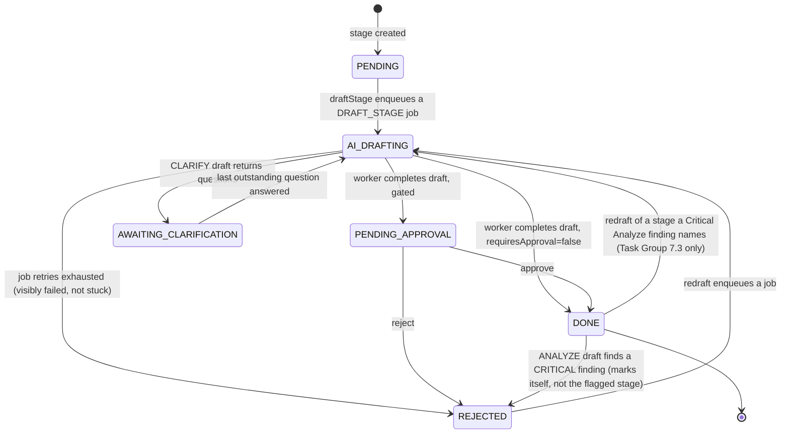
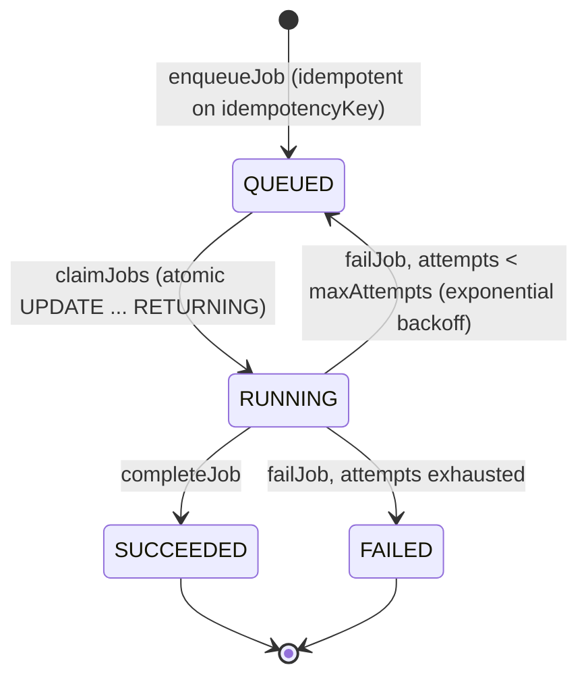
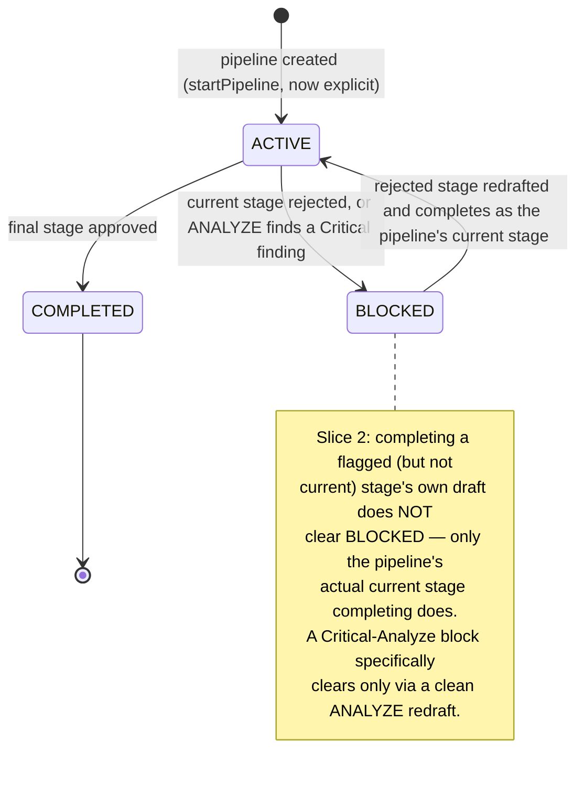
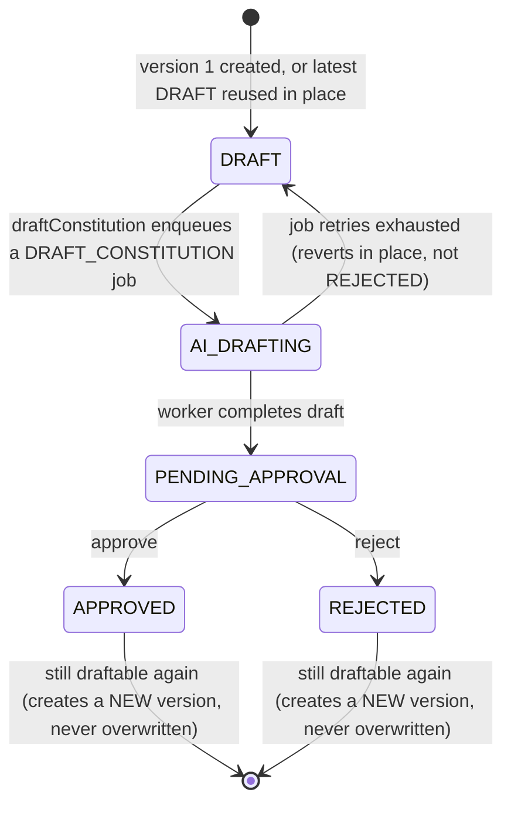
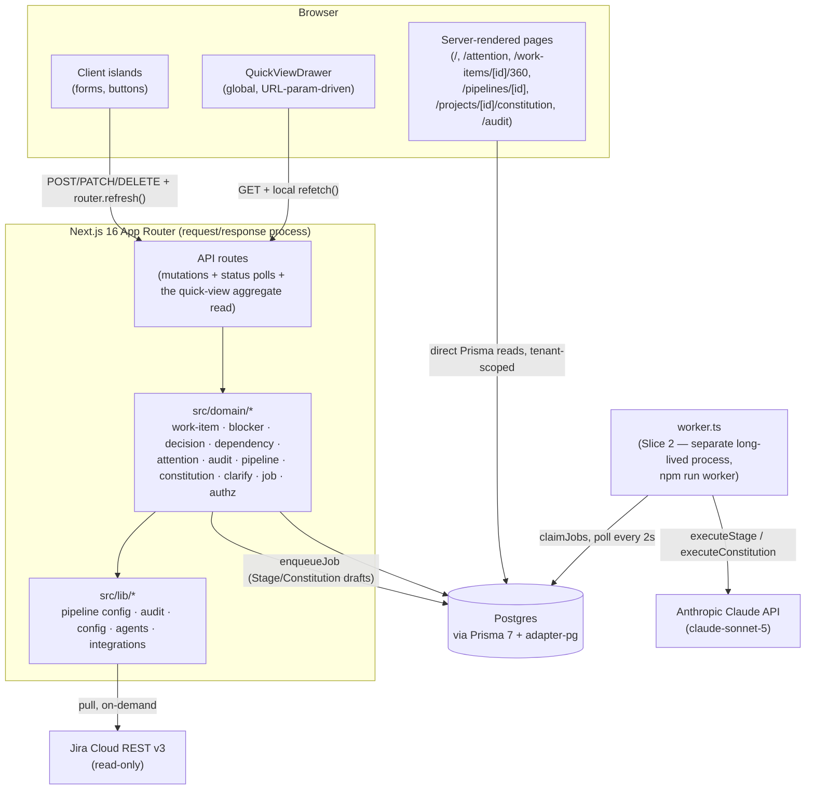

# Delivery Control Center — Product & System Specification

Reverse-engineered from the implementation as of 2026-08-15 (end of Slice 6).
Every claim below is traceable to a file in this repo.
Status tags used throughout:

- **Implemented** — working, verified.
- **Partial** — exists but incomplete, unused, or only half-wired.
- **Planned/implied** — the architecture clearly anticipates it (an
  interface, an enum value, a config field) but nothing calls it yet.
- **Missing** — not present at all; noted because the product's own stated
  goals imply it should exist.

This revision folds in **seven** shipped slices: **Slice 0** (tenancy,
identity, auth — archived at
`openspec/changes/archive/2026-08-14-slice-0-tenancy-and-identity/`),
**Slice 1** (the delivery model and the Attention Center — archived at
`openspec/changes/archive/2026-08-14-slice-1-delivery-model/`), **Slice 2**
(SDD as a subsystem — Constitution versioning, Clarify/Analyze stages,
versioned stage artifacts, a durable job-backed run state machine, role-based
gate policy, redraft feedback — archived at
`openspec/changes/archive/2026-08-15-slice-2-sdd-subsystem/`), **Slice 3**
(Agents as real execution resources — agent registry with per-project routing,
`AgentRun` recording per draft, per-stage cost rollups, budget enforcement with
an audited override flow, and permissioned run-detail visibility — archived at
`openspec/changes/archive/2026-08-15-slice-3-agents-as-execution-resources/`),
**Slice 4** (Connector framework — `Connector`/`SyncRun` entities run
through the `Job` runtime, field-level provenance, manual-wins sync conflict
resolution, real Azure DevOps/GitHub adapters, idempotent webhook intake —
archived at
`openspec/changes/archive/2026-08-15-slice-4-connector-framework/`), and
**Slice 5** (Engineering evidence — `Repository`/`Commit`/`PullRequest`/
`TestRun`/`Build`/`Deployment`/`Evidence`/`CompletionException` entities
populated by GitHub webhook events and the GitHub adapter's catch-up fetch,
manual (never inferred) work-item-to-pull-request linking, and
evidence-driven completion — the `APPROVED` → `COMPLETED` transition now
refuses without a qualifying merged/passing-tests pull request or an
approved exception — archived at
`openspec/changes/archive/2026-08-15-slice-5-engineering-evidence/`), and
**Slice 6** (Configuration Center — hierarchical AI-budget configuration
across Organization → Client → Project scopes, with effective-value
resolution and its source, an impact preview naming affected
clients/projects shown before any cascading change is saved, explicit
reset-to-inherited, and a durable, append-only `ConfigChange` version
history distinct from the general audit trail — archived at
`openspec/changes/archive/2026-08-15-slice-6-configuration-center/`).
The previous revision of this file predated Slice 2 and described a fixed
five-stage pipeline with uniform approval gating and an automatically-created,
per-work-item Constitution stage — none of that is still true.

---

## 1. Product vision and purpose

A transparent, gated, audited, multi-client delivery-tracking system. Work
items — pulled from an external tracker or entered by hand — carry a rich
delivery model (type, status, risk, priority, owner, executor, due date,
progress, hierarchy) and are run through a configurable, seven-stage
documentation pipeline — **SPEC → Clarify → Plan → Tasks → Analyze →
Implement → Deploy** *(Slice 2 — was a fixed `Constitution → SPEC → Plan →
Tasks → Deploy`; Constitution is now a project-scoped versioned artifact
approved once per project, not a per-work-item stage)* — where each stage's
content is AI-drafted (now job-backed, surviving a process restart) and
then must be explicitly approved, by a role-appropriate human, before the
next stage begins. `Clarify` can pause the run and ask a human instead of
guessing; `Analyze` can block advancement on a severity-rated consistency
finding until the flagged stage is redrafted. Around that pipeline, Slice 1
added the "attention" layer the product's vision names as its core
question set: what is happening, why, does anyone need to act, what
happens next. Every draft (and now every *version* of every draft),
approval, rejection, blocker, decision, dependency change, and cost is
permanently recorded. Source: `README.md`, `config/workflow.yaml`,
`openspec/specs/*/spec.md`, `docs/ROADMAP.md`.

The pipeline tracks documentation artifacts moving through a governance
process, not code/test/deploy state on its own — but as of Slice 5, a work
item's completion is no longer a human's unverified claim either: the
`APPROVED` → `COMPLETED` transition requires real engineering evidence (a
merged pull request with passing tests) or an explicitly approved
exception. The delivery model (work-item status lifecycle, risk, blockers,
decisions, dependencies) tracks real delivery state independent of the
pipeline, and that state is now itself evidence-backed for its most
consequential transition.

## 2. Core product concepts

| Concept | What it means here |
|---|---|
| **Organization** | The top of the tenancy tree. One per deployment in practice today. |
| **Client** | A tenant boundary under an Organization — projects, memberships, and (per Slice 1) attention/audit scoping all key off this. |
| **User** | A real, authenticated identity (`User` model, NextAuth Credentials + JWT). Either an org admin (sees everything) or a `ClientMembership` holder with a `Role` on one or more clients. |
| **Project** | A container for work items from one integration (Jira, manual, or — declared but unimplemented — Azure DevOps), scoped to one `Client`. |
| **Work item** | One unit of delivery work — synced from Jira or typed in by hand — with type, status, risk, priority, owner, executor, due date, progress, and optional parent/children (Slice 1). |
| **Pipeline** | The single, 1:1 instance of the configured documentation process for one work item — now *explicitly started* (Slice 2's "Start SDD," requires an approved project Constitution), not auto-created; its `stageSequence` is snapshotted at start, immune to later `workflow.yaml` edits. |
| **Stage** | One step of the pipeline's snapshotted sequence (default: SPEC/Clarify/Plan/Tasks/Analyze/Implement/Deploy); holds AI-drafted Markdown content, an append-only version history (Slice 2), and its approval state. |
| **Constitution** (Slice 2) | A project-scoped, versioned artifact (governing principles/constraints) drafted and approved once per project — not per work item — and referenced by every pipeline started under it. |
| **Approval** | A human decision (approve/reject) recorded against a *stage* — the pipeline's own gate, distinct from the work-item-level `Decision` below. |
| **Blocker** (Slice 1) | A first-class record of why a work item can't proceed: reason, owner, required action, optional impact. Creating one forces the work item to `BLOCKED`; resolving it (when no other active blocker remains) restores it to `OPEN`. |
| **Decision** (Slice 1) | A first-class record of a question needing a human answer: question, reason, impact, optional AI recommendation/confidence/deadline. Creating one forces the work item to `DECISION_REQUIRED`; approving restores it to `OPEN`, rejecting leaves it `DECISION_REQUIRED`. |
| **Dependency** (Slice 1) | A directed edge between two work items (`workItemId` depends on `dependsOnWorkItemId`) with a reason. Cycle detection on add; same-project only. |
| **Audit event** | An immutable, append-only record of one thing that happened, at project, pipeline, stage, *or work-item* (Slice 1 added `workItemId`) scope. |

## 3. Users and roles

**Implemented** (Slice 0). `User` (`email`, `passwordHash`, `isOrgAdmin`),
`ClientMembership` (`userId` + `clientId` + `Role`), and NextAuth
Credentials-provider + JWT-session auth (`src/auth.ts`, `src/auth.config.ts`).
`Role` enum: `MANAGER`, `PROJECT_MANAGER`, `TECH_LEAD`, `EXECUTOR`,
`SECURITY_REVIEWER`, `VIEWER`. Every domain command calls
`requireClientRole(ctx, clientId, allowedRoles)`
(`src/domain/shared/authz.ts`); `WRITE_ROLES` is every role except `VIEWER`
(read-only by design — per-stage-type role gating, e.g. "SPEC needs a PM,"
is explicitly deferred, per `docs/ROADMAP.md`'s resolved-conflicts list, to
Slice 2). An org admin (`User.isOrgAdmin`) bypasses membership checks
entirely and sees every client. `AuditEvent.userId` now links to the real
`User` row for `USER`-actor events (`actorName` remains an immutable
display-name snapshot, also used for the nameless `SYSTEM`/`AI` actors).

`Approval.approverId` links to the real `User` row (Slice 0); `approverName`
is kept alongside it as an immutable display-name snapshot, the same
pattern as `AuditEvent`. A pipeline-gate decision is tied to a verified
identity, not free text — an earlier revision of this document claimed
otherwise; corrected here after checking `src/domain/pipeline/commands.ts`
directly.

## 4. Main workflows

1. **Log in** — `/login` (`src/app/login/page.tsx`), NextAuth Credentials.
2. **Add a project** — `AddProjectForm.tsx` → `POST /api/projects`.
   Integration type: Manual or Jira (Azure DevOps not offered in the form,
   though the enum exists).
3. **Draft / approve a project Constitution** *(Slice 2, new — do this
   before starting any pipeline under the project)* —
   `/projects/[id]/constitution` → `ConstitutionDraftButton` → `POST
   /api/projects/[id]/constitution/draft` (job-backed) →
   `ConstitutionApprovalGate` → `POST /api/constitutions/[id]/approve` or
   `/reject`. A redraft after `APPROVED`/`REJECTED` creates a new version,
   never overwriting the old one.
4. **Sync a Jira project** — `SyncButton.tsx` → `POST
   /api/projects/[id]/sync` → pulls issues, upserts `WorkItem`s (status
   mapped onto the 9-state `WorkStatus` — see §6). No longer creates a
   `Pipeline` — see step 6.
5. **Add a work item by hand** — `AddWorkItemForm.tsx` (quick form: title +
   description) or the fuller `POST /api/work-items` body (type, risk,
   priority, owner, executor, due date, parent) → creates the `WorkItem`
   only. No `Pipeline` yet — see step 6. *(Slice 2 — was one call before.)*
6. **Start a pipeline** *(Slice 2, new — "Start SDD" button, wherever a
   work item with no pipeline is listed)* — `StartPipelineButton.tsx` →
   `POST /api/work-items/[id]/pipeline` → requires the project to have an
   `APPROVED` Constitution (refused with a clear error otherwise);
   snapshots the current `stageSequence` and `constitutionVersion` onto the
   new `Pipeline`.
7. **Edit a work item** — 360° Record's Overview tab → `EditWorkItemForm` →
   `PATCH /api/work-items/[id]` (title, description, risk, priority, owner,
   executor, due date, progress — **not** status, see §6).
8. **Change a work item's status** — `PATCH /api/work-items/[id]/status`,
   validated against the state machine (`src/domain/work-item/status.ts`).
9. **Draft a pipeline stage** — `DraftButton.tsx` → `POST
   /api/stages/[id]/draft` *(Slice 2 — replaces `POST
   /api/pipelines/[id]/advance`; targets the stage directly, not just
   "whatever the pipeline's current stage is," since a flagged stage can be
   redrafted even when it isn't current)* → enqueues a `DRAFT_STAGE` job,
   returns immediately; the button polls `GET /api/stages/[id]` until the
   worker (`worker.ts`) finishes.
10. **Answer a Clarify question** *(Slice 2, new)* — `ClarifyPanel.tsx` →
    `POST /api/clarify-questions/[id]/answer` → once every outstanding
    question on the stage is answered, drafting resumes automatically.
11. **Approve / reject a stage** — `ApprovalGate.tsx` → `POST
    /api/stages/[id]/approve` or `/reject`. Gated by the stage type's own
    `approverRoles`, not a uniform check *(Slice 2)*.
12. **Redraft a stage a Critical Analyze finding names** *(Slice 2, new)* —
    same `DraftButton`/`POST /api/stages/[id]/draft`, but on a stage the
    "Flagged by Analyze" notice names — allowed even though that stage is
    already `DONE` and not the pipeline's current stage.
13. **Create / resolve a blocker** — `CreateBlockerForm`/`ResolveBlockerButton`
    → `POST /api/blockers`, `POST /api/blockers/[id]/resolve`. Side effect on
    the work item's status (see §15).
14. **Create / approve / reject a decision** — `CreateDecisionForm`/
    `DecisionActions` → `POST /api/decisions`,
    `POST /api/decisions/[id]/approve`, `POST /api/decisions/[id]/reject`.
15. **Add / remove a dependency** — `AddDependencyForm`/
    `RemoveDependencyButton` → `POST /api/dependencies`,
    `DELETE /api/dependencies/[id]`. Cycle-checked (§15).
16. **Review the Attention Center** — `/attention`: every decision pending,
    blocker active, high/critical risk, upcoming deadline, review-gate
    item, and paused Clarify stage *(Slice 2)* across the user's accessible
    clients, each with its reason and (if authorized) an action button.
17. **Quick View** — click "Quick View" anywhere a work item is listed
    (Attention Center rows, Dashboard project rows) to open a global side
    drawer (`?quickView=<id>`) with the same blocker/decision/detail/
    dependencies/timeline data as the full record, without navigating away.
14. **360° Delivery Record** — `/work-items/[id]/360`: tabbed Overview /
    Dependencies (incl. a directed graph visualization) / Timeline / Code &
    Changes (linked PRs, commits, CI status) / Tests (test runs) / Evidence
    (completion-policy state and, for a write-capable role, the
    exception-approval action) *(Code/Tests/Evidence implemented in Slice
    5 — were "Coming soon" stubs before)*, plus an honest "Coming soon"
    stub for Configuration.
15. **Review the audit trail** — `/audit`: filterable (project, actor,
    action category, date range), paginated (20/50/100 rows), no longer
    truncated at 200 rows.

## 5. Domain model and entities

Twenty-two Prisma models, all in `prisma/schema.prisma` (six new in Slice 2:
`Job`, `Constitution`, `StageVersion`, `ClarifyQuestion`, `AnalysisFinding`,
plus NextAuth's unwired adapter tables already counted separately below):

```
Organization 1───* Client 1───* Project 1───* WorkItem 1───0/1 Pipeline 1───* Stage 1───* Approval
                       │              │  │          │                          │
                       │              │  │          ├──* Blocker               ├──* StageVersion
                       │              │  │          ├──* Decision              ├──* ClarifyQuestion
                       │              │  │          ├──* Dependency (self-referential)
                       │              │  │          └──* (self) — parentId / children
                       │              │  └──* Constitution (versioned, project-scoped — not per-WorkItem)
                       │              └──* ClientMembership ──* User
                       │
                    AuditEvent ── optional FK to project / pipeline / stage / workItem / user
                    Job ── standalone, polled by worker.ts (payload references stageId/constitutionId)
```

Plus NextAuth's `Account`/`Session`/`VerificationToken` tables (adapter not
wired — see §12).

- `Organization` — `name`, `slug`.
- `Client` — `organizationId`, `name`, `slug` (unique per org),
  `integrationConfig`, `aiConfig` (JSON, per-client override point).
- `User` — `email` (unique), `name`, `passwordHash`, `isOrgAdmin`.
- `ClientMembership` — `userId` + `clientId` + `role` (unique pair).
- `Project` — `clientId`, `name`, `key` (unique **per client**, not
  globally — fixed in Slice 0), `integrationType`, `integrationConfig`.
- `WorkItem` — see §6 for the full Slice-1 shape.
- `Blocker` — `blockingItemId`, `ownerId`, `reason`, `requiredAction`,
  `blockedSince`, `impact` (nullable), `resolvedAt` (nullable).
- `Decision` — `workItemId`, `question`, `reason`, `impact`,
  `aiRecommendation` (nullable), `aiConfidence` (nullable Decimal),
  `deadline` (nullable), `approverId`, `status` (`OPEN`/`APPROVED`/`REJECTED`).
- `Dependency` — `workItemId`, `dependsOnWorkItemId`, `reason`; unique on
  the pair; both FKs cascade-delete.
- `Pipeline` — `currentStage`, `status`, **`stageSequence` (`StageType[]`,
  Slice 2 — snapshotted from `workflow.yaml` at `startPipeline`, so a later
  config edit never changes an in-flight pipeline)**, **`constitutionVersion`
  (`Int?`, Slice 2 — which approved Constitution version this pipeline
  started under)**. Unique on `workItemId` (true 1:1, now created explicitly
  via `startPipeline` rather than automatically — see §14).
- `Stage` — `type` (`StageType` gained `CLARIFY`/`ANALYZE`/`IMPLEMENT` in
  Slice 2, additive; `CONSTITUTION` stays for historical rows only —
  Constitution moved off `Stage` entirely), `status` (`StageStatus` gained
  `AWAITING_CLARIFICATION`), `content`, `aiModel`, `promptTokens`,
  `completionTokens`, `costUsd`, `startedAt`, `completedAt`.
- `Approval` — `decision`, `approverName`, `comment`, `decidedAt`.
- **`StageVersion`** *(Slice 2, new)* — `stageId`, `versionNumber`,
  `content`, `aiModel`/token/cost fields, `createdAsResultOf`
  (`DRAFT`/`REDRAFT`). Append-only history alongside `Stage`'s own columns
  (which remain "the latest version" — no existing read site changed).
- **`ClarifyQuestion`** *(Slice 2, new)* — `stageId`, `question`, `answer`
  (nullable), `answeredByUserId` (nullable FK), `answeredAt` (nullable). A
  `CLARIFY` stage's pause is *this row existing unanswered*, not in-memory
  state — survives a process restart for free.
- **`AnalysisFinding`** *(Slice 2, new)* — `stageId` (the `ANALYZE` stage),
  `severity` (`FindingSeverity`: `INFO`/`WARNING`/`MEDIUM`/`HIGH`/`CRITICAL`),
  `message`, `relatedStageType`. Replaced (not accumulated) on every
  `ANALYZE` redraft — only the latest run's findings count.
- **`Constitution`** *(Slice 2, new)* — `projectId`, `version` (Int, never
  overwritten — a redraft always creates a new version once the latest is
  `APPROVED`/`REJECTED`), `content`, `status` (`ConstitutionStatus`:
  `DRAFT`/`AI_DRAFTING`/`PENDING_APPROVAL`/`APPROVED`/`REJECTED`), cost
  fields, `approvedAt`. Project-scoped, not per-`WorkItem` — this is the
  resolution of gap-register item #22.
- **`Job`** *(Slice 2, new)* — `type` (`DRAFT_STAGE`/`DRAFT_CONSTITUTION`),
  `payload` (JSON), `status` (`QUEUED`/`RUNNING`/`SUCCEEDED`/`FAILED`),
  `attempts`/`maxAttempts`/`lastError`, `scheduledAt`/`lockedAt`/`lockedBy`,
  `idempotencyKey` (unique). The durable run state machine behind
  drafting — see §13/§14/§26.
- `AuditEvent` — `actor`, `userId` (nullable FK), `actorName`, `action`
  (free text), `detail` (JSON), optional `projectId`/`pipelineId`/
  `stageId`/`workItemId`.

All IDs are `cuid()`. Nine migrations exist (see §10); `20260814065231_init`
is never reset per `docs/ROADMAP.md`'s protected invariants.

## 6. Work item model

**No longer thin** (Slice 1). Full shape:

- `type`: `PROJECT` | `TASK` | `BUG` | `CHANGE` (default `TASK`).
- `status`: 9-state `WorkStatus` — `DRAFT`, `OPEN`, `IN_PROGRESS`,
  `DECISION_REQUIRED`, `BLOCKED`, `REVIEW`, `APPROVED`, `COMPLETED`,
  `CLOSED`. Manual transitions go through `updateWorkItemStatus` and
  `src/domain/work-item/status.ts`'s `ALLOWED_TRANSITIONS`; `BLOCKED` and
  `DECISION_REQUIRED` are reachable **only** as a side effect of
  `createBlocker`/`createDecision` (and leavable only via
  `resolveBlocker`/`approveDecision`/`rejectDecision`) — never by a direct
  manual status change, in either direction. This makes the one legitimate
  path in/out of those states impossible to bypass accidentally.
- `risk` / `priority`: `LOW` | `MEDIUM` | `HIGH` | `CRITICAL` (both default
  `MEDIUM`).
- `ownerId` / `executorId`: nullable FKs to `User`; `executorType`:
  `HUMAN` | `AI_AGENT` | `HYBRID` | `UNASSIGNED` (default `UNASSIGNED`).
- `dueDate`, `progress` (0–100, default 0), `aiCost` (Decimal, rolled up
  from pipeline stage costs — see §31 in the gap register).
- `parentId` / `children` — self-referential hierarchy; `addParentWorkItem`
  rejects self-parenting and walks the ancestor chain to reject cycles.
- `source`/`externalId`/`externalUrl` — unchanged from before Slice 1
  (identity for Jira sync upsert).

External sync (`mapExternalStatus` in `src/domain/work-item/commands.ts`)
maps Jira's free-text status onto the 9-state enum, defaulting unrecognized
values to `OPEN` rather than guessing.

**Still missing**: labels/tags, a work-item-level cost budget/threshold, a
`sourceMode` field distinct from `source` (deliberately not added — `source`
already serves that role; see `openspec/changes/2026-08-14-slice-1-delivery-model/design.md`).

## 7. Application architecture

A single Next.js 16 application — no separate backend service. Server
Components read the database **directly via Prisma** for most pages; API
routes exist for mutations **and** for the Quick View drawer's data (a
genuine exception — see below). This means there is still no general-purpose
read API surface (§11).

```
Browser
  │  (Server Components render on request)
  ▼
Next.js App Router  ──reads──▶  Prisma (@prisma/adapter-pg)  ──▶  Postgres
  │
  ├─ "use client" islands (forms/buttons) ──POST/PATCH/DELETE──▶ API routes ──▶ src/domain/*
  │                                                                                  │
  │                                                                    pipeline · audit · authz ·
  │                                                                    agents/* · integrations/*
  │
  ├─ QuickViewDrawer (client component, mounted globally) ──GET──▶
  │     /api/work-items/[id]/quick-view (the one read-only API route,
  │     because the drawer reacts to a URL query param on *whatever page
  │     is currently mounted* — a Server Component can't do that without a
  │     full route transition)
  │
  └─ (mutation succeeds) → router.refresh() re-renders Server Components
        with fresh data — EXCEPT inside QuickViewDrawer, whose data is
        client-fetched; its action components (ResolveBlockerButton,
        DecisionActions, etc.) accept an optional onChanged/onResolved/...
        callback used instead of router.refresh() when present, so the
        drawer can refetch itself in place.
```

Still no client-side cache/store (no SWR/React Query/Redux) beyond that one
drawer-local exception.

## 8. Frontend architecture

9 routes under `src/app/` (up from 3):

| Route | File | Purpose |
|---|---|---|
| `/login` | `login/page.tsx` | Credentials sign-in |
| `/` | `page.tsx` | Dashboard: attention summary, project quick-access, recent activity feed, **plus** the original project list / add-project / add-work-item / sync UI (kept, not replaced — it's the only UI that can create projects/work items; see Slice 1 tasks.md 7.1's deviation note) |
| `/attention` | `attention/page.tsx` | Attention Center: decisions, blockers, risks, deadlines, approval gates |
| `/work-items/[id]/360` | `work-items/[id]/360/page.tsx` | 360° Delivery Record: Overview / Dependencies (+ graph) / Timeline tabs, Code/Tests/Evidence/Configuration stubs |
| `/pipelines/[id]` | `pipelines/[id]/page.tsx` | All 5 pipeline stages, content, cost, approvals, draft/approve/reject, a link into the work item's 360° Record |
| `/audit` | `audit/page.tsx` | Filterable, paginated audit trail (project/actor/action-category/date-range; 20/50/100 rows/page) |
| `/organizations/[id]/config` | `organizations/[id]/config/page.tsx` | The app's first Organization-scoped page: AI-budget `ConfigBudgetPanel` + `ConfigHistoryList` for the organization, plus its clients for drill-down. `requireOrgAdmin`-gated. *(Slice 6.)* |

Components (`src/components/`, 20 total, up from 6): the original
`AddProjectForm`/`AddWorkItemForm`/`ApprovalGate`/`DraftButton`/
`SyncButton`/`StageBadge`, plus Slice 1's `OverviewTab`, `DependenciesTab`,
`DependencyGraph` (hand-rolled SVG, no graph library — see §15),
`TimelineTab`, `WorkItemTabs` (accessible tab list, arrow-key nav),
`EditWorkItemForm`, `CreateBlockerForm`, `CreateDecisionForm`,
`ResolveBlockerButton`, `DecisionActions`, `AddDependencyForm`,
`RemoveDependencyButton`, `QuickViewDrawer`, `QuickViewLink`.

`layout.tsx`: four-link header nav (Projects, Attention Center, Audit
Trail — Dashboard is `/`), the globally-mounted `QuickViewDrawer`, Geist
fonts.

## 9. Backend architecture

28 route files under `src/app/api/` (up from 21 in Slice 1), all thin
wrappers calling into `src/domain/<aggregate>/`:

| Aggregate | Routes |
|---|---|
| Auth | `/api/auth/[...nextauth]` (NextAuth handler) |
| Projects | `GET`/`POST /api/projects`, `POST /api/projects/[id]/sync`, `POST /api/projects/[id]/constitution/draft` *(Slice 2)* |
| Clients | `GET /api/clients` (read-only, no create route exists — see §12's gap note and Task Group 12's E2E-test deviation) |
| Work items | `POST /api/work-items`, `GET`/`PATCH /api/work-items/[id]`, `PATCH /api/work-items/[id]/status`, `PATCH /api/work-items/[id]/parent`, `POST /api/work-items/[id]/pipeline` *(Slice 2 — explicit pipeline start, replaces auto-creation)*, `GET /api/work-items/[id]/audit` (paginated per-item timeline), `GET /api/work-items/[id]/quick-view` (drawer aggregate) |
| Blockers | `POST /api/blockers`, `PATCH /api/blockers/[id]`, `POST /api/blockers/[id]/resolve` |
| Decisions | `POST /api/decisions`, `POST /api/decisions/[id]/approve`, `POST /api/decisions/[id]/reject` |
| Dependencies | `POST /api/dependencies`, `DELETE /api/dependencies/[id]` |
| Stages | `GET /api/stages/[id]` (status poll), `POST /api/stages/[id]/draft` *(Slice 2 — replaces `POST /api/pipelines/[id]/advance`; targets a specific stage directly, not just the pipeline's current one, since a Critical-Analyze-flagged stage can be redrafted even when it isn't current)*, `POST /api/stages/[id]/approve`, `POST /api/stages/[id]/reject` |
| Clarify | `POST /api/clarify-questions/[id]/answer` *(Slice 2)* |
| Constitutions | `GET /api/constitutions/[id]` (status poll), `POST /api/constitutions/[id]/approve`, `POST /api/constitutions/[id]/reject` *(Slice 2)* |

Still no `DELETE` on `WorkItem` — deliberately: hard-deleting a work item
would cascade through `Pipeline` to `AuditEvent` (via `pipelineId`'s
cascade), destroying audit history the `audit-trail-fixed` spec requires to
be immutable. Flagged in Slice 1's tasks.md rather than shipped broken;
needs a schema change (soft-delete, or decoupling the cascade) that's out
of scope for a UI task.

Core logic lives in `src/domain/<aggregate>/{commands,queries}.ts` (the
Slice-0-established pattern: Zod-validate → authorize
(`requireClientRole`) → transaction → `recordAuditEvent()` in the same
transaction → typed result) plus `src/lib/`:
- `pipeline.ts` — the stage/pipeline state machine.
- `audit.ts` — `recordAuditEvent()`, still the single write path for
  `AuditEvent`.
- `config.ts` — loads `config/workflow.yaml` and `config/prompts/*.md`;
  Slice 2 adds `approverRoles` parsing/validation and the pipeline-scoped
  `getNextStageTypeInSequence`.
- `agents/` — `AgentExecutor` interface + `mockExecutor.ts` +
  `claudeExecutor.ts` + `index.ts` selector. Slice 2 adds
  `executeConstitution` (project-scoped, separate context shape from
  `executeStage`) and Zod-schema-validated structured output
  (`clarifyQuestionsSchema`, `analysisFindingsSchema`) for `CLARIFY`/
  `ANALYZE` — the AI never gets to write `AWAITING_CLARIFICATION` state or
  an `AnalysisFinding` row directly from unvalidated output.
- `integrations/` — `IntegrationAdapter` interface + `manual.ts` +
  `jira.ts` + `index.ts` selector.
- **`worker.ts`** *(Slice 2, new — project root, run via `npm run worker`,
  a second long-lived process alongside `next dev`/`next start`)* — polls
  `Job` on a 2s interval, dispatches `DRAFT_STAGE`/`DRAFT_CONSTITUTION` to
  the matching executor call, retries with exponential backoff on failure,
  reverts to a visibly-failed state (reusing `REJECTED`, not a new status)
  once retries are exhausted. See §26.

## 10. Database / data model

Postgres via `@prisma/adapter-pg` (Prisma 7 — no `url` in `schema.prisma`'s
`datasource`). **Nine migrations** (up from six in Slice 1):
`20260814065231_init` → `..._add_organization_client` →
`..._project_client_scoped` → `..._auth_and_roles` →
`..._approval_audit_user_refs` → `..._slice1_delivery_model` →
`..._slice2_data_models` (additive: `Job`/`Constitution`/`StageVersion`/
`ClarifyQuestion`/`AnalysisFinding`, new enum values, `Pipeline.stageSequence`
nullable + a same-migration backfill of every existing row to
`['CONSTITUTION','SPEC','PLAN','TASKS','DEPLOY']` — the list they actually
ran under) → `..._pipeline_stage_sequence_not_null` (separate follow-up,
per design.md's migration plan) → `..._constitution_job_types`. One seed
script (`prisma/seed.ts`), idempotent.

No soft-delete. Versioning/history now exists for two artifact types:
`StageVersion` (append-only per `Stage`) and `Constitution` (append-only
per `Project`, by version number) — both new in Slice 2, alongside
`Stage`/`Approval`'s pre-existing natural accumulation across redrafts.
Row-level tenancy (`Client` → `Project` → everything else) unchanged from
Slice 1.

## 11. APIs and integrations

| System | Status | Detail |
|---|---|---|
| Jira Cloud | **Implemented**, read-only | Unchanged from before Slice 1 — `src/lib/integrations/jira.ts`, REST API v3, Basic Auth. Pull-only. |
| Azure DevOps | **Missing** (declared only) | Unchanged — enum exists, aliased to the manual adapter, not offered in the UI. |
| Anthropic Claude | **Implemented** | `claude-sonnet-5`, single-turn, real usage-based cost. **Slice 2**: calls now run inside the job worker with retry/backoff, not synchronously in the HTTP request; `CLARIFY`/`ANALYZE` calls parse Zod-validated structured output from the response. |
| Inbound webhooks | **Missing** | Sync is still pull-only. |
| Outbound notifications | **Missing** | No email/Slack/webhook on any event — including the new Attention Center's items, which currently require a user to visit `/attention` or `/` to discover. |
| Public read API | **Missing**, mostly | `GET /api/clients`, `GET /api/work-items/[id]`, and `GET /api/work-items/[id]/quick-view`/`audit` exist, but there's no general project/work-item listing API — Server Components still read Prisma directly for the primary UI. |

## 12. Authentication and authorization

**Implemented** (Slice 0; unchanged in Slice 1 except for extending which
actions require which role). NextAuth Credentials provider + JWT sessions
(`src/auth.ts`); `requireAuthContext()`
(`src/domain/shared/session.ts`) gates every page/route; `requireClientRole`
gates every domain command against `WRITE_ROLES`/`ALL_ROLES`. `requireOrgAdmin`
existed since Slice 0 but gated nothing until Slice 6's Organization-scope
budget commands became its first real consumer — it's a `User.isOrgAdmin`
boolean, not a per-organization membership row, so it's a global admin flag,
not scoped to a specific `Organization` the way `requireClientRole` is scoped
to a specific `Client`. `.env`
(gitignored) still holds shared `DATABASE_URL`/`ANTHROPIC_API_KEY`/`JIRA_*`
— per-client credential isolation exists at the schema level
(`Client.integrationConfig`) but not for the AI/Jira env-var fallback path.

**Known gap, not closed by Slice 1**: there is no UI or API route to
*create* a `Client` — `GET /api/clients` is the only client endpoint. This
surfaced concretely while writing Slice 1's E2E test (`e2e/`
`slice1-delivery-model.spec.ts`), which had to reuse the seeded "Default
Client" instead of creating one, since the task list's literal scenario
step ("create a new client") has no UI path to drive.

## 13. AI / agent capabilities

**Extended in Slice 2.** `AgentExecutor` interface
(`src/lib/agents/types.ts`), `mockExecutor.ts` / `claudeExecutor.ts`,
global env-gated switch (not per-project/client/stage — still Slice 3
scope, gap-register item #27).

- AI drafting is now job-backed (`Job` model + `worker.ts`), not a
  synchronous call inside the HTTP request — survives a process crash
  mid-call; a stage never gets silently stuck in `AI_DRAFTING` with
  nothing to pick it back up. Retries with exponential backoff up to
  `maxAttempts`, then reverts to a visibly-failed state a human can act
  on. This is gap-register item #32 ("retry/backoff on AI calls"),
  closed for AI drafting in Slice 2 and for connector sync in Slice 4
  (§27) — both now run through the same `Job` runtime pattern.
- `CLARIFY` and `ANALYZE` drafts can return structured output instead of
  (or alongside) prose content — a list of clarification questions, or a
  list of severity-rated findings — validated by a Zod schema
  (`clarifyQuestionsSchema`/`analysisFindingsSchema`) before the domain
  layer ever treats it as authoritative. This is gap-register item #29
  ("AI output → schema → validation → policy → domain command"), now
  real for these two stage types; the *general* case (every stage's raw
  content) still isn't schema-validated the same way, so item #29 is
  partially, not fully, closed.
- `executeConstitution` is a second entry point on `AgentExecutor`,
  alongside `executeStage` — Constitution is project-scoped
  (`projectName`/`projectKey`), not work-item-scoped, so it needed its own
  context shape rather than stretching `StageExecutionContext`.
- A redraft's context now includes the prior rejection's comment
  (`rejectionComment`) and any answered Clarify questions
  (`clarifyAnswers`) — resolves the "redraft silently repeats the
  identical prompt" gap named in `docs/ROADMAP.md`'s resolved-conflicts
  list.

## 14. SDD / specification workflow

**Reshaped in Slice 2.** Two unrelated SDD-like layers remain — the
product's own pipeline, and OpenSpec (`openspec/`), the tooling used to
manage development of *this codebase*. See `CLAUDE.md`.

The product's own pipeline is no longer `Constitution→SPEC→Plan→Tasks→Deploy`:

- **Constitution is no longer a pipeline stage.** It's a project-scoped,
  versioned artifact (`src/domain/constitution/`, new `/projects/[id]/constitution`
  page) drafted/approved once per project, referenced by every pipeline
  started under it via `Pipeline.constitutionVersion` — not redrafted per
  work item. `CONSTITUTION` remains in the `StageType` enum only for
  historical `Stage` rows from before this shipped.
- **Default stage sequence** (`config/workflow.yaml`) is now
  `SPEC → CLARIFY → PLAN → TASKS → ANALYZE → IMPLEMENT → DEPLOY`. Each
  pipeline snapshots this list onto `Pipeline.stageSequence` at
  `startPipeline` — editing `workflow.yaml` afterward never changes an
  in-flight pipeline (closes the "unsnapshotted config" gap §30 used to
  flag).
- **`CLARIFY`** — pauses the run and asks a human instead of guessing when
  information is missing. A draft can return questions
  (`ClarifyQuestion` rows) instead of content; the stage moves to
  `AWAITING_CLARIFICATION`, durable as ordinary rows (no in-memory
  state — survives a restart). Answering the last outstanding question
  re-enqueues drafting with the Q&A folded into context.
- **`ANALYZE`** — a read-only consistency check across the Spec/Plan/Tasks
  produced so far. Always completes (it isn't a gate itself), but a
  `CRITICAL`-severity finding blocks `advancePipelinePastStage` until the
  stage it names is redrafted (allowed even though that stage is already
  `DONE` and no longer "current") and `ANALYZE` is drafted again clean —
  findings are replaced, not accumulated, on every `ANALYZE` redraft.
- **`IMPLEMENT`** — a record of what was built per Task, once `ANALYZE` is
  clean. Stays an AI-drafted Markdown document, not real code
  execution — gap-register item #23 ("Implement = real code") remains
  open by design; genuine code execution is out of scope for this slice
  (and likely several more).
- **Pipeline start is now explicit** (`POST /api/work-items/[id]/pipeline`,
  "Start SDD" button) — `createWorkItem` no longer auto-creates a
  `Pipeline`. Requires the project to have an `APPROVED` Constitution
  first. The `WorkItem 1—0/1 Pipeline` cardinality is unchanged; only
  *when* it's created is different. Resolves gap-register item #26.
- **Stage content is now versioned**, not overwritten — every draft/redraft
  appends a `StageVersion` row alongside updating `Stage`'s own "latest"
  columns; the pipeline detail page shows an expandable per-stage history.
  Resolves half of gap-register item #25 (the other half, pause/resume,
  is `AWAITING_CLARIFICATION` + the `Job` model above).
- **Gate policy is role-based per stage type**
  (`config/workflow.yaml`'s `approverRoles: Role[]`), not the old uniform
  "any write-capable role" check — `approveStage`/`rejectStage` now read
  the stage type's own list; `MANAGER` is included in every list by
  convention. Resolves gap-register item #24.

## 15. Dependencies and blockers

**Implemented** (Slice 1) — the previous revision of this document called
this section "Missing" entirely; it no longer is.

- `Dependency`: `addDependency` validates same-project, rejects
  self-dependency and duplicates, and runs `detectCycles` (BFS over
  existing edges) before insert — rejects if adding the edge would close a
  cycle. `getWorkItemDependencies` returns both directions
  (upstream/downstream) with reasons.
- `Blocker`: `createBlocker` forces the work item to `BLOCKED`;
  `resolveBlocker` restores it to `OPEN` only if no other active blocker
  remains on that item (verified via `getActiveBlockers` count inside the
  same transaction).
- **Dependency Graph visualization**: `DependencyGraph.tsx` — hand-rolled
  SVG (no Cytoscape/D3/Recharts; the connected-neighborhood BFS query
  (`getWorkItemDependencyGraph`) is bounded to 200 nodes, small enough that
  a topological layered layout doesn't need a full graph library). Click a
  node to recolor it (green = selected, blue = upstream/"depends on",
  purple = downstream/"depends on this"), dims the rest; zoom via
  wheel/buttons, pan via drag. Integrated into the 360° Record's
  Dependencies tab only (not the Quick View drawer — a full pan/zoom graph
  doesn't fit a 400px panel).
- **Critical path**: still a stub (`getCriticalPath()` returns `[]`) —
  explicitly deferred to Slice 2 per the original scope.

`PipelineStatus.BLOCKED` (self-referential: a pipeline blocks itself when
its current stage is rejected) is unrelated to `WorkStatus.BLOCKED` — the
two concepts are deliberately not merged; a rejected pipeline stage does
not create a `Blocker` row, and vice versa.

## 16. Decisions and approval gates

**Two decision concepts now coexist, deliberately not merged**:

1. **Pipeline stage gates** (`Approval`) — every stage requiring approval
   still needs exactly one recorded approve/reject before the pipeline can
   advance, tied to the real approving `User` via `approverId` (Slice 0).
   **Slice 2**: gating is now per-stage-type role-based
   (`config/workflow.yaml`'s `approverRoles`), not "any write-capable
   role" — a role permitted to approve one stage type can be refused on
   another whose list doesn't include it. No multi-approver/quorum still
   (explicit Non-Goal in Slice 2's design, not invented).
2. **Work-item `Decision`** (Slice 1, new) — a first-class object with
   `question`/`reason`/`impact`/optional `aiRecommendation`+`aiConfidence`+
   `deadline`. `approveDecision`/`rejectDecision` can be called by *any*
   authenticated user (not just `WRITE_ROLES` — approval is a recorded
   act, and the spec asks that any user with access to see the decision
   can act on it), unlike blocker/decision *creation*, which requires
   `WRITE_ROLES`.

`requiresApproval` in `config/workflow.yaml` is now read and enforced
(fixed in Slice 0 — the previous revision of this document flagged it as a
dead config flag; that's resolved).

## 17. Git / code / PR workflow

**Implemented as of Slice 5** (was "not a product feature" before). A
project's linked GitHub `Repository` (via its `Connector`) is the source of
`Commit`/`PullRequest`/`TestRun`/`Build`/`Deployment` records, populated by
GitHub webhook events (`push`, `pull_request`, `check_run`,
`deployment_status` — `src/app/api/webhooks/github/[connectorId]/route.ts`)
and, for pre-existing history, a bounded inline catch-up fetch run once
when the repository is linked (`linkRepository`,
`src/domain/evidence/commands.ts`). A pull request's commits and CI status
(via `TestRun`) surface on a work item's 360° Record **Code & Changes**
tab; its test runs surface on the **Tests** tab. Linking a pull request to
a work item as its evidence is always an explicit, manual action
(`linkEvidence`) — never inferred from a branch name or PR title. See
`CLAUDE.md`'s own "Git workflow" section for how *this repository itself*
is developed, which remains a separate concern from the product.

## 18. Testing and deployment

**Implemented**, tests (was "Missing" before Slice 0). Vitest
(`vitest.config.ts`) for domain-layer integration tests against a real
local Postgres — **149 tests across 17 files** as of this revision (up
from 88/12 in Slice 1), one per domain aggregate plus the
Attention/Dashboard/Audit aggregation queries; Slice 2 added `job`,
`constitution`, and `clarify` files plus extensive coverage in
`pipeline/commands.test.ts` (21 tests — the most-covered file in the app).
`fileParallelism: false` (Slice 2) — two test files temporarily swap the
real `config/workflow.yaml` on disk and restore it after, which raced
under Vitest's default parallel-file execution; sequential execution is
the simpler fix over mocking the filesystem out of `loadWorkflow()`.
Playwright (`playwright.config.ts`, `e2e/`) for end-to-end scenarios — 6
tests: tenancy/role isolation (`isolation.spec.ts`), the pipeline happy
path (`smoke.spec.ts`), Slice 1's full delivery-model scenario
(`slice1-delivery-model.spec.ts`: dependency → blocker → Attention Center
→ Quick View → resolve → timeline → audit trail), and Slice 2's full SDD
lifecycle (`slice2-sdd-lifecycle.spec.ts`: Constitution → Clarify
pause/answer/resume → Analyze block/redraft/resolve → completion), which
caught 4 real bugs during development (see §30, §13, §14, §20).

Still **no CI configuration** and **no deployment configuration** — the app
only runs via `npm run dev` / `next build` + `next start`. "Verification"
(`CLAUDE.md`, the `/verify` skill) remains a manual development discipline
(build + lint + a targeted live check), not an automated gate.

## 19. Evidence and completion rules

**Implemented as of Slice 5** (was "unchanged, still just an `Approval`
record" before). The `APPROVED` → `COMPLETED` status transition
(`updateWorkItemStatus`, `src/domain/work-item/commands.ts`) now runs a
fixed default completion policy (`checkCompletionPolicy`,
`src/domain/evidence/completion.ts`): it succeeds only if the work item has
at least one linked, merged `PullRequest` whose latest `TestRun` passed, or
an approved `CompletionException` exists for it — otherwise the transition
is rejected with an error naming exactly what's missing. A write-capable
role can record a `CompletionException` (required reason, audited) when
qualifying evidence genuinely can't be produced. The 360° Record's
**Evidence** tab shows the policy's current state in plain language and,
for a write-capable role, the exception-approval action. This policy is
fixed (not per-project/per-type configurable) for this slice — configurable
policy is Slice 6's Configuration Center territory. Work-item `progress`
(0–100, Slice 1) remains a manually-set number, independent of this policy.

## 20. Audit and provenance

**Extended** (Slice 1). `recordAuditEvent()` remains the single write path,
inside the same transaction as the state change it describes. `AuditEvent`
gained a `workItemId` FK (nullable, `SET NULL` on delete) so
Blocker/Decision/Dependency events — which have no `pipelineId` — can trace
back to a work item, powering both the 360° Record's Timeline tab and
`/audit`'s new filters.

**The 200-row silent truncation is fixed.** `/audit` now has real
pagination (`listAuditEvents`, `skip`/`take`, 20/50/100 rows selectable)
and filters (project, actor, action category, date range). The
`ACTION_CATEGORIES` filter is a **substring classifier over free text**, not
a stored enum — `AuditEvent.action` has always been a human-readable
sentence (e.g. `"Alice created work item \"Fix login bug\""`, one of ~19
unique interpolated templates across the domain layer), not a fixed code
like `WORK_ITEM_CREATED`. Reworking the write path to store a real action
code was judged out of scope for a filtering-UI task; flagged rather than
silently worked around.

`listRecentAuditEvents(ctx, limit)` still exists (default `limit=200`) but
is now used **only** for the Dashboard's intentionally-small "top 10"
recent-activity preview — the old hard cap is out of the audit trail's own
data path entirely.

**Bug found and fixed in Slice 2**: `/audit`'s project filter matched
`AuditEvent.projectId` directly — but that column is only set on
project-level events (e.g. Constitution draft/approve); every
pipeline/stage event sets `pipelineId`/`stageId` instead, so filtering by
project silently excluded almost all of them (drafts, approvals,
"started the pipeline," "Pipeline advanced to X," ...). `buildWhere` now
mirrors the client-scope filter's existing OR-join pattern
(`{ OR: [{ projectId }, { pipeline: { workItem: { projectId } } }] }`).
Found by Slice 2's own E2E scenario asserting against the filtered page.

## 21. Configuration and inheritance

Pipeline shape/prompts (`config/workflow.yaml` + `config/prompts/*.md`)
remain global, unchanged. **AI budget is now Slice 6's Configuration
Center**, the first (and, for this slice, only) field to get hierarchical,
inspectable configuration: `Organization.aiBudgetUsd` /
`Client.aiBudgetUsd` / `Project.aiBudgetUsd` are all nullable `Decimal`
columns, unset meaning "inherit from the next-broadest scope, or unbounded
if nothing in the chain has a value." `getEffectiveBudget`
(`src/domain/config/queries.ts`) walks Project → Client → Organization and
returns the resolved value, which scope it actually came from, and whether
this scope holds its own override or is inheriting — shown by
`ConfigBudgetPanel` (`src/components/ConfigBudgetPanel.tsx`) on the
Dashboard's Client cards, the project Constitution page, and a new
Organization Configuration page (`/organizations/[id]/config` — the app's
first Organization-scoped page, `requireOrgAdmin`-gated). Changing a
value at Organization or Client scope shows an impact preview
(`previewBudgetImpact`: how many descendant clients/projects with no
override of their own would see their effective value change) before the
change is confirmed and saved — no server-held pending-change state, just
the same read the UI shows, with the UI's own confirm step standing
between preview and save (design.md decision 3). Project scope has no
descendants, so it saves directly with no preview step. Every set/clear is
recorded as a `ConfigChange` row (old value, new value, who, when) —
append-only, separate from the general `AuditEvent` trail (which still
also records the same change, exactly like every other domain command),
because `AuditEvent` has no `clientId`/`organizationId` FK to attach a
tenancy-scoped change to cleanly. `checkBudget`
(`src/domain/agent/commands.ts`, Slice 3) now falls through Project →
Client → Organization → unbounded, one more tier than before. `Client.
integrationConfig`/`Client.aiConfig` remain integration-credential-only,
untouched by Slice 6. Configuring anything other than AI budget (pipeline
shape, gate policy, per-project completion policy) remains out of scope —
Slice 6's mechanics are designed to extend to a second field later without
a breaking change, but nothing else is wired up yet.

## 22. Notifications and attention mechanisms

**Implemented** (Slice 1) — the previous revision called this "Missing"
entirely; it's now the product's second-most-developed surface after the
pipeline itself.

- **Attention Center** (`/attention`): aggregates, across every client the
  user can access, open decisions, active blockers, high/critical-risk
  items, upcoming deadlines (within 7 days), review-gate items, and
  (**Slice 2**) paused Clarify stages (`AWAITING_CLARIFICATION`, with
  their unanswered questions) — its own group, not folded into the
  `Decision` shape, since a paused Clarify stage resumes automatically
  once every question is answered rather than needing a single
  approve/reject. Each group sorted by urgency (oldest/soonest first);
  every row states *why* it's there.
- **Dashboard** (`/`): an attention-summary card (counts linking into
  `/attention#section`, or an "All clear" state), a project quick-access
  grid, and a 10-event recent-activity feed — sits above the original
  project-management UI (kept, not replaced; see §7's deviation note).
- **Quick View** (global side drawer, `?quickView=<id>`): progressive
  disclosure — blocker panel first, then decision panel, then full detail,
  then dependencies/timeline — openable from any list without leaving the
  page.

Still **no push notification** (email/Slack/webhook) — discovering an
attention item still requires visiting `/attention` or `/`. Outbound
notifications remain unbuilt (§11).

## 23. UI architecture and navigation

6 authenticated routes (§8, up from 3), 4 nav links (up from 2: Projects,
Attention Center, Audit Trail — Dashboard is the root). Filters now exist
on the audit trail (project/actor/action/date range) — the previous "no
filters anywhere" claim no longer holds there, though project/work-item
*lists* on the Dashboard still have none. Pagination exists on `/audit`
(20/50/100/page) and the 360° Record's Timeline tab (20/page); still none
on the Dashboard's project/work-item lists. No client-level navigation, no
`Ctrl+K` command palette / global search (still Slice-1-vision items not
built).

## 24. Design system and UX principles

Unchanged. Tailwind v4 utility classes directly in components, no
component library, no design-tokens file. `StageBadge.tsx` remains the
only pre-Slice-1 shared visual primitive; Slice 1 added `WorkItemTabs`
(accessible `role="tablist"`, arrow-key navigation) as a second one. Dark
mode automatic via `prefers-color-scheme`. Still no toast system (inline
red error text near the triggering control remains the pattern).

## 25. Important business rules

Unchanged rules from before Slice 1, plus new ones (Slice 1 and Slice 2):

- A stage drafts only from `PENDING` or `REJECTED` — **plus one Slice 2
  exception**: a `DONE` stage a Critical Analyze finding currently names
  can also be drafted, since the pipeline may have already moved on to
  `ANALYZE` by the time a human resolves the block. Approves/rejects only
  from `PENDING_APPROVAL`, gated by the stage type's own `approverRoles`
  *(Slice 2 — was any write-capable role)*.
- Approving the final configured stage completes the pipeline; approving
  any other stage advances to the next one — **only when that stage is
  the pipeline's actual current stage** *(Slice 2)*: approving a flagged
  stage's redraft (the exception above) updates that stage but does not
  advance the pipeline or move `currentStage`, since the pipeline is still
  logically at `ANALYZE`. Rejecting blocks the pipeline; redrafting the
  rejected stage unblocks it — but completing *any other* stage's own
  draft does not clear a block caused by a Critical Analyze finding; only
  a clean `ANALYZE` re-run does *(Slice 2 — a real bug this slice's own
  E2E test caught and fixed)*.
- A work item has at most one pipeline, ever — now created only via an
  explicit `startPipeline` call, requiring an `APPROVED` project
  Constitution first *(Slice 2 — was automatic on work-item creation)*.
- A pipeline's `stageSequence` is fixed at creation (snapshotted from
  `config/workflow.yaml`) — editing the config file never changes a
  pipeline already in flight *(Slice 2)*.
- A Constitution redraft while the latest version is `DRAFT` reuses that
  same row in place; while `APPROVED`/`REJECTED`, it creates a new version
  instead — never overwritten. Refused entirely while the latest is
  `PENDING_APPROVAL`/`AI_DRAFTING` *(Slice 2)*.
- An `ANALYZE` draft always completes (it's a read-only check, not a
  gate); a `CRITICAL`-severity finding marks the stage itself `REJECTED`
  and blocks the pipeline instead of auto-advancing. Findings are
  replaced, not accumulated, on every `ANALYZE` redraft *(Slice 2)*.
- Work-item identity for sync/upsert: `(projectId, source, externalId)`.
- `Project.key` is unique **per client** (fixed in Slice 0 — was globally
  unique before).
- **`WorkStatus.BLOCKED` and `.DECISION_REQUIRED` are unreachable from
  `updateWorkItemStatus` in either direction** — entering them is a side
  effect of `createBlocker`/`createDecision`; leaving them, a side effect
  of `resolveBlocker`/`approveDecision`/`rejectDecision`. This is
  deliberately stricter than a runtime "check no active blocker exists"
  gate.
- **Adding a dependency that would create a cycle is rejected** — BFS
  cycle check runs before every insert.
- **Adding a parent that would create a hierarchy cycle is rejected** —
  ancestor-chain walk before every reparent.
- A blocker's resolution only restores the work item to `OPEN` if **no
  other active blocker** remains on that item.
- `requiresApproval` in `config/workflow.yaml` now has real effect (fixed
  in Slice 0).

## 26. State machines and lifecycle transitions

**Stage state machine — extended in Slice 2** (drafting is now job-backed,
and a `CLARIFY` draft can pause instead of completing):



`Job`'s own lifecycle (new in Slice 2 — `src/domain/job/commands.ts`,
polled by `worker.ts`):





`Constitution`'s own lifecycle (new in Slice 2 —
`src/domain/constitution/commands.ts`), independent of any `Pipeline`:



**New** (Slice 1) — the `WorkItem.status` state machine
(`src/domain/work-item/status.ts`):

```mermaid
stateDiagram-v2
    [*] --> DRAFT
    DRAFT --> OPEN
    OPEN --> IN_PROGRESS
    IN_PROGRESS --> REVIEW
    REVIEW --> APPROVED
    REVIEW --> IN_PROGRESS: rejected back
    APPROVED --> COMPLETED
    IN_PROGRESS --> CLOSED
    COMPLETED --> CLOSED
    OPEN --> CLOSED
    note right of DECISION_REQUIRED
      Entered only via createDecision,
      left only via approve/rejectDecision.
      Not reachable through manual
      updateWorkItemStatus in either
      direction.
    end note
    note right of BLOCKED
      Entered only via createBlocker,
      left only via resolveBlocker
      (when no other active blocker
      remains).
    end note
```

## 27. External systems and connectors

**Rebuilt in Slice 4.** A project's connection to an external tracker is
now a first-class `Connector` record (`type`, `mode`, `authType`,
`syncMode`, `capabilities`, `status: CONNECTED|DISCONNECTED|ERROR`,
`lastSyncAt`) — replacing the bare `Project.integrationType`/
`integrationConfig` fields those columns still hold (kept as the backfill
source, no longer read by application code). Real adapters now exist for
**Jira Cloud** (read-only, unchanged from Slice 2), **Azure DevOps**
(WIQL query + work-item-details fetch), and **GitHub** (Issues API,
filtering out pull requests, which share the same endpoint) — all
implementing the same `IntegrationAdapter` interface, so
`src/domain/connector/` calls `getIntegrationAdapter(connector.type)`
without ever branching on a specific provider.

- **Every sync is a `SyncRun`, run through the `Job` runtime**
  (`src/domain/connector/commands.ts`'s `triggerSync`/`triggerSyncFromWebhook`
  → `worker.ts`'s `handleSyncProjectJob`), inheriting retry-with-backoff
  and crash-durability from the same pattern Slice 2 established for AI
  drafting — closing gap-register item #32's remaining half ("Jira sync
  calls still have no retry," §13). A connector's sync history
  (`SyncRun` list: status, item counts, timing) is visible to any
  read-capable role.
- **Field-level provenance**: every work-item field a sync can write
  (`title`/`description`/`status`/`externalUrl`) has a current
  `FieldProvenance` row recording its source (`SYNC` with the external
  id, or `MANUAL` with the editing user) and timestamp — answering "where
  did this value come from" (gap-register item unnamed in the original
  register but explicit in the Slice 4 source scope).
- **Sync never silently overwrites a human edit.** Before writing a
  field, a sync checks that field's current provenance: if it was last
  set manually and the incoming value differs, the write is withheld and
  a `SyncConflict` is recorded instead (upserted per `[workItem, field]`,
  not append-only — a later sync while one is still open updates the
  conflict in place). A write-capable role resolves it by keeping the
  manual value or accepting the incoming one; either way the resolution
  is audited. An unresolved conflict surfaces on the Attention Center
  (a new `syncConflicts` entry type) and on the project's own Settings
  page, alongside the connector configuration form and sync history.
- **Idempotent webhook intake** (`POST /api/webhooks/github/[connectorId]`,
  `POST /api/webhooks/azure-devops/[connectorId]`): each push-capable
  adapter verifies the delivery before touching the database (GitHub:
  HMAC-SHA256 signature; Azure DevOps: Basic Auth on the webhook URL),
  then a `WebhookDelivery` dedup row (unique per `[connectorId,
  deliveryId]`) ensures a redelivered event triggers a sync exactly once.

Still absent: GitLab, any CI system, email/Slack, billing/invoicing. No
scheduled/polled sync — `Connector.syncMode` records a project's intent
(`MANUAL`/`SCHEDULED`) as data, but every sync in this slice is still
triggered by a human action or a verified webhook, never a timer
(deliberate Non-Goal, not an oversight — see the archived change's
design.md).

## 28. Security boundaries

**Largely fixed** (Slice 0; unchanged in Slice 1). Every route requires
`requireAuthContext()`; every domain command requires
`requireClientRole()`. Tenancy scoping (Client → Project → everything) means
one client's data is not visible to another's members by default. Secrets
still live in one shared `.env` — per-client credential isolation exists at
the schema level (`Client.integrationConfig`) but the Jira/Claude env-var
fallback path remains a single shared credential set.

**Narrower gaps that remain**: no client-creation UI/API (§12), no
CSRF-specific hardening beyond NextAuth's defaults, no rate limiting.

## 29. Observability

Unchanged — still no structured logging, error tracking, metrics, request
tracing, or health-check endpoint. `AuditEvent` remains business-level
provenance, not infrastructure observability.

## 30. Current limitations and technical debt

Fixed since the previous revision of this document (kept here as a record,
not a re-flagged risk): no-auth, global tenancy, `Project.key` global
uniqueness, `requiresApproval` dead flag, 200-row audit truncation, no
tests. **Fixed in Slice 2** (same treatment): config snapshotting (stage
sequence now frozen per-pipeline at `startPipeline`), no retry/backoff on
AI drafting calls (now job-backed with exponential backoff), uniform
(non-role-based) approval gating, Constitution drafted per-work-item
instead of versioned per-project, pipeline auto-created instead of
explicitly started, stage content overwritten instead of versioned, and
the Audit Trail's project filter silently excluding pipeline/stage-scoped
events (matched `AuditEvent.projectId` directly, which only project-level
actions like Constitution set — found by Slice 2's own E2E test).
**Fixed in Slice 3**: no agent registry or per-project AI routing, AI cost
never summed across drafts, no budget/threshold enforcement, raw run
detail visible to read-only roles. **Fixed in Slice 4**: no retry/backoff
on Jira sync calls (now job-backed, same pattern as Slice 2's AI
drafting), no field-level provenance ("where did this value come from"
was unanswerable), a re-sync silently overwriting a human's manual edit,
Azure DevOps declared but stubbed out, no webhook intake at all.
**Fixed in Slice 5**: `WorkStatus.COMPLETED` reachable on status alone
with zero evidence any code was written, tested, or reviewed; the 360°
Record's Code/Tests/Evidence tabs were honest but permanent "Coming soon"
stubs.

Still outstanding:

- `StageStatus.APPROVED` remains a dead enum value — `approveStage` sets
  `DONE` directly, never `APPROVED`. `AI_DRAFTING`, by contrast, is real
  and assigned (fixed in Slice 0's `real-ai-stage-drafting` change): a
  drafting stage is set to `AI_DRAFTING` before the executor call and
  resolved after — this document's previous revision claimed otherwise;
  corrected here.
- No client-creation UI/API (§12, §28).
- No `DELETE` on `WorkItem` (§9) — needs a schema change to avoid
  destroying immutable audit history via cascade.
- `Dependency` critical-path analysis is a stub (§15) — still unscoped;
  Slice 2 addressed the *other* SDD-engine gaps (#20–26) but not this one
  (#7), which was never actually part of Slice 2's own scope (source
  document scoping error carried over from the original gap register —
  see the "still outstanding" list once more below).
- No pagination on the Dashboard's project/work-item lists (only `/audit`
  and the 360° Record's Timeline have it).
- No push notifications for Attention Center items (§22).
- Global, single-tenant AI credentials despite per-client isolation
  existing at the schema level (Connector-level credentials now exist for
  sync — §27 — but the AI executor's own `ANTHROPIC_API_KEY` fallback
  path remains a single shared value).
- `IMPLEMENT` stays an AI-drafted document, not real code execution
  (gap-register item #23, deliberately left open — see §14).
- Two more `Job`-runtime edge cases worth naming even though they didn't
  block Slice 2: no `SELECT ... FOR UPDATE SKIP LOCKED` on job claims
  (the current atomic `UPDATE ... RETURNING` is correct at this scale, per
  design.md's own risk note, but wouldn't be the first thing reached for
  under real concurrent-worker throughput); and a Critical Analyze
  finding has no dismiss/override path — the only way to clear one is a
  real redraft of the stage it names (explicit Non-Goal, not an oversight).
- No CI, no deployment configuration.

---

## High-level system architecture



## Domain model

See §5's diagram. Twenty-two models: the tenancy chain
(`Organization → Client → Project`), the delivery model
(`WorkItem → {Pipeline → Stage → Approval/StageVersion/ClarifyQuestion/AnalysisFinding, Blocker, Decision, Dependency}`),
the Constitution artifact (`Project → Constitution`, versioned,
independent of any `WorkItem`), the job runtime (`Job`, standalone),
identity (`User`/`ClientMembership`), and `AuditEvent` hanging off
`Project`/`Pipeline`/`Stage`/`WorkItem` independently.

## Main entity relationships

| From | To | Cardinality | Notes |
|---|---|---|---|
| Organization | Client | 1—* | cascade delete |
| Client | Project | 1—* | cascade delete |
| Client | ClientMembership | 1—* | cascade delete |
| User | ClientMembership | 1—* | cascade delete |
| Project | WorkItem | 1—* | cascade delete |
| Project | Constitution | 1—* | cascade delete, versioned, unique per `(project, version)` — *Slice 2* |
| WorkItem | Pipeline | 1—0/1 | true 1:1, cascade delete, now explicitly started (`startPipeline`) not auto-created |
| WorkItem | Blocker/Decision/Dependency | 1—* each | cascade delete |
| WorkItem | WorkItem (parent/children) | 1—* | `SET NULL` on parent delete |
| Pipeline | Stage | 1—* | cascade delete, unique per `(pipeline, type)` |
| Stage | Approval | 1—* | cascade delete, history accumulates |
| Stage | StageVersion | 1—* | cascade delete, append-only — *Slice 2* |
| Stage | ClarifyQuestion | 1—* | cascade delete — *Slice 2* |
| Stage | AnalysisFinding | 1—* | cascade delete, replaced (not accumulated) per `ANALYZE` redraft — *Slice 2* |
| Project/Pipeline/Stage/WorkItem | AuditEvent | 1—* (optional) | Project/Pipeline cascade; Stage/WorkItem set null |
| *(none — standalone)* | Job | — | polled by `worker.ts`, payload references a `stageId`/`constitutionId` — *Slice 2* |

## Major user journeys

1. Stand up a client and project → **draft and approve a project
   Constitution** *(Slice 2 — once per project, not per work item)* →
   sync or hand-enter work → **explicitly start a pipeline** *(Slice 2 —
   "Start SDD," requires the approved Constitution)* → walk every item
   through `SPEC → CLARIFY → PLAN → TASKS → ANALYZE → IMPLEMENT → DEPLOY`,
   AI-drafted (now job-backed, surviving a process restart) and
   human-gated by role → completed.
2. **New (Slice 1)**: work stalls → create a blocker or decision on it →
   it surfaces in the Attention Center with its reason → resolved via Quick
   View or the full 360° Record → timeline and audit trail both reflect it.
3. Redraft loop: reject a stage → pipeline blocks → redraft (now sees the
   rejection comment) → gate again.
4. **New (Slice 2)**: AI lacks information → `CLARIFY` pauses and asks →
   human answers → drafting resumes automatically. `ANALYZE` finds a
   Critical inconsistency → pipeline blocks → the flagged stage (even if
   already `DONE`) is redrafted → `ANALYZE` re-run clean → advancement
   resumes.
5. Audit review: `/audit`, now filterable and paginated — no more silent
   200-row cutoff, and (Slice 2) the project filter now actually includes
   pipeline/stage-scoped events, not just project-level ones.

## Main state transitions

Covered in §26 (Stage, Pipeline, **and** WorkItem-status diagrams).

## Most important business rules

Covered in §25.

## Current capabilities (implemented, verified)

- Config-driven, 7-stage (`SPEC → CLARIFY → PLAN → TASKS → ANALYZE →
  IMPLEMENT → DEPLOY`) documentation pipeline with role-based human
  approval gates. *(Slice 2 — was a fixed 5 stages with uniform gating.)*
- Project-scoped, versioned Constitution — drafted/approved once per
  project, referenced by every pipeline via `constitutionVersion`, never
  overwritten on redraft. *(Slice 2.)*
- Durable, job-backed AI drafting (`Job` + `worker.ts`) — survives a
  process restart mid-draft, retries with exponential backoff, reverts to
  a visibly-failed state once exhausted. *(Slice 2.)*
- `CLARIFY`: pauses a run and asks a human when information is missing,
  durable across restarts, resumes drafting automatically once answered.
  *(Slice 2.)*
- `ANALYZE`: severity-rated consistency findings across prior stages; a
  Critical finding blocks advancement until the stage it names is
  redrafted and `ANALYZE` re-runs clean. *(Slice 2.)*
- Append-only stage-content versioning (`StageVersion`) and rejection
  comments/clarification answers reaching a redraft's prompt context.
  *(Slice 2.)*
- Real AI drafting via Claude (with a working mock fallback).
- Jira read-only sync with upsert-safe re-sync, status-mapped onto the
  9-state `WorkStatus`.
- Manual work-item entry and full editing (except status, which has its
  own gated command).
- Multi-client tenancy with real authentication and role-based
  authorization on every command.
- Rich work-item delivery model: type, status, risk, priority, owner,
  executor, due date, progress, hierarchy.
- First-class Blocker, Decision, and Dependency entities with correct
  side-effect wiring to work-item status.
- Cycle detection on both dependency edges and parent/child hierarchy.
- Attention Center aggregating decisions, blockers, risks, deadlines, and
  review gates across all accessible clients.
- Dashboard command-center summary + Quick View global drawer.
- 360° Delivery Record with a hand-rolled, interactive dependency graph
  visualization.
- Filtered, paginated audit trail with no silent truncation, and (Slice 2)
  a project filter that correctly includes pipeline/stage-scoped events.
- Full, transactionally-consistent, append-only audit trail (now
  work-item-scoped, not just pipeline/project-scoped).
- Real per-draft token/cost tracking, now summed per work item/project/
  client with configurable budgets and an audited override past them.
  *(Slice 3.)*
- Agent registry with per-stage-type routing, snapshotted per pipeline the
  same way `stageSequence` is; every drafting attempt recorded as its own
  `AgentRun` (status, tokens, cost, retries, structured error), never
  overwritten by a redraft. *(Slice 3.)*
- Permissioned run detail: raw error/tool-call detail is write-role-only;
  a read-only role still sees status and cost. *(Slice 3.)*
- Connector framework: a project's external-tracker connection is a real,
  inspectable resource (`Connector`/`SyncRun`), not bare config fields;
  every sync retried with backoff via the same `Job` runtime AI drafting
  uses. *(Slice 4.)*
- Real Azure DevOps and GitHub sync adapters, alongside Jira — all three
  implementing the same `IntegrationAdapter` interface. *(Slice 4.)*
- Field-level provenance ("where did this value come from") and
  manual-wins sync conflict resolution — a sync can never silently
  overwrite a human edit; it surfaces a reviewable conflict instead, shown
  on the Attention Center and the project's Settings page. *(Slice 4.)*
- Idempotent webhook intake for GitHub and Azure DevOps, verified by
  signature/Basic-Auth before touching the database. *(Slice 4.)*
- Engineering evidence: `Repository`/`Commit`/`PullRequest`/`TestRun`/
  `Build`/`Deployment` entities populated by GitHub webhook events (push,
  pull_request, check_run, deployment_status) and a bounded catch-up fetch
  when a repository is linked; manual (never inferred) work-item-to-PR
  linking; the 360° Record's Code & Changes and Tests tabs are real.
  *(Slice 5.)*
- Evidence-driven completion: `APPROVED` → `COMPLETED` requires a linked,
  merged pull request whose latest test run passed, or an approved
  `CompletionException` — status alone can no longer mean "done." The
  Evidence tab explains the policy's current state in plain language.
  *(Slice 5.)*
- Hierarchical AI-budget configuration (Configuration Center): effective
  value + its source shown at Organization/Client/Project scope
  (`getEffectiveBudget` walks Project → Client → Organization → unbounded);
  impact preview naming affected clients/projects before an
  Organization- or Client-scope change is confirmed and saved; explicit
  reset-to-inherited, distinct from saving an empty value; a durable,
  append-only `ConfigChange` history per scope, separate from the general
  audit trail. The app's first Organization-scoped page
  (`/organizations/[id]/config`). `checkBudget` (Slice 3) now falls
  through Project → Client → Organization → unbounded, one more tier than
  before, and the "Approve to continue" override flow now works at
  Organization scope too. *(Slice 6.)*
- 270 domain-layer integration tests, 10 Playwright E2E tests (up from 253
  and 9 — Slice 6 added Organization-tier budget-precedence coverage and
  its own end-to-end scenario, which itself caught a real gap: a project-
  scope budget API route that had been marked done but never actually
  existed, before it shipped; Slice 4 added connector/provenance/conflict
  coverage and a scenario that itself caught and fixed a real Server/Client
  boundary bug before shipping; Slice 5 added evidence/completion-policy
  coverage and its own end-to-end scenario, and made the GitHub adapter's
  base URL configurable — mirroring `jira.ts` — so that scenario runs
  against a local deterministic stub).

## Missing capabilities

- Client-creation UI/API (§12, §28) — the one concrete gap Slice 1's own
  E2E test surfaced while implementing it.
- Notifications/push mechanism for Attention Center items.
- Critical-path analysis over dependencies (stub only — not part of
  Slice 2's own scope, despite living in the same "SDD engine" gap-register
  section as the items Slice 2 did close).
- `DELETE` on work items (blocked by the audit-immutability constraint —
  needs a schema decision).
- General-purpose read API (public API surface beyond mutations + the
  quick-view aggregate).
- CI, deployment configuration.
- Any pagination on the Dashboard's project/work-item lists.
- Per-client AI credential isolation actually wired to the fallback path
  (schema supports it, nothing sets it from the UI) — Connector-level
  credentials now exist for sync (§27), but this is about the AI
  executor's own shared `ANTHROPIC_API_KEY`.
- Ctrl+K command palette / global search.
- Real code execution for `IMPLEMENT` (stays an AI-drafted document —
  Slice 2 deliberately left this open; see §14).
- Scheduled/polled sync — every sync in Slice 4 is still triggered by a
  human action or a verified webhook, never a timer (deliberate Non-Goal;
  `Connector.syncMode` records the intent as data, nothing acts on it yet).
- Two-way sync (pushing local changes back to Jira/Azure DevOps/GitHub) —
  Slice 4's adapters are fetch/webhook-in only.
- Auto-detection of work-item-to-PR linking (branch name/title parsing) —
  deliberately manual-only in Slice 5; see §17, §19.
- Per-project/per-type configurable completion policy — still one fixed
  default policy for every project; Slice 6's Configuration Center covers
  AI budget only, by deliberate scope (confirmed Non-Goal — see
  `openspec/changes/archive/2026-08-15-slice-6-configuration-center/design.md`).
- Non-GitHub evidence sources (Jira/Azure DevOps commits or PRs) — Slice
  5's `Repository` is GitHub-only.
- Config scopes below Project (Repository, Work Item) — no existing
  inheritance-target concept for either; confirmed out of scope for Slice
  6.
- A generic/pluggable config-value framework — `ConfigChange` and the
  Configuration Center UI are written concretely against the AI budget
  field; generalizing to arbitrary fields is deferred until a second field
  actually needs it.

## Inconsistencies between UI, backend, and domain model

- `StageStatus.APPROVED` (schema) vs. never reached (code) — still a dead
  enum value; `AI_DRAFTING` is not (§30).
- Azure DevOps as a first-class `IntegrationType` (schema/enum) vs.
  silently aliased to the manual adapter (behavior) vs. not offered at all
  (UI) — unchanged.
- `AuditEvent.action` is free text classified into categories for
  filtering (§20) rather than a stored enum — functional, but means the
  Action filter is best-effort substring matching, not exact.

## Technical risks

- **No client-creation path** means every E2E/manual test scenario that
  literally needs "create a new client" has to route around it — a
  concrete, reproducible gap (see §12, §28).
- **`DELETE` on `WorkItem` is unimplemented by design**, not oversight —
  but that means there is currently no way to remove a mistakenly-created
  work item at all, through the UI or API.
- **Global config + global AI/Jira credentials** still won't survive real
  multi-client use without further work, despite the schema now supporting
  per-client override.
- **No CI** means test regressions only surface when someone runs
  `npm test`/`npx playwright test` locally.
- **`AuditEvent.action` as free text** means the audit trail's Action
  filter can silently miss a *new* action template added later without a
  matching entry in `ACTION_CATEGORIES` — the substring-classifier
  approach requires remembering to update it.
- **A Critical Analyze finding has no dismiss/override** — a false
  positive the team judges incorrect still has to go through a real
  redraft to clear (Slice 2's explicit Non-Goal, not an oversight; worth
  revisiting if it proves too rigid in practice).

## Prioritized roadmap

Per `docs/ROADMAP.md`'s slice sequence (source of truth — this section
summarizes, doesn't override it):

1. Cheap, high-clarity fixes that don't need a full slice: client-creation
   UI/API; a `WorkItem` delete path (once the audit-immutability question
   is resolved); push notifications for the Attention Center;
   critical-path analysis over dependencies; scheduled/polled connector
   sync; per-project/per-type configurable completion policy; auto-detected
   work-item-to-PR linking; a fix for the pre-existing pipeline-detail-page
   navigation gap `e2e/slice3-budget-enforcement.spec.ts` still tolerates
   (no "back to Dashboard"-style link on `/pipelines/[id]`, unrelated to
   Slice 6 but surfaced again while verifying it).

*(Slice 3 — Agents as real execution resources — Slice 4 — Connector
framework — Slice 5 — Engineering evidence — and Slice 6 — Configuration
Center — are now Done; see `docs/ROADMAP.md`.)*

---

## Current Product Definition

**Delivery Control Center, as it exists today, is a multi-client,
authenticated, config-driven governance and attention-management tool that
runs individual work items — carrying a full delivery model of status,
risk, priority, ownership, dependencies, blockers, and decisions — through
a configurable, seven-stage, AI-drafted, role-gated documentation pipeline
(SPEC → Clarify → Plan → Tasks → Analyze → Implement → Deploy, run under a
project-scoped, versioned Constitution approved once per project rather
than drafted per work item), with a durable, job-backed run state machine
that survives process restarts, recording every draft, decision, blocker,
dependency change, and cost in an immutable, work-item-traceable audit
trail.** It answers the product vision's four core questions — what is
happening, why, does anyone need to act, what happens next — through the
Attention Center, Quick View drawer, and 360° Delivery Record (Slice 1),
now joined by a Clarify Q&A panel and Analyze findings panel on the
pipeline detail page and a dedicated Constitution page (Slice 2), plus an
agent registry with per-project AI routing, per-run cost tracking and
budgets, and an audited override flow (Slice 3), plus a real connector
framework with field-level provenance, manual-wins conflict resolution,
and idempotent webhook intake for Jira/Azure DevOps/GitHub (Slice 4), plus
real engineering evidence — GitHub commits, pull requests, and test runs
traced to the work item they belong to, with the `APPROVED` → `COMPLETED`
transition now refusing without qualifying evidence or an approved
exception (Slice 5), plus a hierarchical Configuration Center for AI
budget — Organization → Client → Project inheritance with an inspectable
effective value and source, a cascade-impact preview before any
Organization- or Client-scope change is confirmed, explicit
reset-to-inherited, and a durable per-scope change history (Slice 6).
`IMPLEMENT` still stays an AI-drafted document, not
real code execution — that gap is now specifically about the pipeline's
own `IMPLEMENT` stage, not evidence at large, since Slice 5 closed the
"status alone means done" gap — and several real gaps remain: no
client-creation path, no work-item deletion, no push notifications, no
critical-path analysis, no scheduled sync, no per-project completion
policy configuration (Slice 6 covers AI budget only, by design). Its strongest, most fully-realized property remains
provenance — the audit trail is real, transactionally consistent,
tenant-scoped, work-item-traceable, and (Slice 2) its project filter now
actually includes pipeline/stage-scoped events, a real bug fixed along the
way, joined in Slice 4 by field-level provenance for every synced
work-item field and in Slice 5 by evidence-backed completion. Its
access-control story is
solid and got sharper in Slice 2: gate approval is now role-based per
stage type, not a single uniform check. The product's architecture
(swappable `AgentExecutor`/`IntegrationAdapter`, config-driven pipeline
shape, the `src/domain/<aggregate>/` command/query pattern, and now the
`Job`-backed durable-execution pattern) has proven itself capable of
absorbing six slices this large in a row (Slice 2: 13 task groups, 5 new
entities, 1 new page, ~60 new tests; Slice 3: 10 task groups, 3 new
entities, 2 new API suites, ~60 new tests and an E2E scenario; Slice 4: 10
task groups, 5 new entities, 3 real adapters, a new page, ~50 new tests
and an E2E scenario that caught a real bug before it shipped; Slice 5: 10
task groups, 8 new entities, 4 new API routes, 3 new 360°-Record tabs made
real, ~27 new tests and an E2E scenario; Slice 6: 8 task groups, 1 new
entity, 7 new API routes, 2 new components, a new page, ~17 new tests and
an E2E scenario that caught a real gap — a project-scope budget API route
marked done but never actually created — before it shipped) without a
rewrite — a reasonable signal for the slices still ahead.
