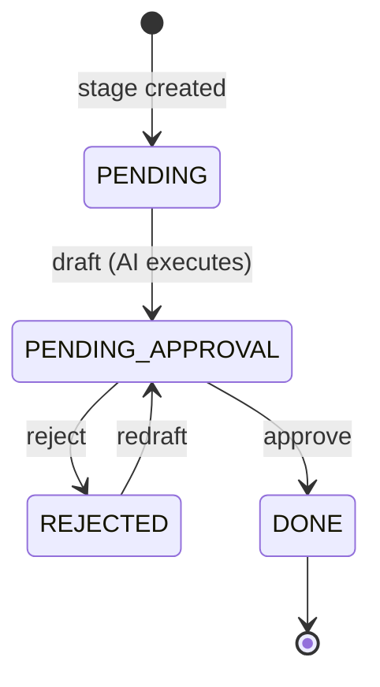
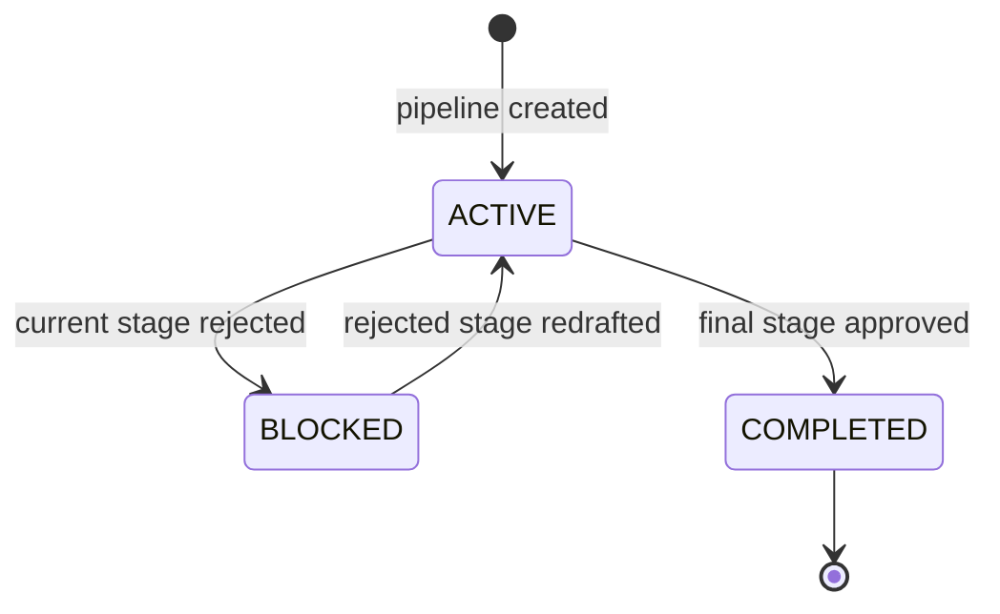
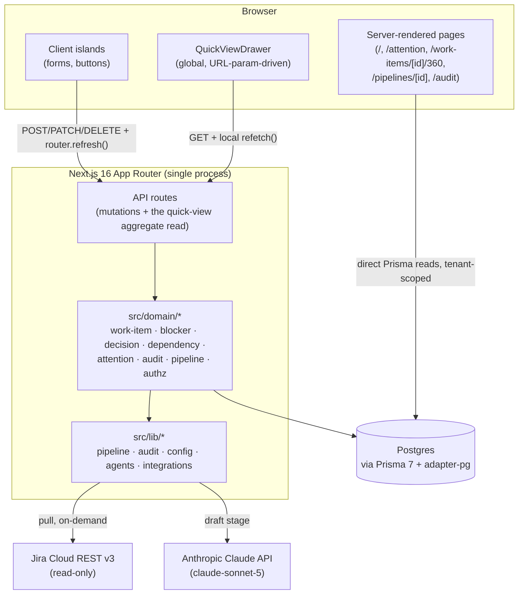

# Delivery Control Center — Product & System Specification

Reverse-engineered from the implementation as of commit `1bdba78` (2026-08-15,
end of Slice 1). Every claim below is traceable to a file in this repo.
Status tags used throughout:

- **Implemented** — working, verified.
- **Partial** — exists but incomplete, unused, or only half-wired.
- **Planned/implied** — the architecture clearly anticipates it (an
  interface, an enum value, a config field) but nothing calls it yet.
- **Missing** — not present at all; noted because the product's own stated
  goals imply it should exist.

This revision folds in **two** shipped slices this document previously
didn't reflect: **Slice 0** (tenancy, identity, auth — archived at
`openspec/changes/archive/2026-08-14-slice-0-tenancy-and-identity/`) and
**Slice 1** (the delivery model and the Attention Center — archived at
`openspec/changes/2026-08-14-slice-1-delivery-model/`). The previous
revision of this file predated both and described a single-tenant,
unauthenticated system with a thin `WorkItem` — none of that is still true.

---

## 1. Product vision and purpose

A transparent, gated, audited, multi-client delivery-tracking system. Work
items — pulled from an external tracker or entered by hand — carry a rich
delivery model (type, status, risk, priority, owner, executor, due date,
progress, hierarchy) and are run through a fixed five-stage documentation
pipeline — **Constitution → SPEC → Plan → Tasks → Deploy** — where each
stage's content is AI-drafted and then must be explicitly approved by a
human before the next stage begins. Around that pipeline, Slice 1 added the
"attention" layer the product's vision names as its core question set: what
is happening, why, does anyone need to act, what happens next. Every draft,
approval, rejection, blocker, decision, dependency change, and cost is
permanently recorded. Source: `README.md`, `config/workflow.yaml`,
`openspec/specs/*/spec.md`, `docs/ROADMAP.md`.

**It is not (yet) a task tracker in the software-engineering sense** — the
pipeline still tracks documentation artifacts moving through a governance
process, not code/test/deploy state (that's Slice 5, unbuilt). But it is no
longer *just* that: the delivery model (work-item status lifecycle, risk,
blockers, decisions, dependencies) now tracks real delivery state
independent of the pipeline.

## 2. Core product concepts

| Concept | What it means here |
|---|---|
| **Organization** | The top of the tenancy tree. One per deployment in practice today. |
| **Client** | A tenant boundary under an Organization — projects, memberships, and (per Slice 1) attention/audit scoping all key off this. |
| **User** | A real, authenticated identity (`User` model, NextAuth Credentials + JWT). Either an org admin (sees everything) or a `ClientMembership` holder with a `Role` on one or more clients. |
| **Project** | A container for work items from one integration (Jira, manual, or — declared but unimplemented — Azure DevOps), scoped to one `Client`. |
| **Work item** | One unit of delivery work — synced from Jira or typed in by hand — with type, status, risk, priority, owner, executor, due date, progress, and optional parent/children (Slice 1). |
| **Pipeline** | The single, 1:1, always-created instance of the 5-stage documentation process for one work item. |
| **Stage** | One of the 5 fixed steps (Constitution/SPEC/Plan/Tasks/Deploy); holds AI-drafted Markdown content and its approval state. |
| **Approval** | A human decision (approve/reject) recorded against a *stage* — the pipeline's own gate, distinct from the work-item-level `Decision` below. |
| **Blocker** (Slice 1) | A first-class record of why a work item can't proceed: reason, owner, required action, optional impact. Creating one forces the work item to `BLOCKED`; resolving it (when no other active blocker remains) restores it to `OPEN`. |
| **Decision** (Slice 1) | A first-class record of a question needing a human answer: question, reason, impact, optional AI recommendation/confidence/deadline. Creating one forces the work item to `DECISION_REQUIRED`; approving restores it to `OPEN`, rejecting leaves it `DECISION_REQUIRED`. |
| **Dependency** (Slice 1) | A directed edge between two work items (`workItemId` depends on `dependsOnWorkItemId`) with a reason. Cycle detection on add; same-project only. |
| **Audit event** | An immutable, append-only record of one thing that happened, at project, pipeline, stage, *or work-item* (Slice 1 added `workItemId`) scope. |

## 3. Users and roles

**Implemented** (Slice 0). `User` (`email`, `passwordHash`, `isOrgAdmin`),
`ClientMembership` (`userId` + `clientId` + `Role`), and NextAuth
Credentials-provider + JWT-session auth (`src/auth.ts`, `src/auth.config.ts`).
`Role` enum: `MANAGER`, `PROJECT_MANAGER`, `TECH_LEAD`, `EXECUTOR`,
`SECURITY_REVIEWER`, `VIEWER`. Every domain command calls
`requireClientRole(ctx, clientId, allowedRoles)`
(`src/domain/shared/authz.ts`); `WRITE_ROLES` is every role except `VIEWER`
(read-only by design — per-stage-type role gating, e.g. "SPEC needs a PM,"
is explicitly deferred, per `docs/ROADMAP.md`'s resolved-conflicts list, to
Slice 2). An org admin (`User.isOrgAdmin`) bypasses membership checks
entirely and sees every client. `AuditEvent.userId` now links to the real
`User` row for `USER`-actor events (`actorName` remains an immutable
display-name snapshot, also used for the nameless `SYSTEM`/`AI` actors).

`Approval.approverName` is still free text (a pipeline-gate decision isn't
tied to `Approval.userId` — there is no such column) — this is a narrower,
pre-existing gap that Slice 1 didn't touch, not evidence that auth is
missing overall.

## 4. Main workflows

1. **Log in** — `/login` (`src/app/login/page.tsx`), NextAuth Credentials.
2. **Add a project** — `AddProjectForm.tsx` → `POST /api/projects`.
   Integration type: Manual or Jira (Azure DevOps not offered in the form,
   though the enum exists).
3. **Sync a Jira project** — `SyncButton.tsx` → `POST
   /api/projects/[id]/sync` → pulls issues, upserts `WorkItem`s (status
   mapped onto the 9-state `WorkStatus` — see §6), creates a `Pipeline` for
   any new one.
4. **Add a work item by hand** — `AddWorkItemForm.tsx` (quick form: title +
   description) or the fuller `POST /api/work-items` body (type, risk,
   priority, owner, executor, due date, parent) → creates the `WorkItem` and
   its `Pipeline` in one call.
5. **Edit a work item** — 360° Record's Overview tab → `EditWorkItemForm` →
   `PATCH /api/work-items/[id]` (title, description, risk, priority, owner,
   executor, due date, progress — **not** status, see §6).
6. **Change a work item's status** — `PATCH /api/work-items/[id]/status`,
   validated against the state machine (`src/domain/work-item/status.ts`).
7. **Draft a pipeline stage** — `DraftButton.tsx` → `POST
   /api/pipelines/[id]/advance` → runs the configured `AgentExecutor`.
8. **Approve / reject a stage** — `ApprovalGate.tsx` → `POST
   /api/stages/[id]/approve` or `/reject`.
9. **Create / resolve a blocker** — `CreateBlockerForm`/`ResolveBlockerButton`
   → `POST /api/blockers`, `POST /api/blockers/[id]/resolve`. Side effect on
   the work item's status (see §15).
10. **Create / approve / reject a decision** — `CreateDecisionForm`/
    `DecisionActions` → `POST /api/decisions`,
    `POST /api/decisions/[id]/approve`, `POST /api/decisions/[id]/reject`.
11. **Add / remove a dependency** — `AddDependencyForm`/
    `RemoveDependencyButton` → `POST /api/dependencies`,
    `DELETE /api/dependencies/[id]`. Cycle-checked (§15).
12. **Review the Attention Center** — `/attention`: every decision pending,
    blocker active, high/critical risk, upcoming deadline, and review-gate
    item across the user's accessible clients, each with its reason and (if
    authorized) an action button.
13. **Quick View** — click "Quick View" anywhere a work item is listed
    (Attention Center rows, Dashboard project rows) to open a global side
    drawer (`?quickView=<id>`) with the same blocker/decision/detail/
    dependencies/timeline data as the full record, without navigating away.
14. **360° Delivery Record** — `/work-items/[id]/360`: tabbed Overview /
    Dependencies (incl. a directed graph visualization) / Timeline, plus
    honest "Coming soon" stubs for Code/Tests/Evidence/Configuration.
15. **Review the audit trail** — `/audit`: filterable (project, actor,
    action category, date range), paginated (20/50/100 rows), no longer
    truncated at 200 rows.

## 5. Domain model and entities

Sixteen Prisma models, all in `prisma/schema.prisma`:

```
Organization 1───* Client 1───* Project 1───* WorkItem 1───0/1 Pipeline 1───* Stage 1───* Approval
                       │              │             │
                       │              │             ├──* Blocker
                       │              │             ├──* Decision
                       │              │             ├──* Dependency (self-referential, via dependsOnWorkItemId)
                       │              │             └──* (self) — parentId / children
                       └──* ClientMembership ──* User
                                                        │
                    AuditEvent ── optional FK to project / pipeline / stage / workItem / user
```

Plus NextAuth's `Account`/`Session`/`VerificationToken` tables (adapter not
wired — see §12).

- `Organization` — `name`, `slug`.
- `Client` — `organizationId`, `name`, `slug` (unique per org),
  `integrationConfig`, `aiConfig` (JSON, per-client override point).
- `User` — `email` (unique), `name`, `passwordHash`, `isOrgAdmin`.
- `ClientMembership` — `userId` + `clientId` + `role` (unique pair).
- `Project` — `clientId`, `name`, `key` (unique **per client**, not
  globally — fixed in Slice 0), `integrationType`, `integrationConfig`.
- `WorkItem` — see §6 for the full Slice-1 shape.
- `Blocker` — `blockingItemId`, `ownerId`, `reason`, `requiredAction`,
  `blockedSince`, `impact` (nullable), `resolvedAt` (nullable).
- `Decision` — `workItemId`, `question`, `reason`, `impact`,
  `aiRecommendation` (nullable), `aiConfidence` (nullable Decimal),
  `deadline` (nullable), `approverId`, `status` (`OPEN`/`APPROVED`/`REJECTED`).
- `Dependency` — `workItemId`, `dependsOnWorkItemId`, `reason`; unique on
  the pair; both FKs cascade-delete.
- `Pipeline` — `currentStage`, `status`. Unique on `workItemId` (true 1:1).
- `Stage` — `type`, `status`, `content`, `aiModel`, `promptTokens`,
  `completionTokens`, `costUsd`, `startedAt`, `completedAt`.
- `Approval` — `decision`, `approverName`, `comment`, `decidedAt`.
- `AuditEvent` — `actor`, `userId` (nullable FK), `actorName`, `action`
  (free text), `detail` (JSON), optional `projectId`/`pipelineId`/
  `stageId`/`workItemId`.

All IDs are `cuid()`. Six migrations exist (see §10); `20260814065231_init`
is never reset per `docs/ROADMAP.md`'s protected invariants.

## 6. Work item model

**No longer thin** (Slice 1). Full shape:

- `type`: `PROJECT` | `TASK` | `BUG` | `CHANGE` (default `TASK`).
- `status`: 9-state `WorkStatus` — `DRAFT`, `OPEN`, `IN_PROGRESS`,
  `DECISION_REQUIRED`, `BLOCKED`, `REVIEW`, `APPROVED`, `COMPLETED`,
  `CLOSED`. Manual transitions go through `updateWorkItemStatus` and
  `src/domain/work-item/status.ts`'s `ALLOWED_TRANSITIONS`; `BLOCKED` and
  `DECISION_REQUIRED` are reachable **only** as a side effect of
  `createBlocker`/`createDecision` (and leavable only via
  `resolveBlocker`/`approveDecision`/`rejectDecision`) — never by a direct
  manual status change, in either direction. This makes the one legitimate
  path in/out of those states impossible to bypass accidentally.
- `risk` / `priority`: `LOW` | `MEDIUM` | `HIGH` | `CRITICAL` (both default
  `MEDIUM`).
- `ownerId` / `executorId`: nullable FKs to `User`; `executorType`:
  `HUMAN` | `AI_AGENT` | `HYBRID` | `UNASSIGNED` (default `UNASSIGNED`).
- `dueDate`, `progress` (0–100, default 0), `aiCost` (Decimal, rolled up
  from pipeline stage costs — see §31 in the gap register).
- `parentId` / `children` — self-referential hierarchy; `addParentWorkItem`
  rejects self-parenting and walks the ancestor chain to reject cycles.
- `source`/`externalId`/`externalUrl` — unchanged from before Slice 1
  (identity for Jira sync upsert).

External sync (`mapExternalStatus` in `src/domain/work-item/commands.ts`)
maps Jira's free-text status onto the 9-state enum, defaulting unrecognized
values to `OPEN` rather than guessing.

**Still missing**: labels/tags, a work-item-level cost budget/threshold, a
`sourceMode` field distinct from `source` (deliberately not added — `source`
already serves that role; see `openspec/changes/2026-08-14-slice-1-delivery-model/design.md`).

## 7. Application architecture

A single Next.js 16 application — no separate backend service. Server
Components read the database **directly via Prisma** for most pages; API
routes exist for mutations **and** for the Quick View drawer's data (a
genuine exception — see below). This means there is still no general-purpose
read API surface (§11).

```
Browser
  │  (Server Components render on request)
  ▼
Next.js App Router  ──reads──▶  Prisma (@prisma/adapter-pg)  ──▶  Postgres
  │
  ├─ "use client" islands (forms/buttons) ──POST/PATCH/DELETE──▶ API routes ──▶ src/domain/*
  │                                                                                  │
  │                                                                    pipeline · audit · authz ·
  │                                                                    agents/* · integrations/*
  │
  ├─ QuickViewDrawer (client component, mounted globally) ──GET──▶
  │     /api/work-items/[id]/quick-view (the one read-only API route,
  │     because the drawer reacts to a URL query param on *whatever page
  │     is currently mounted* — a Server Component can't do that without a
  │     full route transition)
  │
  └─ (mutation succeeds) → router.refresh() re-renders Server Components
        with fresh data — EXCEPT inside QuickViewDrawer, whose data is
        client-fetched; its action components (ResolveBlockerButton,
        DecisionActions, etc.) accept an optional onChanged/onResolved/...
        callback used instead of router.refresh() when present, so the
        drawer can refetch itself in place.
```

Still no client-side cache/store (no SWR/React Query/Redux) beyond that one
drawer-local exception.

## 8. Frontend architecture

9 routes under `src/app/` (up from 3):

| Route | File | Purpose |
|---|---|---|
| `/login` | `login/page.tsx` | Credentials sign-in |
| `/` | `page.tsx` | Dashboard: attention summary, project quick-access, recent activity feed, **plus** the original project list / add-project / add-work-item / sync UI (kept, not replaced — it's the only UI that can create projects/work items; see Slice 1 tasks.md 7.1's deviation note) |
| `/attention` | `attention/page.tsx` | Attention Center: decisions, blockers, risks, deadlines, approval gates |
| `/work-items/[id]/360` | `work-items/[id]/360/page.tsx` | 360° Delivery Record: Overview / Dependencies (+ graph) / Timeline tabs, Code/Tests/Evidence/Configuration stubs |
| `/pipelines/[id]` | `pipelines/[id]/page.tsx` | All 5 pipeline stages, content, cost, approvals, draft/approve/reject, a link into the work item's 360° Record |
| `/audit` | `audit/page.tsx` | Filterable, paginated audit trail (project/actor/action-category/date-range; 20/50/100 rows/page) |

Components (`src/components/`, 20 total, up from 6): the original
`AddProjectForm`/`AddWorkItemForm`/`ApprovalGate`/`DraftButton`/
`SyncButton`/`StageBadge`, plus Slice 1's `OverviewTab`, `DependenciesTab`,
`DependencyGraph` (hand-rolled SVG, no graph library — see §15),
`TimelineTab`, `WorkItemTabs` (accessible tab list, arrow-key nav),
`EditWorkItemForm`, `CreateBlockerForm`, `CreateDecisionForm`,
`ResolveBlockerButton`, `DecisionActions`, `AddDependencyForm`,
`RemoveDependencyButton`, `QuickViewDrawer`, `QuickViewLink`.

`layout.tsx`: four-link header nav (Projects, Attention Center, Audit
Trail — Dashboard is `/`), the globally-mounted `QuickViewDrawer`, Geist
fonts.

## 9. Backend architecture

21 route files under `src/app/api/` (up from 6), all thin wrappers calling
into `src/domain/<aggregate>/`:

| Aggregate | Routes |
|---|---|
| Auth | `/api/auth/[...nextauth]` (NextAuth handler) |
| Projects | `GET`/`POST /api/projects`, `POST /api/projects/[id]/sync` |
| Clients | `GET /api/clients` (read-only, no create route exists — see §12's gap note and Task Group 12's E2E-test deviation) |
| Work items | `POST /api/work-items`, `GET`/`PATCH /api/work-items/[id]`, `PATCH /api/work-items/[id]/status`, `PATCH /api/work-items/[id]/parent`, `GET /api/work-items/[id]/audit` (paginated per-item timeline), `GET /api/work-items/[id]/quick-view` (drawer aggregate) |
| Blockers | `POST /api/blockers`, `PATCH /api/blockers/[id]`, `POST /api/blockers/[id]/resolve` |
| Decisions | `POST /api/decisions`, `POST /api/decisions/[id]/approve`, `POST /api/decisions/[id]/reject` |
| Dependencies | `POST /api/dependencies`, `DELETE /api/dependencies/[id]` |
| Pipeline | `POST /api/pipelines/[id]/advance` |
| Stages | `POST /api/stages/[id]/approve`, `POST /api/stages/[id]/reject` |

Still no `DELETE` on `WorkItem` — deliberately: hard-deleting a work item
would cascade through `Pipeline` to `AuditEvent` (via `pipelineId`'s
cascade), destroying audit history the `audit-trail-fixed` spec requires to
be immutable. Flagged in Slice 1's tasks.md rather than shipped broken;
needs a schema change (soft-delete, or decoupling the cascade) that's out
of scope for a UI task.

Core logic lives in `src/domain/<aggregate>/{commands,queries}.ts` (the
Slice-0-established pattern: Zod-validate → authorize
(`requireClientRole`) → transaction → `recordAuditEvent()` in the same
transaction → typed result) plus `src/lib/`:
- `pipeline.ts` — the stage/pipeline state machine.
- `audit.ts` — `recordAuditEvent()`, still the single write path for
  `AuditEvent`.
- `config.ts` — loads `config/workflow.yaml` and `config/prompts/*.md`.
- `agents/` — `AgentExecutor` interface + `mockExecutor.ts` +
  `claudeExecutor.ts` + `index.ts` selector.
- `integrations/` — `IntegrationAdapter` interface + `manual.ts` +
  `jira.ts` + `index.ts` selector.

## 10. Database / data model

Postgres via `@prisma/adapter-pg` (Prisma 7 — no `url` in `schema.prisma`'s
`datasource`). **Six migrations** (up from one):
`20260814065231_init` → `..._add_organization_client` →
`..._project_client_scoped` → `..._auth_and_roles` →
`..._approval_audit_user_refs` → `..._slice1_delivery_model`. One seed
script (`prisma/seed.ts`), idempotent.

No soft-delete, no versioning/history on any row besides `Stage`/`Approval`
naturally accumulating across redrafts. Row-level tenancy now exists
(`Client` → `Project` → everything else), fixing the gap the previous
revision of this document flagged.

## 11. APIs and integrations

| System | Status | Detail |
|---|---|---|
| Jira Cloud | **Implemented**, read-only | Unchanged from before Slice 1 — `src/lib/integrations/jira.ts`, REST API v3, Basic Auth. Pull-only. |
| Azure DevOps | **Missing** (declared only) | Unchanged — enum exists, aliased to the manual adapter, not offered in the UI. |
| Anthropic Claude | **Implemented** | Unchanged — `claude-sonnet-5`, single-turn, real usage-based cost. |
| Inbound webhooks | **Missing** | Sync is still pull-only. |
| Outbound notifications | **Missing** | No email/Slack/webhook on any event — including the new Attention Center's items, which currently require a user to visit `/attention` or `/` to discover. |
| Public read API | **Missing**, mostly | `GET /api/clients`, `GET /api/work-items/[id]`, and `GET /api/work-items/[id]/quick-view`/`audit` exist, but there's no general project/work-item listing API — Server Components still read Prisma directly for the primary UI. |

## 12. Authentication and authorization

**Implemented** (Slice 0; unchanged in Slice 1 except for extending which
actions require which role). NextAuth Credentials provider + JWT sessions
(`src/auth.ts`); `requireAuthContext()`
(`src/domain/shared/session.ts`) gates every page/route; `requireClientRole`
gates every domain command against `WRITE_ROLES`/`ALL_ROLES`. `.env`
(gitignored) still holds shared `DATABASE_URL`/`ANTHROPIC_API_KEY`/`JIRA_*`
— per-client credential isolation exists at the schema level
(`Client.integrationConfig`) but not for the AI/Jira env-var fallback path.

**Known gap, not closed by Slice 1**: there is no UI or API route to
*create* a `Client` — `GET /api/clients` is the only client endpoint. This
surfaced concretely while writing Slice 1's E2E test (`e2e/`
`slice1-delivery-model.spec.ts`), which had to reuse the seeded "Default
Client" instead of creating one, since the task list's literal scenario
step ("create a new client") has no UI path to drive.

## 13. AI / agent capabilities

Unchanged from before Slice 1. `AgentExecutor` interface
(`src/lib/agents/types.ts`), `mockExecutor.ts` / `claudeExecutor.ts`,
global env-gated switch (not per-project/client/stage).

## 14. SDD / specification workflow

Unchanged. Two unrelated SDD-like layers — the product's own
Constitution→SPEC→Plan→Tasks→Deploy pipeline, and OpenSpec
(`openspec/`), the tooling used to manage development of *this codebase*.
See `CLAUDE.md`.

## 15. Dependencies and blockers

**Implemented** (Slice 1) — the previous revision of this document called
this section "Missing" entirely; it no longer is.

- `Dependency`: `addDependency` validates same-project, rejects
  self-dependency and duplicates, and runs `detectCycles` (BFS over
  existing edges) before insert — rejects if adding the edge would close a
  cycle. `getWorkItemDependencies` returns both directions
  (upstream/downstream) with reasons.
- `Blocker`: `createBlocker` forces the work item to `BLOCKED`;
  `resolveBlocker` restores it to `OPEN` only if no other active blocker
  remains on that item (verified via `getActiveBlockers` count inside the
  same transaction).
- **Dependency Graph visualization**: `DependencyGraph.tsx` — hand-rolled
  SVG (no Cytoscape/D3/Recharts; the connected-neighborhood BFS query
  (`getWorkItemDependencyGraph`) is bounded to 200 nodes, small enough that
  a topological layered layout doesn't need a full graph library). Click a
  node to recolor it (green = selected, blue = upstream/"depends on",
  purple = downstream/"depends on this"), dims the rest; zoom via
  wheel/buttons, pan via drag. Integrated into the 360° Record's
  Dependencies tab only (not the Quick View drawer — a full pan/zoom graph
  doesn't fit a 400px panel).
- **Critical path**: still a stub (`getCriticalPath()` returns `[]`) —
  explicitly deferred to Slice 2 per the original scope.

`PipelineStatus.BLOCKED` (self-referential: a pipeline blocks itself when
its current stage is rejected) is unrelated to `WorkStatus.BLOCKED` — the
two concepts are deliberately not merged; a rejected pipeline stage does
not create a `Blocker` row, and vice versa.

## 16. Decisions and approval gates

**Two decision concepts now coexist, deliberately not merged**:

1. **Pipeline stage gates** (`Approval`) — unchanged from before Slice 1:
   every stage requires exactly one recorded approve/reject before the
   pipeline can advance. Free-text `approverName`, no roles gating who may
   decide, no multi-approver/quorum.
2. **Work-item `Decision`** (Slice 1, new) — a first-class object with
   `question`/`reason`/`impact`/optional `aiRecommendation`+`aiConfidence`+
   `deadline`. `approveDecision`/`rejectDecision` can be called by *any*
   authenticated user (not just `WRITE_ROLES` — approval is a recorded
   act, and the spec asks that any user with access to see the decision
   can act on it), unlike blocker/decision *creation*, which requires
   `WRITE_ROLES`.

`requiresApproval` in `config/workflow.yaml` is now read and enforced
(fixed in Slice 0 — the previous revision of this document flagged it as a
dead config flag; that's resolved).

## 17. Git / code / PR workflow

Unchanged — still not a product feature. See `CLAUDE.md`'s own "Git
workflow" section for how *this repository* is developed, which is a
separate concern from the product.

## 18. Testing and deployment

**Implemented**, tests (was "Missing" before Slice 0). Vitest
(`vitest.config.ts`) for domain-layer integration tests against a real
local Postgres — **88 tests across 12 files** as of this revision, one per
domain aggregate plus the Attention/Dashboard/Audit aggregation queries.
Playwright (`playwright.config.ts`, `e2e/`) for end-to-end scenarios — 5
tests: tenancy/role isolation (`isolation.spec.ts`), the pipeline happy
path (`smoke.spec.ts`), and Slice 1's full delivery-model scenario
(`slice1-delivery-model.spec.ts`: dependency → blocker → Attention Center
→ Quick View → resolve → timeline → audit trail).

Still **no CI configuration** and **no deployment configuration** — the app
only runs via `npm run dev` / `next build` + `next start`. "Verification"
(`CLAUDE.md`, the `/verify` skill) remains a manual development discipline
(build + lint + a targeted live check), not an automated gate.

## 19. Evidence and completion rules

Unchanged — still just a stage's AI-drafted content plus one `Approval`
record. Work-item `progress` (0–100, Slice 1) is a manually-set number, not
derived from any evidence. No file attachments, no linked test results, no
CI status. Evidence-driven completion remains Slice 5's scope.

## 20. Audit and provenance

**Extended** (Slice 1). `recordAuditEvent()` remains the single write path,
inside the same transaction as the state change it describes. `AuditEvent`
gained a `workItemId` FK (nullable, `SET NULL` on delete) so
Blocker/Decision/Dependency events — which have no `pipelineId` — can trace
back to a work item, powering both the 360° Record's Timeline tab and
`/audit`'s new filters.

**The 200-row silent truncation is fixed.** `/audit` now has real
pagination (`listAuditEvents`, `skip`/`take`, 20/50/100 rows selectable)
and filters (project, actor, action category, date range). The
`ACTION_CATEGORIES` filter is a **substring classifier over free text**, not
a stored enum — `AuditEvent.action` has always been a human-readable
sentence (e.g. `"Alice created work item \"Fix login bug\""`, one of ~19
unique interpolated templates across the domain layer), not a fixed code
like `WORK_ITEM_CREATED`. Reworking the write path to store a real action
code was judged out of scope for a filtering-UI task; flagged rather than
silently worked around.

`listRecentAuditEvents(ctx, limit)` still exists (default `limit=200`) but
is now used **only** for the Dashboard's intentionally-small "top 10"
recent-activity preview — the old hard cap is out of the audit trail's own
data path entirely.

## 21. Configuration and inheritance

Unchanged. Global `config/workflow.yaml` + `config/prompts/*.md`, no
per-project/per-client override despite `Client.integrationConfig` and
`Client.aiConfig` existing (integration credentials only). Hierarchical
config remains Slice 6's scope.

## 22. Notifications and attention mechanisms

**Implemented** (Slice 1) — the previous revision called this "Missing"
entirely; it's now the product's second-most-developed surface after the
pipeline itself.

- **Attention Center** (`/attention`): aggregates, across every client the
  user can access, open decisions, active blockers, high/critical-risk
  items, upcoming deadlines (within 7 days), and review-gate items. Each
  group sorted by urgency (oldest/soonest first); every row states *why*
  it's there.
- **Dashboard** (`/`): an attention-summary card (4 counts linking into
  `/attention#section`, or an "All clear" state), a project quick-access
  grid, and a 10-event recent-activity feed — sits above the original
  project-management UI (kept, not replaced; see §7's deviation note).
- **Quick View** (global side drawer, `?quickView=<id>`): progressive
  disclosure — blocker panel first, then decision panel, then full detail,
  then dependencies/timeline — openable from any list without leaving the
  page.

Still **no push notification** (email/Slack/webhook) — discovering an
attention item still requires visiting `/attention` or `/`. Outbound
notifications remain unbuilt (§11).

## 23. UI architecture and navigation

6 authenticated routes (§8, up from 3), 4 nav links (up from 2: Projects,
Attention Center, Audit Trail — Dashboard is the root). Filters now exist
on the audit trail (project/actor/action/date range) — the previous "no
filters anywhere" claim no longer holds there, though project/work-item
*lists* on the Dashboard still have none. Pagination exists on `/audit`
(20/50/100/page) and the 360° Record's Timeline tab (20/page); still none
on the Dashboard's project/work-item lists. No client-level navigation, no
`Ctrl+K` command palette / global search (still Slice-1-vision items not
built).

## 24. Design system and UX principles

Unchanged. Tailwind v4 utility classes directly in components, no
component library, no design-tokens file. `StageBadge.tsx` remains the
only pre-Slice-1 shared visual primitive; Slice 1 added `WorkItemTabs`
(accessible `role="tablist"`, arrow-key navigation) as a second one. Dark
mode automatic via `prefers-color-scheme`. Still no toast system (inline
red error text near the triggering control remains the pattern).

## 25. Important business rules

Unchanged rules from before Slice 1, plus new ones:

- A stage drafts only from `PENDING` or `REJECTED`; approves/rejects only
  from `PENDING_APPROVAL`.
- Approving the final configured stage completes the pipeline; approving
  any other stage advances to the next one. Rejecting blocks the pipeline;
  redrafting the rejected stage unblocks it.
- A work item has at most one pipeline, ever.
- Work-item identity for sync/upsert: `(projectId, source, externalId)`.
- `Project.key` is unique **per client** (fixed in Slice 0 — was globally
  unique before).
- **`WorkStatus.BLOCKED` and `.DECISION_REQUIRED` are unreachable from
  `updateWorkItemStatus` in either direction** — entering them is a side
  effect of `createBlocker`/`createDecision`; leaving them, a side effect
  of `resolveBlocker`/`approveDecision`/`rejectDecision`. This is
  deliberately stricter than a runtime "check no active blocker exists"
  gate.
- **Adding a dependency that would create a cycle is rejected** — BFS
  cycle check runs before every insert.
- **Adding a parent that would create a hierarchy cycle is rejected** —
  ancestor-chain walk before every reparent.
- A blocker's resolution only restores the work item to `OPEN` if **no
  other active blocker** remains on that item.
- `requiresApproval` in `config/workflow.yaml` now has real effect (fixed
  in Slice 0).

## 26. State machines and lifecycle transitions

Pipeline/Stage diagrams unchanged from before Slice 1:





**New** (Slice 1) — the `WorkItem.status` state machine
(`src/domain/work-item/status.ts`):

```mermaid
stateDiagram-v2
    [*] --> DRAFT
    DRAFT --> OPEN
    OPEN --> IN_PROGRESS
    IN_PROGRESS --> REVIEW
    REVIEW --> APPROVED
    REVIEW --> IN_PROGRESS: rejected back
    APPROVED --> COMPLETED
    IN_PROGRESS --> CLOSED
    COMPLETED --> CLOSED
    OPEN --> CLOSED
    note right of DECISION_REQUIRED
      Entered only via createDecision,
      left only via approve/rejectDecision.
      Not reachable through manual
      updateWorkItemStatus in either
      direction.
    end note
    note right of BLOCKED
      Entered only via createBlocker,
      left only via resolveBlocker
      (when no other active blocker
      remains).
    end note
```

## 27. External systems and connectors

Unchanged. Jira Cloud (read-only), Anthropic Claude API, Postgres. No
GitHub/GitLab, no CI system, no email/Slack, no billing/invoicing system.

## 28. Security boundaries

**Largely fixed** (Slice 0; unchanged in Slice 1). Every route requires
`requireAuthContext()`; every domain command requires
`requireClientRole()`. Tenancy scoping (Client → Project → everything) means
one client's data is not visible to another's members by default. Secrets
still live in one shared `.env` — per-client credential isolation exists at
the schema level (`Client.integrationConfig`) but the Jira/Claude env-var
fallback path remains a single shared credential set.

**Narrower gaps that remain**: no client-creation UI/API (§12), no
CSRF-specific hardening beyond NextAuth's defaults, no rate limiting.

## 29. Observability

Unchanged — still no structured logging, error tracking, metrics, request
tracing, or health-check endpoint. `AuditEvent` remains business-level
provenance, not infrastructure observability.

## 30. Current limitations and technical debt

Fixed since the previous revision of this document (kept here as a record,
not a re-flagged risk): no-auth, global tenancy, `Project.key` global
uniqueness, `requiresApproval` dead flag, 200-row audit truncation, no
tests.

Still outstanding:

- Dead `StageStatus` values (`AI_DRAFTING`, `APPROVED`) — never assigned.
- `WorkItem.status` is now displayed everywhere in Slice 1's UI (fixed) —
  but `Approval.approverName` (pipeline gates) is still free text, not tied
  to a real `User` row.
- No client-creation UI/API (§12, §28).
- No `DELETE` on `WorkItem` (§9) — needs a schema change to avoid
  destroying immutable audit history via cascade.
- `Dependency` critical-path analysis is a stub (§15) — Slice 2 scope.
- No pagination on the Dashboard's project/work-item lists (only `/audit`
  and the 360° Record's Timeline have it).
- No push notifications for Attention Center items (§22).
- No config snapshotting — editing `workflow.yaml` retroactively affects
  pipelines already mid-flight.
- Global, single-tenant AI/Jira credentials despite per-client isolation
  existing at the schema level.
- No retry/backoff on external API calls (Jira, Claude).
- No CI, no deployment configuration.

---

## High-level system architecture



## Domain model

See §5's diagram. Sixteen models: the tenancy chain
(`Organization → Client → Project`), the delivery model
(`WorkItem → {Pipeline → Stage → Approval, Blocker, Decision, Dependency}`),
identity (`User`/`ClientMembership`), and `AuditEvent` hanging off
`Project`/`Pipeline`/`Stage`/`WorkItem` independently.

## Main entity relationships

| From | To | Cardinality | Notes |
|---|---|---|---|
| Organization | Client | 1—* | cascade delete |
| Client | Project | 1—* | cascade delete |
| Client | ClientMembership | 1—* | cascade delete |
| User | ClientMembership | 1—* | cascade delete |
| Project | WorkItem | 1—* | cascade delete |
| WorkItem | Pipeline | 1—0/1 | true 1:1, cascade delete |
| WorkItem | Blocker/Decision/Dependency | 1—* each | cascade delete |
| WorkItem | WorkItem (parent/children) | 1—* | `SET NULL` on parent delete |
| Pipeline | Stage | 1—* | cascade delete, unique per `(pipeline, type)` |
| Stage | Approval | 1—* | cascade delete, history accumulates |
| Project/Pipeline/Stage/WorkItem | AuditEvent | 1—* (optional) | Project/Pipeline cascade; Stage/WorkItem set null |

## Major user journeys

1. Stand up a client and project → sync or hand-enter work → walk every
   item through 5 AI-drafted, human-gated stages → completed. *(unchanged
   engine room)*
2. **New (Slice 1)**: work stalls → create a blocker or decision on it →
   it surfaces in the Attention Center with its reason → resolved via Quick
   View or the full 360° Record → timeline and audit trail both reflect it.
3. Redraft loop: reject a stage → pipeline blocks → redraft → gate again.
4. Audit review: `/audit`, now filterable and paginated — no more silent
   200-row cutoff.

## Main state transitions

Covered in §26 (Stage, Pipeline, **and** WorkItem-status diagrams).

## Most important business rules

Covered in §25.

## Current capabilities (implemented, verified)

- Config-driven, 5-stage documentation pipeline with human approval gates.
- Real AI drafting via Claude (with a working mock fallback).
- Jira read-only sync with upsert-safe re-sync, status-mapped onto the
  9-state `WorkStatus`.
- Manual work-item entry and full editing (except status, which has its
  own gated command).
- Multi-client tenancy with real authentication and role-based
  authorization on every command.
- Rich work-item delivery model: type, status, risk, priority, owner,
  executor, due date, progress, hierarchy.
- First-class Blocker, Decision, and Dependency entities with correct
  side-effect wiring to work-item status.
- Cycle detection on both dependency edges and parent/child hierarchy.
- Attention Center aggregating decisions, blockers, risks, deadlines, and
  review gates across all accessible clients.
- Dashboard command-center summary + Quick View global drawer.
- 360° Delivery Record with a hand-rolled, interactive dependency graph
  visualization.
- Filtered, paginated audit trail with no silent truncation.
- Full, transactionally-consistent, append-only audit trail (now
  work-item-scoped, not just pipeline/project-scoped).
- Real per-draft token/cost tracking.
- 88 domain-layer integration tests, 5 Playwright E2E tests.

## Missing capabilities

- Client-creation UI/API (§12, §28) — the one concrete gap Slice 1's own
  E2E test surfaced while implementing it.
- Notifications/push mechanism for Attention Center items.
- Critical-path analysis over dependencies (stub only).
- `DELETE` on work items (blocked by the audit-immutability constraint —
  needs a schema decision).
- Azure DevOps integration (declared, not built).
- General-purpose read API (public API surface beyond mutations + the
  quick-view aggregate).
- CI, deployment configuration.
- Any pagination on the Dashboard's project/work-item lists.
- Per-client AI/Jira credential isolation actually wired to the fallback
  path (schema supports it, nothing sets it from the UI).
- Ctrl+K command palette / global search.

## Inconsistencies between UI, backend, and domain model

- `StageStatus.AI_DRAFTING` / `APPROVED` (schema) vs. never reached (code)
  — unchanged, still dead enum values.
- `Approval.approverName` (free text) vs. real `User` identity existing
  everywhere else in the system now — pipeline gates are the one place
  that still doesn't use a verified identity for the decision itself.
- Azure DevOps as a first-class `IntegrationType` (schema/enum) vs.
  silently aliased to the manual adapter (behavior) vs. not offered at all
  (UI) — unchanged.
- `AuditEvent.action` is free text classified into categories for
  filtering (§20) rather than a stored enum — functional, but means the
  Action filter is best-effort substring matching, not exact.

## Technical risks

- **No client-creation path** means every E2E/manual test scenario that
  literally needs "create a new client" has to route around it — a
  concrete, reproducible gap (see §12, §28).
- **`DELETE` on `WorkItem` is unimplemented by design**, not oversight —
  but that means there is currently no way to remove a mistakenly-created
  work item at all, through the UI or API.
- **Global config + global AI/Jira credentials** still won't survive real
  multi-client use without further work, despite the schema now supporting
  per-client override.
- **Unsnapshotted workflow config** — a `workflow.yaml` edit can still
  silently change the behavior of pipelines already mid-flight.
- **No CI** means test regressions only surface when someone runs
  `npm test`/`npx playwright test` locally.
- **`AuditEvent.action` as free text** means the audit trail's Action
  filter can silently miss a *new* action template added later without a
  matching entry in `ACTION_CATEGORIES` — the substring-classifier
  approach requires remembering to update it.

## Prioritized roadmap

Per `docs/ROADMAP.md`'s slice sequence (source of truth — this section
summarizes, doesn't override it):

1. **Slice 2 — SDD as a subsystem**: Constitution as a versioned
   project-scoped artifact, `Clarify`/`Analyze` stages, versioned stage
   artifacts, a durable run state machine, role-based per-stage-type gate
   policy, rejection/clarification feedback reaching redrafts.
2. **Slice 3 — Agents as real execution resources**: agent registry,
   `AgentRun` entity, retry/backoff, cost rollups with budgets.
3. **Slice 4 — Connector framework**: `Connector`/`SyncRun` entities,
   field-level provenance, conflict handling, Azure DevOps/GitHub adapters.
4. **Slice 5 — Engineering evidence**: repository/commit/PR/test-run
   entities, Code & Changes / Tests tabs, evidence-driven completion.
5. **Slice 6 — Configuration Center**: hierarchical config with
   inheritance, impact preview, versioning.
6. Cheap, high-clarity fixes that don't need a full slice: client-creation
   UI/API; a `WorkItem` delete path (once the audit-immutability question
   is resolved); push notifications for the Attention Center.

---

## Current Product Definition

**Delivery Control Center, as it exists today, is a multi-client,
authenticated, config-driven governance and attention-management tool that
runs individual work items — carrying a full delivery model of status,
risk, priority, ownership, dependencies, blockers, and decisions — through
a fixed, five-stage, AI-drafted, human-approved documentation pipeline
(Constitution → SPEC → Plan → Tasks → Deploy), recording every draft,
decision, blocker, dependency change, and cost in an immutable,
work-item-traceable audit trail.** It answers the product vision's four
core questions — what is happening, why, does anyone need to act, what
happens next — through the Attention Center, Quick View drawer, and 360°
Delivery Record, all built in Slice 1. It is not yet a code/deployment
system (Slice 5), and several real gaps remain: no client-creation path, no
work-item deletion, no push notifications, no critical-path analysis. Its
strongest, most fully-realized property remains provenance — the audit
trail is real, transactionally consistent, tenant-scoped, and now
work-item-traceable. Its access-control story, weak in the previous
revision of this document, is now solid: real authentication, real
per-client roles, and every domain command gated. The product's
architecture (swappable `AgentExecutor`/`IntegrationAdapter`, config-driven
pipeline shape, the `src/domain/<aggregate>/` command/query pattern) has
proven itself capable of absorbing a slice this large (14 task groups, 6
new entities, 5 new pages, 88 tests) without a rewrite — a reasonable
signal for the slices still ahead.
