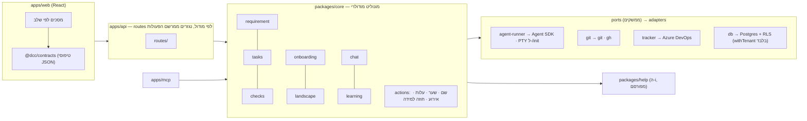

# איכות קוד, ארכיטקטורה ומודולריות — המלצה

**מה המסמך הזה.** תוצאת מחקר, לא החלטה לשכתב. הוא עונה על התדריך
`docs/fable-brief-code-architecture.md`: האם הקוד, השפה, החבילות והדפוסים של
DCC נכונים; אם לא — לשנות כמה, איך, ומה המחיר. התדריך התיר במפורש לשקול
שכתוב מאפס ושפה אחרת; המסמך שוקל את שניהם ברצינות, ועונה עליהם במספרים.

**איך נערך.** (1) **מדידה** של הריפו כפי שהוא (commit `35b088a`): cloc, jscpd
(שכפול), madge (מעגלים), ESLint (מורכבות ואורך), knip (קוד מת), vitest, tsc,
vite, git — הפירוט המלא: `docs/research/sources/dcc-metrics.md`. (2) **סקר
קוד** של השכבות, ה-API, המצב בזיכרון, הדרכים לנתוני דייר, והלקחים שנרשמו
בהערות: `docs/research/sources/dcc-survey.md`. (3) **שלושה ניסויים מעשיים**
(סעיף 5.6): שיתוף טיפוסים בין ה-web ל-core על עותק זמני, כללי ארכיטקטורה
כ-lint על הקוד האמיתי, ופלט מובנה של ה-CLI מול חילוץ JSON ברגקס — על הריפו
של Trade. (4) **סריקת עולם**: ראיות על שכתוב מול שיפור בעידן הסוכנים
(Google, Airbnb, Anthropic/Bun, METR), מונוליט מודולרי ואכיפת גבולות, יומן
אירועים מול event sourcing, RLS ב-Postgres ו-Drizzle, PGlite, בחירת שפה
ו-Agent SDK, נורמות איכות (Sonar, Google), ומחקרי שחיקת איכות בקוד שנוצר
ב-AI (GitClear, CodeRabbit): `docs/research/sources/world-code-architecture.md`.
דרגות: **[A]** תיעוד רשמי או מחקר מבוקר · **[B]** תצפית או benchmark ·
**[C]** דיווח של איש מקצוע.

**גבול.** חמש ההחלטות הבסיסיות נבדקו — לא הונחו. המסקנה: כולן עומדות, שתיים
מהן (זהות, קיר בין לקוחות) **לא נאכפות עד הסוף בקוד**, וזה חלק מהממצאים.

---

## 1. השורה התחתונה

**לא לשכתב. לבנות מחדש מודול-מודול, מול "אורקל", בלי לעצור את הפיילוט —
וב-TypeScript.** ההיסוד נכון; הצורה לא. במספרים: 28,034 שורות TypeScript
ב-193 קבצים, כתובות ב-9 ימים, עם 217 קומיטים. השכפול 1.9% (מתחת לסף של
Sonar), 14 תלויות מעגליות לפי madge — אבל עם פענוח TypeScript 12 מהן הן ייבוא-טיפוס בלבד (10 במרשם ה-"i"), אחת מכוונת, ואחת אמיתית, 107 מתוך
4,288 פונקציות מעל מורכבות 15 (2.5%), ו-**3.9% בדיקות** — אף אחד מ-18 המודולים
הגדולים (מעל 400 שורות) לא נבדק. שני קבצים — `ai-assist.ts` (2,708 שורות)
ו-`server.ts` (1,813, כל 162 ה-routes) — הם 12.8% מהקוד, ושבעה מעשרת הקבצים
שמשתנים הכי הרבה הם גם הגדולים או המורכבים ביותר: השינוי מתרכז איפה שקשה
לשנות. זה קוד של אב-טיפוס שהצליח, לא קוד שבור.

**למה לא שכתוב.** כל הצלחה מתועדת של שכתוב בעידן הסוכנים — Google (מיגרציות
עם AST + אימות, 50% חיסכון), Airbnb (3,500 קובצי בדיקה, 97% אוטומטית),
Anthropic/Bun (535k שורות Zig → Rust ב-11 יום, $165k) — הייתה **טרנספורמציה
מכנית עם אורקל**: מבחנים, מהדר או בדיקת שקילות שאומרים "מתנהג אותו דבר".
Anthropic במילים שלהם: "הקושי לא היה מהירות הביצוע אלא בניית אימות חזק" [B].
ל-DCC אין אורקל: 3.9% בדיקות, בלי CI, ומה שנלמד בשטח חי בהערות ("hard
lesson", "found live", 13 ענפי `win32`). שכתוב מאפס עכשיו = לגלות מחדש את
הפינות האלה, עם פי 1.7 באגים לקוד שסוכן כותב [B], תוך הקפאת המוצר מול הלקוח
היחיד — התסריט של Netscape [C]. ו"לא מודולרי / יש שכפולים / שפה אחרת נחמדה
יותר" אינו אורקל.

**למה כן לבנות מחדש — מודול-מודול.** בגודל של 35k שורות, מיקרוסופט עצמה אומרת
שהחלפה סיטונאית *אפשרית* ולכן חזית ה-strangler fig אופציונלית [A]; המשמעות
ההפוכה: יחידת ההחלטה היא **מודול אחד עם אורקל אחד** — לממש מחדש מאחורי אותו
ממשק, להוכיח זהות עם אותם `prove:` ו-`smoke`, למחוק את הישן באותו שינוי (הכלל
שכבר כתוב ב-`CLAUDE.md`). ששת המסמכים האחרים כבר מגדירים בדיוק אילו מודולים
נבנים מחדש ולמה — מכונת מצבים של דרישה, ישות החלטה, ישות הצעה, חבילת ה-"i",
רמת ההתקשרות, מודל הנוף — כל אחד עם ה-`prove:` שלו.

**עשר המלצות, לפי סדר:**

1. **אורקל קודם, ואז סוכנים.** לפני כל בנייה מחדש: CI (אין היום) שמריץ
   typecheck / lint / test / audit על כל PR, ואת `dev:prove` / `smoke` /
   `prove:*` על **Postgres אמיתי** (Docker או Neon branch), לא רק PGlite —
   כי PGlite לא יכול להוכיח תפקידים, `FORCE RLS` ומקביליות [A]. בדיקות למודול
   לפני שמחליפים אותו, לא אחרי.
2. **להישאר ב-TypeScript.** ה-Agent SDK של Anthropic קיים ב-TypeScript
   וב-Python בלבד; כל שפה אחרת מקבלת subprocess או Managed Agents [A]. העומס
   של DCC הוא מודל + REST + git — אין benchmark שמראה שה-runtime הוא צוואר
   בקבוק. ריפו רב-לשוני עולה (build, כלים, גיוס) בלי תועלת שנמדדה [C]. לקוח
   .NET משורת דרך ה-HTTP API, לא דרך port של הליבה. אין דוגמה קונקרטית לחלק
   שבו שפה אחרת מנצחת מספיק — ולכן אין המלצה כזו.
3. **מונוליט מודולרי לפי תכונה, נאכף בכלים.** `packages/core` הופך מ-74 קבצים
   בתיקייה אחת למודולים עם ממשק ציבורי (`requirement/`, `tasks/`, `checks/`,
   `claude-runner/`, `git/`, `tracker/`, `onboarding/`, `chat/`, `learning/`,
   `help/`), ו-`server.ts` ל-route לכל מודול. גבולות נאכפים ב-CI
   (dependency-cruiser) ובעורך (eslint-plugin-boundaries), עם רשימת "חובות"
   בסגנון packwerk: להקפיא את ההפרות של היום, לאסור חדשות, לצמצם [A].
   ports/adapters רק בארבעת הגבולות האמיתיים: Claude, git, Azure DevOps,
   מסד הנתונים.
4. **מ-CLI ל-Agent SDK.** DCC מפעיל היום `claude -p` תחת החשבון המחובר
   במכונה: הזהות היא של המכונה, לא של האדם שפעל (סתירה מעשית להחלטה
   הבסיסית השנייה), כל המשתמשים על תהליך אחד באותה מכונה, 13 ענפי Windows,
   עלות שהיא הערכה בצד הלקוח [A], ובלי `canUseTool` / `AskUserQuestion`
   שמאפשרים למוצר להציג שאלות של המודל במסך שלו. ה-SDK נותן את כל אלה, ואת
   `--bare` לריצות בריפו משובט של לקוח — שבלעדיו `-p` מריץ את ה-hooks ואת
   ה-MCP של הריפו הזר בלי דיאלוג אמון [A]. ה-PTY נשאר ל-`/init` בלבד (אין
   לו תחליף headless [A]).
5. **הקיר בין לקוחות — לאכוף עד הסוף.** 6 מ-33 טבלאות בלי RLS (`flow_run`
   בהן), שלוש דרכים להגיע לנתוני דייר (`withTenant` / `withoutTenant` /
   `db` גולמי) ו-`db` גולמי בשימוש על טבלאות דייר ב-8+ מקומות; אין הרשאה
   לפי לקוח ב-API; 24 routes של GET ו-`/admin/shutdown` בלי אימות; אימות =
   "pilot shim". לפני לקוח שני: תפקיד אפליקציה בלי `BYPASSRLS`, `FORCE ROW
   LEVEL SECURITY` ב-SQL (Drizzle לא יודע להצהיר עליו, #5819 [A]), הקשר דייר
   רק ב-`SET LOCAL` בטרנזקציה, בדיקה גנרטיבית "לכל טבלת דייר יש policy"
   ובדיקת מוטציה (מוחקים policy — הבדיקות חייבות להיכשל) [C].
6. **יומן אירועים היברידי — כן; event sourcing — לא.** `event_log` append-only
   לצד טבלאות מצב הוא בדיוק הדפוס המומלץ לצוות קטן [A]; מה שחסר: אירוע ומצב
   **באותה טרנזקציה**, גרסה לאירועים עם upcast בקריאה, ולא להבטיח "שחזור
   ע"י replay" שאיש לא מריץ. שום projections ו-CQRS עד שצורך שאילתה יכריח.
7. **PGlite — פותח אחד.** שני תהליכים על אותה תיקייה = פיצול שקט או השחתת
   WAL [C]; נעילת PID שמסרבת לפותח שני, או PGlite מאחורי `pglite-socket`
   בתהליך ה-API. יומן המיגרציות (8 מתוך 54) ו-`node` במקום `tsx` בסקריפטים
   של `@dcc/db` — לתקן.
8. **חוזים משותפים ל-web.** 126 טיפוסים מועתקים ביד ב-`api.ts` — הקובץ
   שהשתנה הכי הרבה בריפו (45 קומיטים). הניסוי (5.6): 57% ניתנים לשיתוף מיד, ה-bundle זהה, ו-7 סטיות שקטות כבר קרו — השאר דורש חוזה בצד ה-API.
9. **שערי איכות ב-CI לפי ברירות המחדל בתעשייה:** jscpd ≤3% ונכשל על שכפול
   *חדש*; מורכבות ≤15; פונקציה ≤80 שורות; אפס knip; אפס מעגלים; כיסוי ≥75%
   ב-`packages/core` על קוד חדש; `prove:`/`smoke` נספרים כשכבת האינטגרציה
   [A].
10. **לולאת עידן-הסוכנים כמוסד:** מאמת → סקירה יריבה בהקשר טרי → `/code-review
    --fix` → מיזוג; סריקת איחוד חודשית (שכפולים, ייצוא מת, עזרים כפולים) עם
    המדדים ש-GitClear מראה שנשחקים בריפואים כבדי-AI: שיעור ריפקטור, שימוש
    חוזר בין קבצים, שכפול [B].

**מה זה עולה (Q7, בקצרה — הפירוט ב-5.7):** הדרך המומלצת — 6–10 שבועות
במקביל לפיצ'רים, בלי הקפאה, סיכון נמוך-בינוני, ~$3–6k טוקנים; שכתוב מלא —
3–4 שבועות לבנות אורקל, 1–2 שבועות שכתוב סוכני, 2–4 שבועות אימות ורגרסיות,
הקפאה של 6–10 שבועות מול Trade, ~$10–20k, סיכון גבוה — ובסוף אותו יעד
מודולרי. **ההבדל אינו היעד; ההבדל הוא אם הפיילוט ממשיך לחיות בדרך.**

---

## 2. תקדימים בעולם — מה שמשנה החלטה

| מי | מה | דרגה | מה זה אומר ל-DCC |
|---|---|---|---|
| **Spolsky (Netscape), Brooks (second system), Caudill (6 סיפורי שכתוב)** | קוד מכוער מכיל תיקוני-פינה שנלמדו בדם; שכתוב מקפיא את המוצר; המערכת השנייה סופגת כל רעיון שנדחה; ההצלחות (Basecamp, VS Code, FreshBooks) בנו *ליד* הישן והחליפו | [C] קלאסי | הישן ממשיך לרוץ; הקפאה היא המחיר האמיתי |
| **Fowler strangler fig; Microsoft Architecture Center** | החלפה חלק-חלק מאחורי חזית; "לא מתאים כשמערכת קטנה והחלפה סיטונאית פשוטה" | [A] | ב-35k שורות: יחידת ההחלטה — מודול + אורקל |
| **Google (2025–26)** | מיגרציות int32→int64, JUnit, TF→JAX: AST + LLM + אימות אוטומטי + סקירה; 50% חיסכון; 87% קוד לא שונה בסקירה; בדיקת שקילות כמותית | [B] | הצלחה = טרנספורמציה מכנית עם אורקל |
| **Airbnb (2025)** | 3,500 קובצי בדיקה, 97% אוטומטית עם retries והקשר 40–100k; 3% ביד | [B] | "sweep the long tail" בהקשר, לא בפרומפט |
| **Anthropic — Bun Zig→Rust (2026)** | 535k → 1M שורות ב-11 יום, 6,502 קומיטים, 64 סוכנים, $165k; 100% מבחנים לפני מיזוג; 19 רגרסיות אחרי; "הקושי — אימות"; "אל תעקבו אחרי המדריך בעיוורון" | [B] | האורקל קודם; מודלים קטנים לנפח, גדולים לסקירה |
| **METR RCT (2025)** | מפתחים מנוסים בריפו מוכר: −19% עם AI, מאמינים +20% | [A] | אין האצה על עבודת שיפוט בקוד מוכר; יש על מכני |
| **dependency-cruiser, eslint-plugin-boundaries, ts-arch, project references, packwerk** | כללי תלות ב-CI ובעורך; ארכיטקטורה כבדיקות יחידה; כיוון תלות במהדר; רשימת הפרות "todo" להתקדמות הדרגתית | [A] | לאכוף גבולות בכלים, להתחיל מ-baseline |
| **Simon Brown, Fowler MonolithFirst, Prime Video** | מונוליט מודולרי לפי תכונה; פרמיית מיקרו-שירותים משתלמת רק במורכבות מספקת; Prime Video חזר למונוליט ב-90% פחות עלות | [C] | תהליך API אחד + MCP + web = הצורה הנכונה |
| **Microsoft Event Sourcing; Marten; Dudycz** | "לא ל-CRUD, לא ל-MVP, לא בלי ניסיון"; גרסאות אירועים additively, upcast; "audit log לא מצדיק event sourcing" — היברידי | [A]/[C] | יומן + מצב; טרנזקציה אחת; בלי replay מובטח |
| **PostgreSQL docs; Supabase; pgTAP suites; Drizzle #5819** | בעל טבלה עוקף RLS בלי FORCE; `SET LOCAL` רק בטרנזקציה; pooling מדליף דייר; אינדקס לכל עמודת policy; Drizzle לא יודע FORCE; בדיקות כתפקיד לא-בעלים + מוטציה | [A]/[C] | רשימת החיזוק בסעיף 5.3 |
| **PGlite docs + דיווחי כשל** | משתמש יחיד; שני תהליכים = פיצול שקט / WAL / SIGSEGV; pglite-socket; בדיקות מקביליות עוברות "בריק" | [A]/[C] | נעילת PID; הוכחות על Postgres אמיתי |
| **Agent SDK, CLI headless, `/init`, cost** | SDK ב-TS/Python בלבד; `--bare` מומלץ לסקריפטים; `-p` בריפו זר מריץ hooks/MCP בלי אמון; `canUseTool` + `AskUserQuestion` ב-UI של המוצר; `/init` אינטראקטיבי בלבד; שדות עלות = הערכה | [A] | SDK למוצר; PTY רק ל-`/init`; עלות מה-API |
| **Sonar, ESLint, Google coverage** | שכפול ≤3% על קוד חדש; מורכבות 15; 300/50 שורות; כיסוי 60/75/90, לוגריתמי מעל 70 | [A] | שערים בסעיף 5.9 |
| **GitClear (2025–26), CodeRabbit (2025)** | churn 3.3% → 7.1%; שכפול ×8; ריפקטור −70%; שימוש חוזר −35%; PRs של AI ×1.7 בעיות | [B] | סריקת איחוד תקופתית; מדדים חודשיים |
| **Anthropic best practices, `/code-review`, code-simplifier** | "תן ל-Claude דרך לאמת"; סקירה יריבה בסוכן טרי — "אל תרדוף כל ממצא"; `--fix`; simplifier ששומר התנהגות | [A] | הלולאה בסעיף 1.10 |

---

## 3. מה קיים ב-DCC היום — מספרים, לא תחושות

### 3.1 מדדים (Q1)

| מדד | ערך | הנורמה | שיפוט |
|---|---|---|---|
| שורות TypeScript (cloc) | 28,034 ב-193 קבצים (35,436 גולמי) | — | קטן; "החלפה סיטונאית אפשרית" |
| שכפול (jscpd 50 טוקנים / 30) | **1.88%** / 3.24% (80 / 142 clones) | Sonar ≤3% | בסף; 17 מהשכפולים web↔core הם טיפוסים מועתקים |
| תלויות מעגליות (madge) | **14**: 13 ב-core (9+1 במרשם ה-"i", ai-assist↔tasks, chat↔proposals, chat↔screens), 1 ב-web. **עם פענוח TypeScript (dependency-cruiser, 5.6): 12 ייבוא-טיפוס בלבד, 1 `await import()` מכוון (`tasks.ts:133`), 1 אמיתי — `chat/index ⇄ chat/proposals`** | 0 | תיקון קטן; המרשם — קובץ אחד; האמיתי — פיצול אחד |
| מורכבות > 15 | **107 / 4,288** (2.5%); ממוצע 2.78, חציון 1, מקס' **244** | ≤15 | מרוכז: `TaskDetail` 244 (1,334 שורות, 65 `useState`), `WorkflowTab` 115, `pullRequestDetail` 80, `runImplement` 60, `askChat` 56 |
| פונקציות > 120 שורות | 23 (web 17, core 6) | ≤50–80 | מסכים = פונקציה אחת ענקית |
| קוד מת (knip) | 39 exports, 48 types, 2 קבצים (`.tmp-perf.cjs`, `scenario-altshuler.ts`), `zod` לא מוצהר ב-core | 0 | קטן, לנקות |
| בדיקות | 15 קבצים / 1,279 שורות / 180 מקרים / 1.25s; **3.9%**; **0 מ-18** מודולים >400 שורות נבדקים; + 9 סקריפטי הוכחה (997 שורות) שפותחים DB | Google: 60/75/90 | **הפער המרכזי** |
| בריאות | typecheck 12s ✓, lint 0 שגיאות / 32 אזהרות, test ✓, audit ✓, web tsc ✓ | — | ירוק |
| build web | 3.8s; **1.14MB** chunk אחד (317kB gzip) | <500kB | פיצול לפי מסך |
| הערות | 16.9% צפיפות; 0 TODO; 7 "לקחים" בקוד | — | הידע חי בהערות, לא בבדיקות |
| git | 217 קומיטים / 9 ימים; 4 שמות מחבר; `api.ts` שונה ב-45 קומיטים | — | חשיפת קצב; מיקוד שינוי |

**ריכוז:** `ai-assist.ts` (2,708) + `server.ts` (1,813) = 12.8% מהקוד; שבעה
מעשרת הקבצים המשתנים ביותר הם בין הגדולים/המורכבים ביותר.

### 3.2 שכבות וגבולות (Q3)

- **המבנה המוצהר** `db → core → api|mcp`, `web` נפרד — נכון. **בפועל:**
  `apps/api` מייבא `@dcc/db/schema` ב-3 מ-4 קבצים ו-`drizzle-orm` בכולם;
  **יצירת דרישה היא INSERT ב-API** בלי פונקציית core; `apps/mcp` שואל את
  ה-DB ישירות; 47 מ-112 קובצי core מייבאים `@dcc/db` — אין שכבת גישה
  לנתונים; `web` מייבא כלום — ומעתיק 126 טיפוסים ביד.
- **בתוך core:** `ai-assist.ts` מיובא מ-24 קבצים ומייצא גם `git()`,
  `ensureCheckout`, `firstRepo` — הוא גם "מנוע AI" וגם "ספריית git";
  `regenerateBrief` נקרא מ-47 מקומות ב-16 קבצים; `tasks.ts` מייבא את
  ai-assist דינמית כדי לשבור מעגל; `chat/` מייבא `repo-onboarding/` ו-
  `actions/`; `insights.ts` מייבא את הצ'אט.
- **שלוש דרכים לנתוני דייר:** `withTenant` (תפקיד + `app.current_client`),
  `withoutTenant`, ו-`db` גולמי — האחרון על טבלאות דייר ב-dashboard,
  claude-center, insights, chat (topic, conversations), proposals, actions,
  tasks, context, וכל קריאת `flow_run` (בלי RLS). הערה בקוד: "ב-dev מתחברים
  כ-superuser אז זה עובד".
- **מצב בזיכרון:** buffers של ריצות, תהליכים, `busy` של הצ'אט, dedupe של
  clones, caches של PR, cache גרסת ADO, טרמינלי onboarding — רק ריצות
  ו-onboarding משוחזרים באתחול.

### 3.3 שכפולים אמיתיים, עם מיקום (Q4)

| מה | איפה | כמה |
|---|---|---|
| טיפוסים מועתקים web↔core | `apps/web/src/api.ts:191-208 ↔ core/claude-center.ts:51-76`; `api.ts:261-280 ↔ core/insights.ts:12-57`; `api.ts:219-229 ↔ core/chat/index.ts:48-60`; `api.ts:180-190 ↔ core/claude-center.ts:179-189`; `api.ts:748-758 ↔ core/pull-requests.ts:47-66`; `api.ts:609-619 ↔ core/ai-assist.ts:2148-2166`; `api.ts:684-694 ↔ core/repo-onboarding/types.ts:179-195`; `api.ts:374-384 ↔ core/spec-map.ts:22-33`; `api.ts:518-527 ↔ core/ai-assist.ts:2370-2389`; `api.ts:625-633 ↔ core/ai-assist.ts:1236-1256` | 17 clones, 126 הצהרות |
| הפעלת תהליכים | `ai-assist.ts:1277` (`git()`), `:482` (CLI), `merge-verify.ts:50`, `build-recipe.ts:146`, `pull-requests.ts:~79`, `local-folder` | ×5–6 |
| tree-kill ל-Windows | `ai-assist.ts:106, :1299`; `merge-verify.ts:57` | ×3 |
| איתור `gh` / `claude` | `pull-requests.ts:87-117` + `deliver.ts:20`; `ai-assist.ts:40` + `session.ts:130-141` | ×2 ×2 |
| חיבור ADO → orgUrl/project/projBase | `ado-sync`, `task-ado-sync`, `tasks`, `ai-assist`, `ado-pull` | ~×10 |
| `tenantPolicy` | `schema/{tenancy,workitem,claude,repo-onboarding}.ts` + inline ב-`identity`, `events` | ×4 + 2 |
| `rollbackTask` / `pushTask` פתיחה זהה | `ai-assist.ts:2212-2229 ↔ :2301-2318` | 18 שורות |
| פענוח `git diff --numstat` | `repo-onboarding/changes.ts:14-26 ↔ task-files.ts:54-66` | 13 שורות |
| רשימת סוגי דרישה | `forms.tsx:133-144 ↔ :422-427` (`TYPE_OPTS` / `TYPES`) | ×2 |
| עזרי fetch עם כותרות אימות | `api.ts`, `forms.tsx:18-25`, `screens/Record.tsx:18-24` | ×3 |
| מפות תוויות מצב בעברית | `TaskDetail.tsx:27`, `onboarding/Terminal.tsx:7` | ×2 |
| `level()` רקורסיבי | `flow.ts:194-203 ↔ :323-331` | ×2 |
| עמודות `client_id/workitem_id` בסכמה | `workitem.ts:119-129 ↔ :422-432`; `:146-154 ↔ :208-216 ↔ :454-462` | תבנית, לא באג |

### 3.4 ספציפי מדי, וגנרי מדי (Q5)

**ספציפי מדי (חוזר לכל ישות/מסך):** 162 routes ידניים באותו קובץ עם אותם
שלושה צעדים (אתר ישות → `withTenant` → פונקציה); 3 עזרי fetch; מפות תוויות
בכל מסך; ה-`tenantPolicy` ×4; כל מסך גדול הוא `useState`×N ו-`if` ארוכים —
`TaskDetail` עם 65 מצבים הוא לא רכיב, הוא אפליקציה.

**גנרי מדי / מוקדם מדי:** מדיניות ניתוב עם אותות שאיש לא מחשב ומעקות שאיש
לא קורא (מסמך הלמידה); `spec_pane` / `spec-doc.ts` (334 שורות, נבדק) על
מסמכי אפיון שכמעט אין; 4 קומבינציות תצוגה של אותן משימות ×2 מסכים; ישויות
בסכמה בלי כותב (`notification`, `repo_dependency`, `permission_level`,
`progress_pct`, `message.*`); `research/testing` כסוגי דרישה עם מסלול משלהם
לפני שיש דרישת מחקר אחת אמיתית.

### 3.5 מה עוד נמצא (היגיינה)

בייטים של NUL בשני קבצים (grep רואה אותם כבינאריים); `.tmp-perf.cjs` בשורש;
`scenario-altshuler.ts` שקורא ל-API בחתימה שכבר לא קיימת; `@dcc/db` מריץ
`.ts` עם `node` ולא `tsx` (בניגוד ל-`CLAUDE.md`); יומן Drizzle עם 8 מתוך
54 מיגרציות; `demo.ts` מכניס פער ישירות בלי `proposeGap`; `check.*` מועתק על
כל בדיקה ביצירה — עריכת פרומפט לא מגיעה לבדיקות קיימות; `claude-center.ts:165`
מחזיר אפסים קבועים למשתמש; מסמכים עם ספירות ישנות (9/8 בדיקות; הקוד: 16/14).

---

## 4. גנריות — מה הארכיטקטורה חייבת לאפשר

מסמך הגנריות דורש צורות ארגון שונות, מסמך הסביבות דורש יעדים ותהליכים לפי
לקוח, ומסמך הגנריות מעלה את שאלת ה-**silo** (התקנה נפרדת ללקוח). לארכיטקטורה
זה אומר:

| דרישה | מה זה מחייב |
|---|---|
| tracker אחר (Jira, GitHub) בעתיד | port `tracker` עם adapter ל-ADO; שום קוד מחוץ ל-adapter לא מכיר `System.History` |
| מארח git אחר | port `git-host` (GitHub היום דרך `gh`); הריפו המקומי דרך `git` אחד, לא חמישה |
| runner אחר (Claude Code היום; Managed Agents / מודל אחר מחר) | port `agent-runner`; ה-SDK הוא ה-adapter הראשון |
| silo ללקוח | מונוליט מודולרי עם DB אחד = `docker compose` אחד; מיקרו-שירותים היו הופכים את זה לפרויקט |
| שפה של המשתמש | מחרוזות עבריות קשיחות במסכים — לא לתקן עכשיו, אבל כל מסך שנבנה מחדש מקבל מפתחות; ה-"i" כבר מרשם |
| תבניות צורת-ארגון, (ערך, נעול) | `resolve()` אחד לכל הגדרה — לא `if client === …` |

מה **לא** משתנה: חמש ההחלטות; TypeScript; Postgres + RLS; תהליך API אחד.

---
## 5. תשובות לשאלות התדריך

### 5.1 מדידה לפני שיפוט

סעיף 3.1. המספר שקובע: **3.9% בדיקות ו-0 מ-18 המודולים הגדולים נבדקים**.
כל השאר (שכפול 1.9%, 14 מעגלים שמהם אחד אמיתי, 107 פונקציות מורכבות) הוא בטווח שמתקנים
בשבועות, לא סיבה לשכתוב.

### 5.2 שפה נכונה לכל חלק

**ממצא.** TypeScript מקצה לקצה; ה-UI נשאר TypeScript בכל תרחיש, כך שכל שינוי
בצד השרת הופך את הריפו לרב-לשוני. Anthropic: ה-Agent SDK ב-TypeScript
וב-Python בלבד; שפה אחרת מקבלת subprocess של ה-CLI או Managed Agents [A].
benchmarks: .NET/Go מהירים פי 2–5 ב-JSON סינתטי, פי ~1.9 בעבודה עם DB — ואין
ראיה שה-runtime הוא הצוואר של מוצר שכל קריאה שלו מחכה למודל, ל-ADO או ל-git
[B]. ריפו רב-לשוני עולה (build, CI, גיוס, סילו של ידע) בלי תועלת שנמדדה [C].

**החלק היחיד שנבדק כמועמד לשפה אחרת:** מריץ build/בדיקות על מכונת Windows
של הלקוח (Trade: MSBuild, `.snk`, PCF). שם רץ ממילא Claude Code, Node קיים,
וסקריפט `tsx` קטן מספיק; .NET לא נותן שם יתרון שמצדיק toolchain שני.

**המלצה: להישאר ב-TypeScript, במפורש.** לקוח שדורש .NET מקבל אינטגרציה דקה
מעל ה-HTTP API (או Managed Agents), לא port של הליבה — הפורט הוא בדיוק
השכתוב-בלי-אורקל שסעיף 1 מזהיר ממנו.

### 5.3 ארכיטקטורת החבילות

**ממצא (3.2).** החלוקה `db → core → api|mcp` + `web` נכונה **כרעיון** ולא
נאכפת: ה-API וה-MCP עוקפים את core; core הוא שק של 74 קבצים בלי ממשקים; אין
שכבת נתונים; שלוש דרכים לדייר.

**חלופות.** (א) להשאיר ולתקן נקודתית; (ב) מיקרו-שירותים — אין ראיה לצורך,
עלות פרמיה [C], מפריע ל-silo; (ג) **מונוליט מודולרי לפי תכונה, נאכף**; (ד)
hexagonal מלא לכל מודול — over-abstraction לפי אותם מקורות [C].

**המלצה: (ג), עם ports רק בארבעה גבולות.**

```
packages/db          סכמה, מיגרציות, withTenant בלבד (withoutTenant/‏db גולמי — לא מיוצאים)
packages/core/src/
  requirement/       מכונת המצב, החלטות, בירור, פירוק   (מסמך המסלול)
  tasks/             משימות, סטטוס מחושב, תלויות, ענפים
  checks/            build recipe, בדיקות, אורקלים נסתרים
  agent-runner/      port: run(prompt, tools, schema, hooks) → adapter: Agent SDK (ו-PTY ל-/init)
  git/               port: clone/branch/merge/push → adapter: git + gh
  tracker/           port: create/update/removed/webhook → adapter: Azure DevOps
  onboarding/        (קיים; מסמך ההטמעה)
  landscape/         סביבות, יעדים, credential refs         (מסמך הסביבות)
  chat/, learning/   (מסמך הלמידה)
  help/ → packages/help (מסמך ה-"i")
  index.ts           רק re-export של index.ts של כל מודול
apps/api/src/routes/<module>.ts   route דק לכל מודול; אין drizzle ואין @dcc/db ב-api
apps/mcp                           רק דרך @dcc/core
apps/web/src/                      import type מ-@dcc/contracts; מסך = הרכבה של רכיבים לפי שלב
packages/contracts                 טיפוסי JSON של ה-API (בלי Drizzle, בלי Date)
```

**אכיפה:** dependency-cruiser ב-CI — על הקוד של היום: 27 הפרות לחמשת הכללים (5.6) — (מעגלים, api/mcp→db, cross-module דרך
index בלבד, chat→onboarding, insights→chat), eslint-plugin-boundaries בעורך,
project references ל-`web` (היום מחוץ ל-`tsc -b`), ts-arch כבדיקות ב-`npm
test`. **התחלה בסגנון packwerk:** להקפיא את ההפרות של היום כרשימה, לאסור
חדשות, לצמצם בכל שינוי מודול — כך הכלל לא חוסם את הפיילוט ביום הראשון.

**שלוש הדרכים לדייר → אחת:** `withTenant` בלבד מיוצא; פעולות אדמין
חוצות-לקוח דרך פונקציה בשם עם תפקיד אדמין ואירוע; `flow_run` מקבל RLS;
`db` גולמי לא יוצא מ-`@dcc/db`.

### 5.4 שכפולים — מה עושים עם כל אחד

| שכפול (3.3) | הפתרון | גודל |
|---|---|---|
| 126 טיפוסים ב-`api.ts` | `packages/contracts` — הניסוי (5.6): 57% ניתנים לייבוא מיד, 43% דורשים חוזה בצד ה-API; 7 סטיות שקטות נמצאו | בינוני |
| הפעלת תהליכים ×5–6, tree-kill ×3, איתור בינארי ×2×2 | מודול `proc/` אחד: `run`, `spawnStream`, `killTree`, `which` — עם 13 ענפי Windows במקום אחד | קטן |
| חיבור ADO ×10 | `tracker/ado-client.ts` אחד, נבנה מחיבור פעם אחת | קטן |
| `tenantPolicy` ×4+2 | עוזר אחד ב-`db/src/rls.ts` + בדיקה גנרטיבית שכל טבלת דייר משתמשת בו | קטן |
| `rollbackTask`/`pushTask`, `numstat` ×2, `level()` ×2, `TYPE_OPTS` ×2 | איחוד מקומי | זעיר |
| 3 עזרי fetch, מפות תוויות ×2 | `apps/web/src/api/client.ts` אחד; תוויות מהמרשם (ה-"i") | קטן |

### 5.5 גנריות מול ספציפיות

**ספציפי מדי → גנרי:** 162 routes באותו תבנית — לגזור routes ממרשם הפעולות
(`actions/`) שכבר יודע שם, שער, עלות ואירוע (מסמך העקרונות §5.4: "קלוד לא
יעשה דבר שהמערכת לא יודעת לרשום כפעולה"); כפתור במסך, קריאה בצ'אט ו-route
ב-API הם שלוש דלתות לאותה פעולה, ולכן אותו קוד. מסכים: `TaskDetail` (1,334
שורות, 65 מצבים) ו-`WorkflowTab` נבנים מחדש כ**הרכבה לפי שלב** (מסמך
המסלול), לא כפונקציה אחת.

**גנרי מדי → למחוק או לדחות:** אותות ניתוב שלא מחושבים (או לחשב, מסמך
הלמידה); ישויות בלי כותב (`notification`, `repo_dependency`,
`permission_level`, `progress_pct`, `message.*`, `direction_changed`); 4
קומבינציות תצוגה → 2; `spec_pane` נשאר רק כמקור לקריטריונים.

### 5.6 מבחן מעשי — שלושה ניסויים

| ניסוי | מה נבדק | תוצאה | מקור |
|---|---|---|---|
| **פלט מובנה של ה-CLI** (Trade, `claude -p`, Sonnet, n=1 לכל ריצה, $0.81 סה"כ) | `--json-schema` מול חילוץ JSON ברגקס (`runClaudeJson`, `ai-assist.ts:590-603`: בלוק מגודר אם יש, חיתוך עד `{`/`[`, `JSON.parse`, בלי ולידציה); `--bare` | **`--json-schema` עובד על 2.1.283, גם ב-`stream-json` (הפורמט של DCC):** `structured_output` תקין מול הסכמה (4 פערים, enum/boolean/maxItems נאכפו), ו-`result` הוא JSON חשוף; $0.36, 99s. בלי סכמה: התשובה עטופה ב-```json```, `JSON.parse` נכשל, הרגקס של DCC הציל — אבל **לא מוודא כלום**; $0.23, 84s. `--bare` מתקבל אבל דורש `ANTHROPIC_API_KEY` — בסביבה עם login של host זה נכשל באימות; בלי `--bare` תשובה של מילה אחת עלתה $0.039 עם ~40k טוקני הקשר (39 כלים, 62 פקודות, 30 skills). ממצא צדדי: ריצה מקוננת יורשת `CLAUDE_CODE_SESSION_ID` של האב — DCC שרץ מתוך סשן Claude Code חייב לנקות אותו. | `sources/experiments/cli-structured-output.md` |
| **כללי ארכיטקטורה כ-lint** (dependency-cruiser על הקוד האמיתי) | כמה הפרות יש היום לכללים שסעיף 5.3 מציע | **27 הפרות היום לחמשת הכללים המוצעים** — זו רשימת ה-todo ההתחלתית בסגנון packwerk: 14 מעגלים (12 ייבוא-טיפוס בלבד, 1 מכוון, **1 אמיתי**: `chat/index ⇄ chat/proposals`; בלי פענוח-טיפוסים הכלי מדווח 2); `api → db` 7 (`context.ts`, `server.ts`, `scenario-altshuler.ts`); `mcp → db` 2; `chat → repo-onboarding` 3; `insights → chat` 1. מידע נוסף: 44 מ-89 קובצי core (49%) מייבאים `@dcc/db` ישירות — שכבת גישה לנתונים היא שינוי מבני, לא כלל lint — הכלל שכן ניתן לאכיפה הוא ההפוך: "רק core מייבא `@dcc/db`" (9 קשתות לתקן). הריצה: 1.6–5 שניות. **מלכודת התקנה:** `npx dependency-cruiser` בלי `typescript` לידו מדלג בשקט על כל קובצי ה-`.ts` ומחזיר 0 הפרות עם exit 0 — מעבר בריק; חייב להיות devDependency עם בקרת-חיוב (מספר מודולים מינימלי). את "web מייבא רק טיפוסים" מבטא eslint-plugin-boundaries (רואה `importKind: "type"`, רץ ב-`npm run lint`). | `sources/experiments/arch-rules.md` |
| **שיתוף טיפוסים web↔core** (עותק זמני `apps/web-exp`) | להחליף את 17 בלוקי הטיפוסים המועתקים ב-`import type` מ-`@dcc/core`: מה נדרש, מה נשבר, מה זה עושה ל-tsc ולגודל ה-bundle | **72 מ-126 טיפוסים (57%) הוחלפו ב-`import type` עם שינוי אחד (`lib: ES2023`), וה-bundle זהה בייט-לבייט** (esbuild מוחק ייבוא-טיפוס). המחיר: typecheck של ה-web עלה מ-9.4s ל-14.4s (+48%; 402 → 891 קבצים, ×5.4 instantiations, ×1.9 זיכרון) כי `@dcc/core` מייצא *מקורות*; עם `.d.ts` מוכנים — +9–12% בלבד. **ההעתקים כבר סטו בשקט:** 7 מ-69 טיפוסים באותו שם לא תאמו לשרת (3 חסרים שדות שהשרת שולח, 2 רופפים מהאיחודים האמיתיים, 1 מדויק *יותר* מ-core) — ואף בדיקה לא תפסה. **התקרה היא ה-API, לא ה-web:** 54 טיפוסים לא ניתנים לייבוא — 20 תשובות שה-routes מרכיבים inline בלי טיפוס, 10 שורות Drizzle שנשפכות ל-JSON (`Date` → מחרוזת במרומז), 12 מוצהרים ב-core ולא מיוצאים, 6 איחודים קטנים, 6 שונים בכוונה. מסקנה: `packages/contracts` (~700 שורות, רובן מועברות) + חתימת החזרה על ~60 routes — האכיפה בצד שמייצר; ודרוש כלל ESLint "web: ייבוא-טיפוס בלבד מ-`@dcc/*`". | `sources/experiments/web-types-sharing.md` |

**מה הניסויים מלמדים על "לבנות מחדש":** גם השינוי הקטן ביותר בגבול (טיפוסים)
מגלה תלויות סמויות שרק ניסיון בפועל חושף — וזה בדיוק למה מודול-מודול עם
אורקל, ולא הכול בבת אחת. ופלט מובנה זמין בלי לשנות ארכיטקטורה: צעד אחד
מיידי, לפני כל SDK.

### 5.7 מחיר: שכתוב מלא מול הדרגתי

| | הדרגתי, מודול-מודול (מומלץ) | שכתוב מלא בפריטי (parity) |
|---|---|---|
| תנאי מוקדם | CI + הוכחות על Postgres אמיתי (שינוי 1 בסעיף 10) — 1–2 שבועות | **אורקל מלא**: בדיקות ל-18 מודולים גדולים, e2e ל-UI, שקילות ל-ADO — 3–4 שבועות אדם+סוכן |
| ביצוע | 8–10 מודולים × 2–5 ימי סוכן + סקירה, בתוך שינויי ה-OpenSpec של ששת המסמכים | 1–2 שבועות סוכני (28k שורות; ביחס Bun — ימים), ואז 2–4 שבועות אימות ורגרסיות (Bun: 19 אחרי 100% מבחנים) |
| הקפאה מול Trade | **אין** — כל מודול מוחלף מאחורי אותו ממשק | 6–10 שבועות |
| מה נשמר | הלקחים בהערות, 13 ענפי Windows, ההתנהגות מול ADO | רק מה שהאורקל תופס; השאר מתגלה מחדש |
| טוקנים (הערכה) | ~$3–6k | ~$10–20k (Bun: ~$0.3/שורה × 28k ≈ $9k + סקירה) |
| סיכון | נמוך-בינוני; כל צעד הפיך | גבוה: second-system + פי 1.7 באגים [B] + חמש ההחלטות צריכות הוכחה מחדש |
| בסוף | מונוליט מודולרי, TypeScript, אותן ההחלטות | אותו דבר |

**ספייק של שבועיים לפני כל התחייבות גדולה יותר** (כלל 4 במקורות): המודול
הגרוע — `ai-assist.ts` → `agent-runner/` + `checks/` על ה-SDK — עם אורקל
(`prove:checks`, `prove:manual`, `smoke`), למדוד עלות, פגמים, זמן סקירה,
ולהסיק מהמספר. רק זה, לא תוכנית, יגיד אם "לבנות מחדש" גדול יותר משתלם.

### 5.8 מה קורה למה שכבר עובד

| מה | בזמן המעבר |
|---|---|
| **נתונים** | מיגרציות additively בלבד; שום `DROP` על טבלה עם נתוני Trade; אירועים מקבלים `version` וקוראים ישנים דרך upcast; בדיקה שקוראת את הקבועים הישנים ביותר |
| **RLS** | הטבלאות החדשות נולדות עם policy (בדיקה גנרטיבית); 6 החסרות מקבלות; `FORCE` ב-SQL; ההוכחה רצה על Postgres אמיתי לפני ואחרי כל מודול |
| **Azure DevOps** | ה-adapter שומר את אותן פונקציות (`materializeTasksToAdo`, Removed, checklist); הוכחה: אותו סט קריאות מדומה (`prove-kit`) לפני ואחרי; שום שינוי בפריטים קיימים של Trade |
| **ריצות חיות** | מודול `agent-runner` חדש מאחורי אותו `runClaudeRaw` תחילה (adapter), ואז החלפת המימוש; `recoverFlowRuns` נשאר |
| **מסכים** | מסך נבנה מחדש מתפרסם ליד הישן (route חדש) ומחליף אותו באותו שינוי — הכלל של `CLAUDE.md` |
| **הפיילוט** | ממשיך לרוץ על `master`; כל מודול = PR אחד ירוק |

---

## 6. הארכיטקטורה המומלצת — תרשים אחד



**כללי הגבול (נאכפים):** web מייבא רק contracts; api/mcp מייבאים רק core;
מודול מייבא מודול אחר רק דרך ה-`index.ts` שלו; רק adapters מכירים ספריות
חיצוניות (drizzle, SDK, `gh`); `withTenant` הוא הדרך היחידה לנתוני דייר.

---

## 7. מה זה אומר עבור DCC עצמו

- **DCC בונה את עצמו מחדש דרך המסלול שלו:** כל מודול הוא דרישה על "DCC
  Internal" עם החלטות פתוחות (סעיף 11), חוזה קודם (CI + אורקל), משימות
  קטנות, בדיקות קבלה נסתרות (`prove:*`) — הפיילוט הראשון של המסלול המומלץ
  הוא הריפו הזה.
- **ההטמעה של עצמו:** הריפו כבר נושא hooks, skills, `reviewer`, `CLAUDE.md`;
  מסמך ההטמעה מבקש AGENTS.md + שכבה חמה ≤150 שורות + אכיפה — `CLAUDE.md`
  של DCC (ארוך, עם לקחים) הוא המועמד הראשון לפיצול חם/קר.
- **הלמידה על הקוד של עצמו:** מדדי GitClear (שכפול, ריפקטור, שימוש חוזר)
  חודשיים במרכז הבקרה — DCC כלקוח של מנגנון ההצעות.
- **התיקונים הזעירים מהמחקר** (NUL bytes, `.tmp-perf.cjs`,
  `scenario-altshuler.ts`, `node`→`tsx`, יומן Drizzle, הערה שמפנה ל-
  `extractFencedBlock` שלא קיים ב-`ai-assist.ts:415`, מסמכים עם ספירות
  ישנות) — שינוי `fix/` אחד.

---

## 8. מה משתנה לעומת הקיים, ומה נשאר

**נשאר:** חמש ההחלטות; TypeScript; npm workspaces; Postgres + Drizzle +
RLS; `appendEvent` בלבד; Fastify + React; PGlite לפיתוח; `prove:`/`smoke`
כשכבת אינטגרציה; `audit:stale`; מרשם הפעולות; ה-brief המורכב; הסטטוס
המחושב של משימות; המבנה `db → core → api|mcp`.

| היום | מוצע |
|---|---|
| בלי CI; הוכחות רק על PGlite | CI על כל PR; הוכחות על Postgres אמיתי; שערי jscpd/מורכבות/knip/מעגלים/כיסוי |
| core = 74 קבצים, `ai-assist.ts` 2,708 | מודולים לפי תכונה עם index; `agent-runner`, `checks`, `git`, `tracker` |
| api/mcp עוקפים core; INSERT ב-API | routes דקים לפי מודול, נגזרים ממרשם הפעולות; אפס drizzle ב-api |
| 3 דרכים לדייר; 6 טבלאות בלי RLS; 24 GET בלי אימות; אין הרשאה ללקוח | `withTenant` בלבד; RLS לכולן + FORCE; אימות והרשאה לפי לקוח לפני לקוח שני |
| `claude -p` תחת חשבון המכונה; רגקס ל-JSON | Agent SDK; `--json-schema` מיד; `canUseTool`/`AskUserQuestion` במסך; API key לאדם |
| 126 טיפוסים מועתקים | `packages/contracts` |
| מסך = פונקציה של 1,334 שורות | הרכבה לפי שלב; chunk לכל מסך |
| PGlite פתוח לכל תהליך; יומן 8/54 | נעילת PID / socket; יומן מלא; `tsx` |
| אירוע ומצב בשתי כתיבות | טרנזקציה אחת; `version` לאירוע |
| שכפולים של 3.3 | מודול `proc`, לקוח ADO אחד, `tenantPolicy` אחד, fetch אחד |

---

## 9. מה עוד לא ידוע

1. **הספייק** — כמה באמת עולה לבנות מחדש את המודול הגרוע על ה-SDK עם אורקל.
   ההערכות בסעיף 5.7 הן הערכות עד שהוא רץ.
2. **מודל החשבון** — ה-SDK ו-`--bare` דורשים API key; המחיר בפועל לעומת
   מנוי claude.ai במכונה לא נמדד (הניסוי: $0.36 לבדיקת בשלות קטנה עם סכמה).
3. **Postgres ל-CI** — Docker על מכונת DCC, Neon branch, או שרת קטן; לא
   נבדק מה זמין אצלך.
4. **הרשאות** — מודל ההרשאות (מי רואה איזה לקוח) עוד לא עוצב (מסמך
   העקרונות §10.3); הוא תנאי ללקוח שני, ולא נחקר כאן לעומק.
5. **i18n** — כמה מחרוזות עבריות קשיחות יש במסכים (לא נספר); משפיע רק אם
   לקוח לא-עברי מגיע.

---

## 10. תוכנית ביצוע מוצעת (שינויי OpenSpec)

| # | שינוי | מה בפנים | תלוי ב |
|---|---|---|---|
| 1 | `ci-and-real-postgres-oracle` | GitHub Actions: typecheck/lint/test/audit; `dev:prove`/`smoke`/`prove:*` על Postgres בקונטיינר; jscpd (חדש ≤0%), מעגלים 0 (אמיתיים), knip 0, dependency-cruiser כ-devDependency עם baseline ובקרת-חיוב; כיסוי core על קוד חדש | — (החוזה) |
| 2 | `tenant-wall-hardening` | RLS ל-6 הטבלאות + FORCE ב-SQL; `withTenant` בלבד; אימות לכל route; הרשאה לפי לקוח; `/admin/shutdown` מאחורי אדמין; PAT → Vault (סביבות) | 1 |
| 3 | `structured-output-now` | `--json-schema` בכל קריאה עם חוזה JSON, ולידציה, רגקס כ-fallback; ניקוי `CLAUDE_CODE_SESSION_ID`; `is_error` נבדק בנפרד | — (מיידי) |
| 4 | `module-boundaries` | פיצול core למודולים עם index; routes לפי מודול נגזרים ממרשם הפעולות; api/mcp בלי db; רשימת הפרות packwerk; ts-arch ב-`npm test` | 1 |
| 5 | `agent-runner-sdk` | port `agent-runner`; adapter על Agent SDK (streaming, `canUseTool`, `AskUserQuestion`, SessionStore, עלות מה-API); PTY רק ל-`/init`; **הספייק** | 1, 3, 4 |
| 6 | `shared-contracts` | `packages/contracts`; web מייבא; api מייצא; מחיקת 126 ההעתקים | 4 |
| 7 | `proc-and-adapters-consolidation` | מודול `proc`; לקוח ADO אחד; `tenantPolicy` אחד; fetch אחד; ניקוי היגיינה (3.5) | 4 |
| 8 | `event-and-state-transaction` | אירוע+מצב בטרנזקציה; `version` + upcast; בדיקת קבועים ישנים; PGlite PID lock; יומן מיגרציות; `tsx` | 1 |
| 9 | `screens-by-stage` | `TaskDetail`/`WorkflowTab`/`Record` כהרכבה לפי שלב; chunk למסך; (עם מסמך המסלול) | 6 |
| 10 | `consolidation-sweep` (חוזר) | חודשי: `/code-review --fix`, simplifier, מדדי GitClear במרכז הבקרה | 1, למידה |

סדר: 3 מיד; 1 → 2 → 4 → 5 (הספייק מכריע את קצב השאר) → (6 ‖ 7 ‖ 8) → 9;
10 שוטף.

---

## 11. החלטות שרק אתה יכול לקבל

1. **הדרך.** (א) הדרגתי, מודול-מודול עם אורקל, בלי הקפאה — **מומלץ**; (ב)
   שכתוב מלא בפריטי אחרי בניית אורקל (6–10 שבועות הקפאה); (ג) לשמור כמו
   שזה ולתקן רק אבטחה — לגיטימי לחודש-חודשיים, לא לשנה (הקוד המרכזי ימשיך
   להתרכז בשני קבצים).
2. **מודל החשבון של Claude.** (א) API key לכל אדם (זהות אמיתית, SDK,
   `--bare`, עלות מדויקת מה-API) — **מומלץ**, גם כי מוצר צד-שלישי לא אמור
   לרוץ על login של claude.ai [A]; (ב) להישאר על החשבון המחובר במכונה —
   זול תחת מנוי, אבל זהות של המכונה ותהליך אחד לכולם.
3. **שפה.** (א) TypeScript, במפורש ולתמיד קרוב — **מומלץ**; (ב) לפתוח דלת
   ל-.NET בליבה בגלל לקוחות .NET (המסמך ממליץ נגד; אינטגרציה מעל ה-API).
4. **Postgres ל-CI.** Docker על המכונה של DCC / Neon branch / שרת קטן —
   ההמלצה: Neon branch (אפס תחזוקה) אם מותר ענן; אחרת Docker.
5. **הרשאות לפני לקוח שני.** (א) לבנות עכשיו (שינוי 2) — **מומלץ**; (ב)
   לדחות עד שיש לקוח שני (סיכון: 24 routes פתוחים בינתיים).
6. **silo.** האם להתחייב להתקנה נפרדת ללקוח (מסמך הגנריות, החלטה 5) — זה
   קובע שהפריסה היא `docker compose` אחד, ולכן מחזק את המונוליט.

---

## נספח — הנחות שרשמתי ושאלות שעלו

- ההערכות בסעיף 5.7 מניחות Fable ב-`xhigh` למודולים ו-Sonnet לנפח, ויחס
  Bun ($0.3/שורה) כסדר גודל — הספייק יחליף אותן במספר.
- הנחתי ש-Trade נשאר על `master` לאורך המעבר; אם תרצה להקפיא — התוכנית לא
  משתנה, רק מתקצרת.
- לא מדדתי ביצועים בזמן ריצה (זמני תגובה של ה-API) — לא היה סימן שהם בעיה.
- הניסויים הם n=1; מה שהם מוכיחים הוא *מנגנון* (עובד / לא עובד), לא ממוצע.
- שאלה: האם יש לך מגבלה חוזית על API key של Anthropic מול מנוי — זה משפיע
  על החלטה 2.
