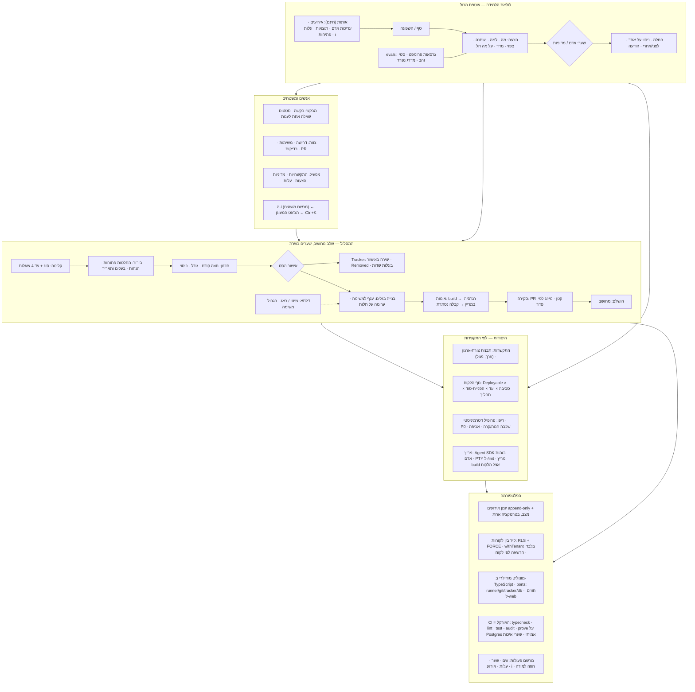

# DCC — סינתזה הוליסטית: מערכת אחת שעובדת בהרמוניה

**מה המסמך הזה.** המסמך השמיני והאחרון של המחקר. שבעת המסמכים הקודמים ענו
כל אחד על תדריך אחד; זה מחבר אותם למערכת אחת: מה משותף, איפה הם סותרים ואיך
זה נפתר, איך המערכת נראית כתרשים אחד, באיזה סדר בונים, ואיך משאירים מקום
לעוד המון תכונות ונושאים שיבואו. הוא נפתח בשורה תחתונה בעברית פשוטה ומסתיים
ברשימה **אחת** של החלטות שרק אתה יכול לקבל — מאוחדת משבעת המסמכים ומסודרת
לפי מה שחוסם את הצעד הראשון.

**איך לקרוא.** קודם את סעיף 1 כאן. אחר כך, לכל נושא, את סעיף 1 ("השורה
התחתונה") של המסמך שלו ואת סעיף ההחלטות בסופו. את הפרטים — רק כשמחליטים.

| מסמך | מה הוא קובע |
|---|---|
| `product-genericity-recommendation.md` | למי DCC משרת: צורות ארגון, רמת ההתקשרות, (ערך, נעול), שתי מילים |
| `repo-onboarding-recommendation.md` | הטמעה כ"מאמן אישי לריפו": אבחון דטרמיניסטי → כללים גלויים → סט רכיבים שונה לכל ריפו עם "כי ראיתי" → אימות ומדידה → מאמן מתמשך. ההוכחה: 11 ריפואים, 11 סטים. (+ `onboarding-walkthrough-trade.html`) |
| `request-to-delivery-recommendation.md` | המסלול: שלב מחושב, החלטות פתוחות עם הנחות, חוזה קודם, בדיקות נסתרות, דלתא |
| `client-environments-recommendation.md` | הנוף: Deployable × סביבה × יעד × הפניית-סוד × תהליך; סודות כהפניות |
| `learning-system-recommendation.md` | הלולאה: אות → סף → הצעה → שער → מדידה → הודעה; ולפני הכל — evals |
| `info-hints-recommendation.md` | ה-"i": מרשם מושגים עם שלושה קוראים ו-lint, כחבילה ניידת |
| `code-architecture-recommendation.md` | הקוד: לא שכתוב; מודול-מודול מול אורקל; TypeScript; מונוליט מודולרי; SDK |

הראיות: `docs/research/sources/` (סקר הקוד, המדדים, שבעה קובצי סריקת-עולם
עם דרגת ראיה לכל טענה, ותוצאות הניסויים).

---

## 1. השורה התחתונה

**DCC נכון ביסודות ושגוי בצורה — ולכן לא שכתוב, אלא בנייה מחדש מודול-מודול,
בלי לעצור את הפיילוט.** חמש ההחלטות הבסיסיות עומדות (יומן אירועים, זהות
של אדם, קיר בין לקוחות, מבנה לקוח→פריט, סדר resolution). מה שמסביב נבנה
בתשעה ימים כאב-טיפוס שהצליח, ועכשיו צריך את הצורה של מוצר.

**שלושה חוסרים חוזרים בכל שבעת המסמכים — ולכן הם הסדר:**

1. **אין אורקל.** 3.9% בדיקות, בלי CI, בדיקות שהסוכן רואה ושופט בעצמו,
   הטמעה בלי לולאת אימות, ריפו של לקוח בלי מריץ. בלי "משהו שאומר עבר/נכשל"
   אף אחד מהשינויים למטה לא ניתן לאישור באחריות. **ראשון: CI, הוכחות על
   Postgres אמיתי, בדיקות קבלה נסתרות, ו-P0 בהטמעה.**
2. **אין מדידה.** פרומפטים בלי גרסה ובלי סט בדיקה; מדיניות ניתוב שמצהירה
   על אותות שאיש לא מחשב; הטמעה שאף פעם לא נמדדה לפני/אחרי; "i" שאיש לא
   יודע אם נקרא. **שני: לרשום את האותות (כולל עריכות אדם לתוצר AI שהיום
   שקטות), גרסאות ו-evals לפרומפטים, לפני/אחרי לכל שינוי.**
3. **חסרה הישות האמצעית.** בין "לקוח" ל"דרישה" חיים כללי האישור, התקציב,
   מקור האמת, הסביבות, מדיניות ההנחות ומדיניות הלמידה — ואין להם היום מקום.
   **שלישי: רמת ההתקשרות (engagement), עם תבניות צורת-ארגון ו-(ערך, נעול)
   לכל הגדרה.**

**ושלושה עקרונות חוצים שכל מסמך הגיע אליהם בנפרד — הם ה"הרמוניה":**

- **טיוטה קודם, אדם בשער, הכול נרשם.** משימות לפני TFS, קובצי הטמעה לפני
  PR, הצעות למידה לפני החלה, ניסוחי "i" לפני פרסום, סביבות לפני פריסה. כל
  מערכת בעולם שעובדת עושה כך; DCC כבר עושה כך במסלול — ועכשיו בכל מקום.
- **מצב מחושב, אף פעם לא נכתב ביד.** סטטוס משימה (כבר), שלב דרישה (עוד
  לא), מוכנות ריפו, סחף סביבה, "נמדד/לא הוכח" של הצעה. זה מה שמסיים את
  "שלב 5 ✓ ליד שלב 1 נוכחי".
- **תוכן כנתונים, מרשם אחד, קוראים רבים.** מושגי ה-"i" (ה-i, הצ'אט, המתעד),
  מרשם הפעולות (כפתור, צ'אט, API, אירוע, חוזה למידה), תבניות צורת-ארגון,
  פרומפטים עם גרסה. אף מוצר שבדקנו לא עושה את השילוב הזה — זה הבידול.

**מה זה אומר למשתמש על המסך, בשורה:** דרישה מראה שלב אחד ומה צריך ממך
עכשיו; פס קבוע "מתקדמים על 2 הנחות · ממתינים לדני עד 5.10"; משימות בגלים,
לא בגרף; כל בדיקה עם מספר; לשונית "הצעות" עם לפני/אחרי; ה-"i" עונה ראשון
והצ'אט מעוגן ליד המסך, לא עליו; ומילים בעברית — "בקשה" למי שביקש, "דרישה"
למי שבונה.

**מה זה עולה, בקצרה:** הדרך המומלצת היא 6 גלים, כל אחד ירוק בפני עצמו, ללא
הקפאה, בערך 4–6 חודשים אלמנטריים במקביל לפיצ'רים; שכתוב מלא היה מגיע לאותו
יעד אחרי 6–10 שבועות הקפאה וסיכון גבוה (מסמך הארכיטקטורה, 5.7).

**שלוש ההחלטות שחוסמות את השבוע הראשון:** (1) הדרך — הדרגתי (אם לא, כל
השאר משתנה); (2) מודל החשבון של Claude — API key לאדם (מאפשר SDK, זהות,
עלות מדויקת); (3) מריץ Windows אצל Trade (בלעדיו אין בדיקות אמיתיות ואין
P0). השאר — סעיף 9.

---

## 2. מה משותף לכל המסמכים — התבניות שחוזרות

| תבנית | איפה היא מופיעה | מה זה מחייב במערכת אחת |
|---|---|---|
| **טיוטה → שער אדם → אירוע** | משימות ל-TFS (מסלול); קובצי הטמעה ל-PR (הטמעה); הצעות (למידה); ניסוחים (i); סביבות ופריסה (סביבות) | מנגנון אישור אחד: `runAction` עם שם, אדם, עלות, אירוע — ומדיניות "אוטומטי" רק כערך נעיל להתקשרות |
| **מצב מחושב מעובדות** | סטטוס משימה (קיים); שלב דרישה; מוכנות ריפו (P0); סחף סביבה; "נמדד" להצעה | פונקציה טהורה + `prove:` לכל אחת; המסך רק מציג |
| **הנחה במקום חסימה** | החלטה פתוחה → assumed (מסלול); הטמעה "שקט + דיווח" לפעולות הפיכות; `/init` שמציע ולא כותב | כל "לא יודע" הופך לרשומה עם בעלים, תאריך ומה קורה כשמתברר |
| **דטרמיניסטי קודם, מודל אחר כך** | build recipe לפני מודל (קיים); Discover בהטמעה; רשימת בשלות לפני assess; ניתוח כיסוי אחרי breakdown; שלב-אפס בצ'אט; אשכול SQL לפני Sonnet | "הטוקן הזול ביותר הוא זה שלא נשלח" — כעיקרון תכנון, לא רק כלכלה |
| **סוכן לא מדרג את עצמו** | בדיקות קבלה נסתרות; אימות הטמעה על קבצים אמיתיים; סקירה יריבה בהקשר טרי; evals עם מדרג נפרד | שני שחקנים לכל שער איכות |
| **מרשם אחד, קוראים רבים** | מושגים (i/צ'אט/תיעוד); פעולות (כפתור/צ'אט/API/אירוע/למידה); תבניות ארגון; מדיניות | קונפיגורציה כנתונים עם סכמה; קוד קורא, לא מכיל |
| **(ערך, נעול) לפי רמה** | תקציב, מדיניות הנחות, אוטומציה, מילים, בדיקות, סביבות | `resolve()` אחד: global → engagement → workitem, נעילה מלמעלה |
| **הריפו אומר מה ואיך; הלקוח אומר לאן ובזהות מי** | הטמעה ↔ סביבות | גבול ברור בין פרופיל ריפו לנוף לקוח |
| **הכול נמדד לפני/אחרי** | הטמעה (Δ), הצעות, פרומפטים, ניסוחים, ניתוב | טבלת אותות אחת; חלון ומעקות מוצהרים |

---

## 3. איפה המסמכים סותרים — ואיך זה נפתר

| סתירה | בין | ההכרעה |
|---|---|---|
| **הזהות של קריאות Claude.** "זהות תמיד אדם" (החלטה 2) מול `claude -p` תחת חשבון המכונה | עקרונות ↔ קוד ↔ ארכיטקטורה | ארכיטקטורה (SDK + API key לאדם) גוברת; עד אז — הרשומה ב-DCC היא הזהות, והמגבלה נאמרת במפורש |
| **`--bare` לריפו זר** מול login של host | ארכיטקטורה ↔ הטמעה | `--bare` דורש API key → תלוי בהחלטה על מודל החשבון; עד אז `--setting-sources local` + deny מפורש, ואימות שה-hooks של הריפו הזר לא נטענים בריצות implement |
| **"מודל הנתונים משתנה רק ברמת ההתקשרות"** (גנריות) מול ישויות חדשות בסביבות, מסלול, למידה, i | גנריות ↔ שאר | הכלל הוא לא "אין ישויות חדשות" אלא "כל ישות חדשה: additively, עם `client_id` + RLS + אירוע, ותלויה בהתקשרות כשיש לה מדיניות" |
| **סביבות שייכות ללקוח או להתקשרות** | סביבות ↔ גנריות | להתקשרות (שם חיים האישורים והזהות); לקוח = ברירת מחדל כשיש התקשרות אחת |
| **מותר להוסיף קוד לריפו של לקוח?** (בדיקות נסתרות, `.gitignore`, סקריפט build) | מסלול ↔ הטמעה | כן — כפריט מסומן בכרטיס המלצה, לעולם לא בשקט; החלטה אחת (סעיף 9, D7) |
| **"צ'אט אחד לכל המערכת, מסביר כל כפתור"** (עקרונות §4) מול "ה-i עונה ראשון, הצ'אט יורד בדרגה" | עקרונות ↔ למידה ↔ i | לא סתירה: אותו מרשם; ה-i הוא הדלת הראשונה, הצ'אט השנייה, ושניהם עונים אותו דבר; העקרונות מתעדכנים במילה אחת ("מעוגן") |
| **"אין פעולה שקטה"** מול הורדת מאמץ אוטומטית | עקרונות ↔ למידה | מותר רק במדיניות נעילה של ההתקשרות, הפיך, נרשם כפעולה עם האדם שקבע את המדיניות, ומוכרז ב"מה השתנה" |
| **הפרומפט של הבשלות טוב — לשמור** מול "בלי evals כל שיפור הוא דעה" | מסלול ↔ למידה | שניהם: לשמור *ו*למדוד; סט הזהב הראשון = 20 הדרישות של DCC Internal ו-Trade |
| **`/init` הוא הדרך** מול "שלוש הטמעות בשבועיים בלי החלטה" | הטמעה ↔ היסטוריה | ההטמעה היא תהליך קבוע (אבחון → כללים גלויים → כרטיס לכל רכיב → אימות → מאמן מתמשך) עם תוצאה שונה לכל ריפו; `/init` = מחולל טיוטה אחד בתוכו; ה-PTY נשאר רק בשבילו |
| **שכתוב מאפס ושפה אחרת מותרים** מול "להישאר ב-TypeScript, מודול-מודול" | התדריך ↔ ארכיטקטורה | הראיות (Bun/Google/METR/SDK) גוברות; הדלת נשארת פתוחה דרך ספייק של שבועיים שמכריע במספר |
| **מסך המבקש** — "אחרי ניהול משתמשים" (גנריות) מול "המבקש עונה בעצמו" (מסלול) | גנריות ↔ מסלול | בינתיים: מכתב + קישור-תשובה חד-פעמי בלי חשבון; משטח מלא כשיש משתמשים |
| **`StatTile.info` אופציונלי** מול `CLAUDE.md` "חובה" | קוד ↔ מסמכים | חובה (או לעדכן את המסמך — החלטה קטנה במסמך ה-i) |

---

## 4. המערכת כתרשים אחד

**ארבע שכבות ולולאה אחת.** אנשים ומשטחים למעלה; המסלול באמצע; היסודות
שכל דרישה נשענת עליהם (התקשרות, נוף, ריפו, מריץ); הפלטפורמה למטה; ולולאת
הלמידה שקוראת מכל השכבות ומציעה שינויים לכולן — דרך אותו שער.

**מה מחבר ביניהן בפועל:** מרשם הפעולות. כפתור במסך, שאלה בצ'אט, קריאת API,
אירוע ביומן, "i" שמסביר, וחוזה הלמידה — כולם רשומה אחת לכל פעולה. זה מה
שמאפשר להוסיף תכונה בלי לשכוח שכבה (סעיף 7).

---
## 5. סדר ביצוע אחד — 46 שינויים, 6 גלים

שבעת המסמכים הציעו 46 שינויי OpenSpec. כמה מהם חופפים (מסומנים "מוזג");
הסדר נקבע לפי תלות אמיתית ולפי שלושת החוסרים של סעיף 1: אורקל → מדידה →
ישות אמצעית. כל גל ירוק בפני עצמו; הפיילוט לא נעצר.

| גל | שם | שינויים | למה עכשיו |
|---|---|---|---|
| **0 — החוזה** (שבועות 1–3) | האורקל, האבטחה, האותות | `ci-and-real-postgres-oracle` · `tenant-wall-hardening` · `structured-output-now` · `learning-signals` · `info-hints-fixes` · תיקון היגיינה (`fix/`) · **ספייק SDK של שבועיים** (`agent-runner-sdk`, שלב א') | בלי אורקל אין אישור; 24 routes פתוחים הם סיכון היום; אותות שלא נרשמים אובדים; הספייק מכריע את קצב הגלים הבאים |
| **1 — היסודות** (שבועות 3–7) | הישות האמצעית והמצב המחושב | `engagement-level` (+`org-shape-templates`, תיקון `project.md`) · `requirement-stage-machine` · `module-boundaries` (baseline packwerk) · `event-and-state-transaction` · `prompt-versions-and-evals` · `help-content-as-data` | הכול נשען על התקשרות ועל שלב מחושב; גבולות מוקפאים לפני שמזיזים מודולים |
| **2 — המסלול והנוף** (שבועות 6–12) | מה שהלקוח מרגיש | `open-decisions` · `intake-form-and-readiness-eval` · `breakdown-contract-first` (+`ado-hierarchy-as-setting` מוזג) · `client-landscape-model` · `credential-refs-and-vault` · `tracker-sync-ownership` · `proposal-object` · `shared-contracts` · `repo-diagnosis` · `onboarding-trial-and-eval` · `proc-and-adapters-consolidation` | הפינג-פונג, הפירוק וה-TFS הם הכאב היומי; P0 ומדידה בהטמעה לפני שמייצרים קבצים |
| **3 — הסגירה** (שבועות 10–18) | מעגלים שנסגרים ביושר | `agent-runner-sdk` (מלא) · `held-out-acceptance-checks` · `onboarding-proposal-cards` · `onboarding-install-verify-deliver` (+`landscape-discovery-in-onboarding` מוזג) · `delta-change-records` · `routing-by-outcome` · `apply-measure-announce` · `help-package` | בדיקות נסתרות דורשות מריץ + SDK; הצעות דורשות מדידה; החבילה דורשת תוכן כנתונים |
| **4 — המסכים והצ'אט** (שבועות 16–22) | מה שרואים | `screens-by-stage` (= `requirement-and-flow-screens`, מוזג) · `chat-structure-first` · `help-measure` (+`help-drafts-and-drift-check`) · `landscape-probes-and-drift` · `operator-catalog` | מסך-שלב אפשרי רק כשהשלב מחושב וההחלטות קיימות; הצ'אט נשען על מרשם הפעולות והמושגים |
| **5 — ההרחבה** (חודש 6+) | מה שפותח לקוח שני | `requester-surface` · `help-per-client` · `deploy-actions` · `world-watch` · `repo-coach` (על `proposal-object`+`world-watch`) · `consolidation-sweep` (חוזר חודשי מגל 1) | דורש משתמשים, כספת, ולקוח שני שמצדיק |

**כלל לכל שינוי, בלי יוצא מן הכלל:** proposal של 4 שאלות (מי, מה "גמור",
מחוץ לגבולות, דחיפות) → החלטות פתוחות עם בעלים → משימות קטנות עם חוזה
קודם → `prove:` משלו כבדיקת קבלה נסתרת → PR ירוק → הישן נמחק באותו שינוי →
"i" וחוזה למידה לכל מסך ופעולה חדשים. זה המסלול המומלץ, מופעל על DCC עצמו.

**מדדי הצלחה של כל המהלך** (נמדדים במרכז הבקרה, לפני/אחרי):

| מדד | היום | יעד אחרי גל 4 |
|---|---|---|
| זמן מבקשה לתוכנית מאושרת (מכונה / אדם) | ~6 דק' / ~15 דק' (Trade) | מכונה דומה; אדם −50% (טופס, ניתוח, אישור כסט) |
| משימות שעוברות בדיקת קבלה נסתרת בניסיון ראשון | לא נמדד (אין נסתרות) | נמדד; ≥60% ועולה |
| עלות AI לדרישה | $1.41 (בלי מימוש) | מוצג לפי שלב; לא עולה |
| הצעות למידה שהוחלו ונמדדו "שיפר" | 0 | ≥5 בחודש, כל אחת עם לפני/אחרי |
| הטמעה: Δ על 3–5 משימות ייצוגיות | לא נמדד | נמדד לכל ריפו; מוצג בכרטיס |
| routes בלי אימות / טבלאות בלי RLS | 24 / 6 | 0 / 0 |
| שכפול / מעגלים אמיתיים / כיסוי core על קוד חדש | 1.9% / 1 (מתוך 14 לפי madge) / 3.9% | ≤3% (0 חדש) / 0 / ≥75% |
| "i": "נפתח ואז נשאל" | לא נמדד | נמדד ויורד |

---

## 6. מה זה אומר עבור DCC עצמו — המערכת החדשה עוברת את ה-onboarding של עצמה

- **DCC Internal הוא הלקוח הראשון של כל גל.** ההתקשרות הראשונה שנוצרת היא
  "אנחנו הלקוח של עצמנו"; המסלול המומלץ רץ קודם על הדרישות של המחקר הזה;
  ההצעה הראשונה בתיבת ההצעות היא תיקון שלב-אפס בצ'אט (הפספוס שנמצא בבדיקה
  החיה); סט הזהב הראשון ל-evals הוא 20 הדרישות של DCC ו-Trade.
- **ההטמעה של הריפו הזה** לפי מסמך ההטמעה: `CLAUDE.md` הארוך מתפצל לשכבה
  חמה (≤150 שורות, `AGENTS.md` + `CLAUDE.md` שמצביע עליו) ושכבה קרה
  (`docs/`, הלקחים), עם אכיפה ב-hooks — ומדידה לפני/אחרי על 3–5 משימות
  ייצוגיות של DCC. הריפו הזה הוא ריפו מס' 1 שמקבל "כרטיס מוכנות".
- **המילים החדשות של המחקר** — התקשרות, החלטה פתוחה, הנחה, גל, חוזה, יעד,
  נוף, הצעה, "נמדד" — נכנסות למרשם ה-"i" לפני שהמסכים שלהן נבנים; זה מבחן
  "עברית פשוטה" של כל מסמך כאן.
- **המחקר עצמו כתבנית:** שמונת המסמכים נכתבו בתבנית אחת (שורה תחתונה →
  עולם → קיים → גנריות → תשובות → מסך → מה משתנה → לא ידוע → OpenSpec →
  החלטות). זו תבנית טובה ל-`docs/history/<name>.md` של כל נושא גדול שיבוא.

---

## 7. מקום לעוד המון תכונות — "צורת התכונה"

המערכת תמשיך לצמוח. כדי שתכונה חדשה לא תשבור את ההרמוניה, היא עונה על
**עשר שאלות** לפני שנבנית — ורובן נאכפות באותו `audit:stale`:

| השאלה | איפה זה נרשם | נאכף? |
|---|---|---|
| 1. על איזו ישות היא יושבת? (התקשרות / דרישה / משימה / ריפו / סביבה / הצעה) | ה-proposal | סקירה |
| 2. באיזה שלב של המסלול היא פועלת, ומה היא משנה במצב המחושב? | `requirement-stage` / `task-status` | `prove:` |
| 3. איזו מדיניות (ערך, נעול) היא מקבלת מההתקשרות? | `resolve()` | טיפוסים |
| 4. אילו אירועים היא כותבת? (אף פעם לא אפס) | מרשם הפעולות | audit |
| 5. איזה "i" יש לכל מסך/כפתור/מונח חדש? | מרשם המושגים | audit + hook |
| 6. מה חוזה הלמידה שלה — אות, "גרוע יותר", סוגי הצעה, פעולת-אדם שהיא תיקון? | מרשם הפעולות | audit |
| 7. מה האורקל שלה — איזה `prove:`/בדיקת קבלה נסתרת? | `packages/*/prove` | CI |
| 8. דרך איזה port היא נוגעת בעולם? (runner / git / tracker / db) — לעולם לא ישירות | גבולות המודולים | dependency-cruiser |
| 9. מה קורה ללקוח שני / לצורת ארגון אחרת? | תבנית צורת-ארגון | סקירה |
| 10. מה הטיוטה, מה השער, ומה נרשם? | `runAction` | טיפוסים |

**דוגמאות לתכונות שכבר נראות באופק, ואיפה הן נכנסות בלי לשבור:**

| תכונה עתידית | ישות / שלב / port | מה כבר מוכן בשבילה |
|---|---|---|
| Jira או GitHub Issues במקום ADO | port `tracker` + תבנית צורת-ארגון | טבלת בעלות שדות; מדרגות כהגדרה |
| התראות ב-Slack / Teams על החלטה פתוחה או הצעה | ערוץ = adapter של "הודעה"; ישות החלטה/הצעה | בעלים + תאריך על החלטה; "מה השתנה" |
| חיוב ושעות לפי התקשרות | ההתקשרות + יומן הקריאות | appetite כשעות חוזה; עלות לפי שלב |
| ספק מודל שני / Managed Agents | port `agent-runner` | הערכת עלות מה-API; evals לפי מודל |
| סריקת אבטחה כבדיקה | `checkKind` חדש | בדיקות בלי מודל קודם; אורקל נסתר |
| אפליקציית מבקש בנייד | משטח המבקש + `contracts` | שתי מילים; קישור-תשובה |
| מאגר ידע ללקוח | `help-per-client` + נוף הלקוח | override לפי לקוח |
| סוכנים במקביל על דרישה | גלים + בעלות קבצים + ערימה | `taskOverlaps`, `merge-tree`, סבבים |
| מרכז PR מלא | שלב "סקירה" במסלול | קיים; מקבל חוזה למידה ובדיקות |
| פריסה בפועל (solution import, publish) | `deploy-actions` על יעד + תהליך | הנוף, הפניות-סוד, probes |

---

## 8. מה עוד לא ידוע — מאוחד

1. **מספרים שרק ריצה נותנת:** הספייק על ה-SDK (עלות/פגמים/סקירה למודול);
   Δ של הטמעה על Trade; שיעור מעבר בדיקות נסתרות; כמה שאלות לקוח עונה
   בשבוע; עלות בדיקת בשלות על ריפו של 100k קבצים.
2. **מה העולם לא מדד:** הבהרה מול לקוחות אמיתיים; האם spec-driven משפר
   מסירה; חוזה-קודם מול ערימה מול סדרתי; גלגל תנופה ב-B2B; האם "i" עדיף על
   צ'אט למי שאינו מפתח. DCC ייצר את הראיות של עצמו — ולכן כל שינוי נמדד.
3. **תשתית אצלך:** Postgres ל-CI; כתובת ציבורית ל-webhooks של ADO; מריץ
   Windows אצל Trade; מדיניות טלמטריה ממכונות מפתחים; חוזה API key מול מנוי.
4. **מודל ההרשאות** (מי רואה איזה לקוח) — תנאי ללקוח שני, לא עוצב.

---

## 9. החלטות שרק אתה יכול לקבל — רשימה אחת, לפי מה שחוסם ראשון

ההמלצה מסומנת; הפירוט והחלופות — במסמך שבסוגריים.

**חוסמות את גל 0 (השבועות הראשונים):**
1. **הדרך.** הדרגתי מודול-מודול מול אורקל, בלי הקפאה — **מומלץ**; שכתוב
   מלא בפריטי; או "רק אבטחה עכשיו" לחודש-חודשיים. (ארכיטקטורה 1)
2. **מודל החשבון של Claude.** API key לכל אדם — **מומלץ** (זהות, SDK,
   `--bare`, עלות מדויקת); או להישאר על ה-login במכונה. (ארכיטקטורה 2)
3. **מריץ build/בדיקות אצל Trade.** לבקש runner Windows — **מומלץ**; עד אז
   review-only מוצהר. (הטמעה 1, סביבות 3, מסלול 5.8)
4. **הסודות בריפו של Trade.** מי אומר להם ומתי — לפני ההטמעה הבאה
   (**מומלץ**) או כחלק ממנה. (הטמעה 5, סביבות 5)
5. **הרשאות ואימות לפני לקוח שני.** לבנות בגל 0 — **מומלץ**. (ארכיטקטורה 5)

**חוסמות את גל 1–2:**
6. **רמת ההתקשרות עכשיו, ואיזה שתי צורות ארגון ראשונות.** אחרי
   `org-shape-templates`, לפני לקוח שני; בית תוכנה↔לקוח חיצוני ו"אנחנו
   הלקוח של עצמנו" — **מומלץ**; והשם: "התקשרות" (מדויק) או "פרויקט" (מוכר).
   (גנריות 1, 2, 4)
7. **"מתקדמים על הנחות" כברירת מחדל.** מותר ומסומן, ניתן לנעול "אסור"
   ללקוח — **מומלץ**. (מסלול 1)
8. **ישות אחת עם סוגים, ו"בקשה" למבקש.** — **מומלץ**. (מסלול 3, גנריות)
9. **מותר להוסיף קוד לריפו של לקוח** (בדיקות קבלה נסתרות בתיקייה מוגנת,
   `.gitignore`, סקריפט build) — כפריט מסומן — **מומלץ**. (מסלול 4, הטמעה 2)
10. **מדרגת הסיכון בהטמעה:** "שקט + דיווח" לפעולות הפיכות — **מומלץ**.
    (הטמעה 3)
11. **זהות וכספת ללקוח הראשון:** SPN + WIF ל-Dataverse, GitHub App ל-git;
    Key Vault במנוי של DCC לפיילוט — **מומלץ**. (סביבות 1, 2)
12. **הדרישה עצמה ב-ADO** כפריט-אב באישור הסט — **מומלץ**. (מסלול 5)

**חוסמות את גל 3–4:**
13. **למידה חוצת-לקוחות** — מספרים בלבד, תוכן לעולם לא — **מומלץ**; ו**החלה
    אוטומטית** — רק הפיך, נמדד, ובמדיניות של ההתקשרות — **מומלץ**. (למידה
    1, 2)
14. **הצ'אט** — נשאר ויורד בדרגה: מעוגן, מבנה קודם, כפתורי פעולה — **מומלץ**.
    (למידה 3)
15. **באג באמצע בנייה** — "לא בוער — מחכה" כברירת מחדל — **מומלץ**. (מסלול 6)
16. **AGENTS.md כקובץ המשותף** (Cursor/Copilot של הלקוח נהנים) — **מומלץ**.
    (הטמעה 4)
17. **ספריית ה-"i"** — קוד פתוח בשם ניטרלי — **מומלץ**; תוכן בקבצים עכשיו,
    מסד עם override לפי לקוח אחר כך; AI מנסח טיוטה, אדם מאשר. (i 1–3)
18. **תקציב ללמידה** — תקרה חודשית מוצגת ונאכפת ($30 לפיילוט) — **מומלץ**;
    וטלמטריה ממכונות מפתחים — ספירות בלבד בהסכמה. (למידה 5, 6)

**חוסמות את גל 5:**
19. **כניסה ללקוח בשנה הקרובה** — קובע אם משטח המבקש נבנה. (גנריות 3)
20. **DCC פורסת בכלל** — רושמת ומאמתת קודם, פריסה כפעולה אחרי חודש עם
    Trade — **מומלץ**. (סביבות 3)
21. **silo ללקוח** — האם להתחייב להתקנה נפרדת (מחזק את המונוליט ואת
    `docker compose`). (גנריות 5, ארכיטקטורה 6)
22. **Postgres ל-CI** — Neon branch אם מותר ענן, אחרת Docker. (ארכיטקטורה 4)

**מה לא צריך החלטה שלך** (ההמלצה חד-משמעית והראיות חזקות): TypeScript;
מונוליט מודולרי; יומן היברידי ולא event sourcing; CI כאורקל; מצב מחושב;
טיוטה-קודם; `--json-schema` מיד; ה-"i" נשאר; שלושת התיקונים הקטנים בכל
מסמך.

---

## 10. מה קורה ביום שני בבוקר

1. לקרוא את סעיף 1 של כל מסמך (7 עמודים) ולענות על החלטות 1–5.
2. גל 0 מתחיל בלי לחכות לשאר: CI + Postgres אמיתי, אבטחת routes ו-RLS,
   `--json-schema`, רישום אותות, תיקוני ה-"i", היגיינה — ובמקביל הספייק על
   ה-SDK (שבועיים, מודול אחד, אורקל, מספר).
3. כל אלה כדרישות על "DCC Internal", במסלול המומלץ — כדי שהמערכת החדשה
   תעבור את ה-onboarding של עצמה מהיום הראשון.
4. אחרי הספייק: החלטה 1 מאושרת במספר, וגל 1 מתחיל.

---

## נספח — הנחות שרשמתי ושאלות שעלו

- הנחתי שהאורקל, המדידה וההתקשרות הם *הסדר* ולא רק *הרשימה*; אם תעדיף
  להתחיל ממה שהלקוח מרגיש (גל 2) — אפשר, אבל אז כל שינוי בגל 2 נכנס בלי
  אורקל ועם סיכון גבוה יותר של רגרסיה.
- הנחתי 4–6 חודשים אלמנטריים לגלים 0–4 עם Fable ב-`xhigh` על המודולים
  וסקירה של אדם; הספייק יאמת או יתקן.
- לא אימתתי בפועל שריצות implement (לא-lean) של DCC אינן טוענות
  `.claude/settings.json` של ריפו זר — נרשם כפריט לבדיקה בגל 0.
- שאלה: האם יש לקוח שני באופק בשלושת החודשים הקרובים? זה מקדים את
  ההרשאות ואת ההתקשרות לפני המסלול.
