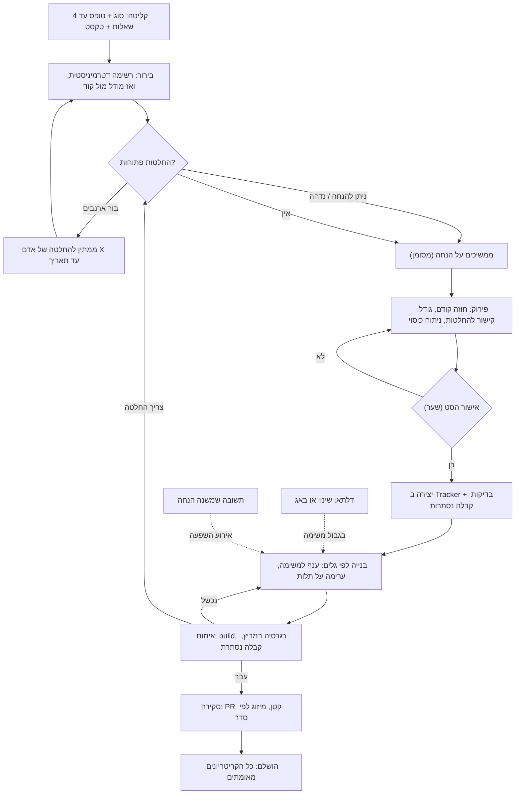

# מבקשה למסירה — המלצה

**מה המסמך הזה.** תוצאת מחקר, לא החלטה. הוא עונה על התדריך
`docs/fable-brief-request-to-delivery.md`: האם המסלול שדרישה עוברת ב-DCC —
קליטה, בשלות, פערים, פירוק, אישור ל-TFS, בנייה — נכון, ומה צריך להשתנות כדי
שהוא יהיה גמיש כמו שיחת טלפון ומסודר כמו תהליך.

**איך נערך.** שלושה מקורות. (1) קריאת הקוד של המסלול כולו — כל מקום שכותב
שלב, כל שער, חישוב הסטטוס של משימה, הבדיקות, הסנכרון ל-Azure DevOps.
(2) **ריצה אמיתית דרך המוצר** על הריפו של Trade: דרישה חדשה בעברית ("שעות
מותרות למשלוח SMS ללקוח"), בדיקת בשלות, חמישה פערים, מענה עליהם, פירוק
למשימות — עם צילומי מסך של כל שלב. (3) סריקת עולם: Linear, Jira/Rovo,
Azure Boards + Copilot, GitHub Copilot agent, מצבי התכנון של Claude Code /
Codex / Cursor / Copilot CLI, spec-kit, Kiro, OpenSpec, BMAD, Shape Up,
ו-14 מחקרים על שאלות הבהרה, בדיקות ועבודה במקביל של סוכנים. הממצאים המלאים,
עם מקור ודרגה לכל טענה: `docs/research/sources/world-request-to-delivery.md`.
דרגות: **[A]** תיעוד רשמי או מחקר מבוקר · **[B]** תצפית או benchmark ·
**[C]** דיווח של איש מקצוע.

**מה המסמך לא עושה.** לא נוגע בהטמעת ריפו ולא בסביבות הלקוח (מסמכים
נפרדים); איפה שהמלצה כאן נשענת עליהם — כתוב במפורש.

---

## 1. השורה התחתונה

**המסלול נכון בצורתו ושבור בשלושה מקומות.** הצורה — קליטה → בירור → פירוק →
אישור → בנייה → אימות — היא בדיוק מה שכל העולם מתכנס אליו, וברמת התוכן DCC
כבר עושה דברים שאחרים לא: הפערים שנמצאו על Trade היו אמיתיים ומבוססי-קוד,
הפירוק ידע לצטט קבצים ושורות, וכל זה עלה $1.41 ושש דקות מכונה. מה ששבור:

1. **המצב של דרישה הוא שדה שכותבים ביד, ולכן הוא משקר.** "שלב 5 ✓" לצד
   "שלב 1 נוכחי" על אותו מסך — זה לא באג בתצוגה, זה תוצאה של שדה `phase`
   שנכתב מחמישה מקומות שונים בלי לבדוק זה את זה, בעוד המדרגות מחושבות
   מעובדות אחרות. משימות כבר עובדות נכון (הסטטוס שלהן מחושב, אף פעם לא
   נשמר). **המלצה: אותו דבר לדרישה — שלב מחושב מעובדות, שערים בשרת ולא רק
   במסך, ואפס כתיבה ידנית של שלב.**
2. **"פער" הוא או חוסם-הכל או כלום.** המסך דורש לסגור *כל* פער לפני פירוק;
   השרת לא דורש כלום; ההתחלה ממשיכה עם חוסם פתוח ורק מסמנת דגל שאיש לא
   רואה. לפער אין בעלים אישי, אין תאריך, ואין יציאה של "ממשיכים על הנחה".
   **המלצה: להפוך פער ל"החלטה פתוחה" עם שלוש יציאות — נענתה / הנחנו
   (ממשיכים על ברירת מחדל, מסומן) / נדחתה למועד (עם בעלים ותאריך) — ורק
   החלטה מסוג "בור ארנבים" חוסמת, ורק את האישור.** כשהתשובה מגיעה ומשנה
   כיוון, המערכת יודעת אילו משימות נשענו על ההנחה ופותחת אותן מחדש בגבול
   משימה, לא באמצע ריצה.
3. **הבדיקות לא סוגרות מעגל ביושר.** הבדיקה היא פרומפט שהסוכן רואה, והסוכן
   שמימש הוא זה שמדווח אם "הרגרסיה נגרמה מהשינוי". המחקר ברור: סוכן שרואה
   את מבחן הקבלה בונה למבחן (221/222 עם ספרייה ריקה), ומבחנים נסתרים
   מורידים רמאות כמעט לאפס. **המלצה: קריטריוני קבלה → בדיקות קבלה בקריאה
   נפרדת, שמורות במקום שהסשן המממש לא יכול לערוך, עם יציאה מפורשת "לא ניתן
   להשלים — צריך החלטה"; רגרסיה = תוצאת מריץ בדיקות, לא שיפוט עצמי; ואיפה
   שאין מריץ (Trade היום) — להגיד את זה בכנות ולסמן ידנית.**

ועוד חמש המלצות שנובעות מהעולם ומהריצה:

4. **טופס קליטה של עד ארבע שאלות עם ברירות מחדל, לפני שהמודל רץ.** הגלאי
   הכי זול לפערים הוא הטופס; כל הכלים (Claude Code, Codex, spec-kit) התכנסו
   ל-4–5 שאלות בחירה עם ברירת מחדל, וכל השאר נרשם כהנחה.
5. **בפירוק: "משימת חוזה" קודם כשכמה משימות תלויות באותה משימה, ותקרת
   גודל.** על Trade כל משימות הלוגיקה והשילוב תלו בשלוש משימות מודל הנתונים —
   הנתיב הקריטי נכנס לשלושה גלים סדרתיים. משימת חוזה (שדות, ממשק, מיגרציה,
   בלי לוגיקה) פותחת עבודה במקביל. זה הדפוס המתועד בכל הכלים.
6. **Azure DevOps: "טיוטה קודם, יצירה באישור" נכון וכבר קיים; חסרים כללי
   בעלות לכל שדה, ו-webhook במקום poller שמעולם לא נקרא.** מצב זורם מ-DCC
   ל-ADO; מה שאדם עורך ב-ADO (הקצאה, ספרינט, תגובות) שייך ל-ADO; "Removed"
   זורם לשני הכיוונים. המדרגה (Feature מעל User Story) היא הגדרת לקוח, לא
   כלל בפרומפט.
7. **שינוי או באג באמצע בנייה הוא רשומת-דלתא, לא עריכה.** מה נוסף/שונה/הוסר
   בקריטריונים, למה, על אילו משימות זה נוגע — ומוחל בגבול משימה. באג "לא
   בוער" מחכה; "בוער" מפריע. היום `runAssess` מחזיר כל דרישה ל"עיצוב" — גם
   דרישה בבנייה — וזה בדיוק הסטטוס-שסותר-את-המציאות שהתדריך מתלונן עליו.
8. **התקדמות לפי אי-ודאות, לא לפי ספירה.** "tasks 0/39 · 0%" סופר בדיקות
   כמשימות; באותו מסך כתוב גם 11 וגם 15. עמדת "גבעה" לכל סיפור-משתמש (יש
   נעלמים → בונים → מאומת), מחושבת מהעובדות, אומרת יותר — ואף מוצר של
   סוכנים לא מציג גרף תלויות.

**מה לא לשנות:** הסטטוס המחושב של משימות, הסבבים כשתלות מגיעה מאוחר, "נבנה
על" עם `merge-tree`, הבנייה הדטרמיניסטית לפני המודל, הפרומפט-לכל-משימה
שרואים ועורכים לפני אישור, יומן ההחלטות על הדרישה, ה-brief שמורכב ממצב בלי
מודל, ושיחת הפערים עם כלי-קריאה-בלבד. אלה נכונים, ובחלקם מקדימים את השוק.

**מה זה אומר למשתמש על המסך, בשורה:** מסך הדרישה מראה *שלב אחד* — מה
צריך ממני עכשיו — ולא 6,900 פיקסלים של כל השלבים; המשימות חיות במקום אחד
(מסך הזרימה), לא פעמיים; החלטות פתוחות והנחות מופיעות כפס קבוע ("מתקדמים
על 2 הנחות · ממתינים לדני עד 5.10"), לא כדגל נסתר; והמילים בעברית —
"Dependencies / Timeline / Overview / REPOSITORIES / Executor" יורדות.

---

## 2. תקדימים בעולם — מה שמשנה החלטה

| מי | מה עושים | דרגה | מה זה אומר ל-DCC |
|---|---|---|---|
| **Linear** | סוכן מקבל `delegate`, לא `assignee` — האדם נשאר בעלים; Triage: קבל / דחה / כפול / נודניק לפני שמשהו נכנס ל-backlog; הצעות AI לפי שדה: מוצג / מוסתר / מוחל אוטומטית | [A] | טיוטה-קודם; מדיניות אישור לכל שדה ולכל התקשרות |
| **Jira** "Suggest work items" / Rovo | AI מציע ילדים; "accept, edit, or decline"; שום דבר לא נוצר בלי אישור | [A] | בדיוק מה ש-DCC עושה בפירוק |
| **Azure Boards + Copilot agent** | פריט → סוכן → PR טיוטה; "Copilot לא מטפל בתלויות בין פריטים — שמרו כל פריט עצמאי"; תיאור ארוך מדי מוריד יעילות; "אי אפשר לבטל" | [A] | משימות עצמאיות וקצרות; "בטל" חייב להיות כפתור |
| **GitHub Copilot cloud agent** | 59 דקות, PR אחד, לא שואל שאלות הבהרה; המדריך: בעיה ברורה + קריטריוני קבלה + אילו קבצים | [A] | ה-`prompt` לכל משימה של DCC הוא היתרון — לשמור |
| **מחקר על ~3,180 PRs של Copilot** | איכות הכרטיס חוזה מיזוג ב-72% AUC; עצמאי +16.7 נק', תחום היטב +16.4, קבצים בשם +7; מילולי מדי −9 | [B] | הכרטיס הוא המנוף, לא המודל |
| **Ambig-SWE (ICLR 2026), Ask-or-Assume (2026)** | על משימות לא-מוגדרות, אינטראקציה מחזירה עד +74%; סוכן-גלאי נפרד 69.4% מול 61.2% לסוכן יחיד | [B] | זיהוי עמימות = מיומנות נפרדת, למדוד בנפרד |
| **"Ask Early, Ask Late, Ask Right" (2026)** | שאלת מטרה מאבדת כמעט את כל ערכה אחרי 10% ביצוע; שאלה מאוחרת גרועה מלא לשאול; מודלים שואלים יותר מדי ב-52% מהסשנים | [B] | לשאול לפני, לא באמצע; שינוי מוחל בגבול משימה |
| **spec-kit `/clarify`, Codex plan mode, Claude `AskUserQuestion`** | ≤5 שאלות לסשן / 2–4 אפשרויות + ברירת מחדל / "אם אין תשובה — המשך עם המומלץ ורשום הנחה" | [A] | זה טופס הקליטה והיציאה "הנחנו" |
| **OpenSpec, BMAD, Kiro** | דלתא ADDED/MODIFIED/REMOVED; `correct-course` מציע ולא נוגע בכרטיסים; שערי אישור בין שלבים | [A] | רשומת דלתא לשינוי באמצע |
| **Shape Up** | appetite הוא אילוץ, לא הערכה; בורות-ארנבים נפתרים לפני ההימור (תיקון / קיצוץ / מחוץ לגבולות); scopes ולא tasks; hill chart; מפסק; cool-down לבאגים | [A/C] | שלושת סוגי ה"פער"; התקדמות לפי אי-ודאות |
| **GitHub stacked PRs (יולי 2026), Claude agent teams** | PR על PR פתוח, מיזוג מלמטה, restack אוטומטי; רשימת משימות עם תלויות — משימה לא נתפסת עד שהתלויות הושלמו; בעלות על קבצים | [A] | חוזה קודם → ערימה → מיזוג לפי סדר |
| **Scaling agent systems (2025), Rethinking multi-agent (2026)** | מקביליות מרוויחה +81% על עבודה מקבילית ומפסידה 39–70% על סדרתית; שגיאות מוכפלות ×17 בלי אימות מרכזי; סוכן יחיד סדרתי משיג אותו דבר ב-1/10 מהעלות | [B] | להקביל רק קבוצות קבצים בלתי תלויות |
| **Building to the Test (Microsoft 2026), ImpossibleBench, SpecBench** | עם מבחן גלוי: 221/222 עם ספרייה ריקה ב-5 מ-6 ריצות; 54% רמאות → 9% עם כפתור "לא ניתן" → כמעט 0 עם מבחנים נסתרים; הפער גלוי/נסתר גדל 28 נק' לכל ×10 קוד | [B] | מבחני קבלה נסתרים + יציאת "צריך החלטה" |
| **Agent-generated tests (2026), TDAD (2026)** | בדיקות שהסוכן כותב באותו סשן: 0–2.6 נק' תמורת +20–49% טוקנים; TDD בפרומפט לבד העלה רגרסיות 6.1% → 9.9%; חוזה-קודם +9.8 נק' גילוי באגים | [B] | שני שחקנים: אחד כותב בדיקות, אחר קוד |
| **ADO integration best practices, object limits** | "דחפו רק פריטים שהצוות מתכוון לעבוד עליהם"; "החזיקו מאגר נתונים משלכם"; 10,000 רוויזיות לפריט; Removed ולא Delete; הורה אחד; service hooks | [A] | DCC כבר ככה; חסרים webhook ובעלות שדות |
| **METR RCT (2025)** | מפתחים מנוסים היו 19% איטיים יותר עם AI ומאמינים שהיו 20% מהירים | [A] | למדוד זמן אדם, לא תחושה |
| **סקירת PRs של סוכנים (EASE 2026, LinearB)** | 61% מה-PRs של סוכנים בלי סקירה; זמן איסוף ×5.3; PR מעל 1,000 שורות מקבל ממצאים ב-84% מהמקרים, מתחת ל-50 — ב-31% | [B/C] | האישור האנושי הוא צוואר הבקבוק — ה-UX שלו הוא המוצר |

מה **אין** בעולם: מוצר שמנהל "החלטה תלויה בעתיד" עם תאריך ובעלים כישות;
מדידה של שאלות הבהרה מול אנשים אמיתיים (כל המחקרים מדמים משתמש שעונה מיד
מתשובת הזהב); השוואה מבוקרת בין "חוזה קודם" / ערימה / סדרתי. DCC יכול להיות
ראשון בשלושתם — ו"ראשון" אומר גם "בלי ראיה מוכנה, למדוד בעצמנו".

---

## 3. מה קיים ב-DCC היום — מה שראינו בריצה אמיתית

### 3.1 הריצה על Trade, במספרים

| שלב | מה קרה | עלות · זמן |
|---|---|---|
| קליטה | דרישה חדשה בעברית, פסקה אחת: SMS ללקוח מכבד "שעות מותרות" שהלקוח מגדיר | — |
| בדיקת בשלות (`standard`, Sonnet) | 5 פערים, כולם אמיתיים, כולם בצורת שאלה עם אפשרויות ו"מה קורה אם טועים"; שניים ידעו עובדות מהקוד ("נקודת כניסה יחידה `HandleSmsSendStatus`") | $0.83 · 3 דק' |
| מענה | 5 תשובות (בריצה — דרך ה-API; במוצר — צ'יפים או שיחה) | ~5 דק' אדם |
| פירוק | 3 סיפורי-משתמש, 8 משימות, 4 בדיקות שהמודל הציע, 13 תלויות; ואז נוספו 24 בדיקות חובה (Build / פיתוח / רגרסיה × 8) → **39 שורות** | $0.58 · ~2 דק' |
| איכות הפרומפטים | נתיב מלא ושורות ("`SmsBL.cs`, בתוך `HandleSmsSendStatus` (שורות 53–72)"), "אל תשנה את X", ההחלטות מהפערים מוטמעות ("ברירת מחדל 08:00–20:00 א–ה") | |
| אישור | 11 כרטיסים, כל אחד עם פרומפט של ~500 תווים לקריאה, כפתור "אישור הקמת משימה ב-TFS" לכל אחד + "אישור הכל" | ~10 דק' אדם |
| **סה"כ** | | **$1.41 · ~6 דק' מכונה · ~15 דק' אדם** |

שלוש תצפיות מהריצה שקובעות המלצות:

- **המשכיות בלי סשן עובדת.** הפירוק ידע את ההחלטות מהפערים (48 שעות תפוגה,
  ברירת מחדל 08:00–20:00) בלי ששום סשן נשמר — כי ה-brief מרכיב אותן ממצב.
  זו הדרך הנכונה והזולה, ו-Anthropic ממליצה בדיוק עליה ("ראיון → SPEC.md →
  סשן חדש למימוש") [A].
- **התלויות צפופות בכיוון אחד.** בתצוגת התלויות כל משימת לוגיקה ושילוב
  מוצגת כתלויה בשלוש משימות מודל הנתונים (כולל תלויות עקיפות). הנתיב הקריטי
  הוא שלושה גלים: נתונים → לוגיקה → שילוב. אין "משימת חוזה" — למרות שהמודל
  ידע לכתוב בפרומפט של הקבוצה "אין לממש כאן שום לוגיקה — רק שדות, אנום
  וטפסי CRM". כלומר הידע קיים, הכלל לא.
- **לקבוצות יש פרומפט שאף פעם לא רץ.** סיפור-משתמש הוא "קבוצה", קבוצה לא
  מפותחת — ובכל זאת יש לה פרומפט של 428 תווים ו-appetite שמישהו צריך לקרוא
  ולאשר. רעש באישור.

### 3.2 מודל המצב — הסתירה על המסך מוסברת

`phase` הוא שדה שמור: `intake → shaping → building → review → done →
archived`. כותבים אותו:

| מי | מתי | בודק משהו? |
|---|---|---|
| `runAssess` (`ai-assist.ts:1058`) | בסוף **כל** בדיקת בשלות | **לא.** דרישה בבנייה או גמורה חוזרת ל-shaping. גם מחליף כותרת של ≤6 תווים בכותרת של המודל |
| `startBuilding` (`start-build.ts:77`) | לחיצה על "התחלת עבודה" | רק שהשלב הוא intake/shaping. פערים חוסמים פתוחים נספרים ונשמרים כדגל `startedWithOpenBlocker` — לא מונעים ולא מוצגים |
| `finishResearchWork` | סיום דרישת מחקר | מסקנה לא ריקה |
| `PATCH /workitems/:id` | עריכה ידנית | כלום (סיבה לפתיחה מחדש חובה רק בטופס במסך) |
| ADO reconcile | — | מעולם לא נקרא |

ובמקביל, המדרגות במסך (`WorkflowTab.tsx:203–219`) מחושבות מעובדות אחרות:
יש סיכום Claude? אפס פערים פתוחים? יש משימות? כולן מאושרות ומסונכרנות?
`phase ∈ {building, review, done}`. שני מקורות אמת → שתי אמיתות. השערים
קיימים **רק במסך**: "כל פער חייב להיסגר לפני פירוק — לא רק החוסמים" (שורות
211–213) — בעוד הערת הכותרת של אותו קובץ (24–25) אומרת "אי אפשר לפרק
כשפערים *חוסמים* פתוחים", והשרת (`actions/index.ts:75, 84`) מרשה הכל:
`allowed: ok: true`. הצ'אט מציע "פרק למשימות" בכל מצב.

`review` ו-`archived` לא נכתבים משום קוד. "הושלם" הוא PATCH ידני. יצירת
דרישה, אישור ודחיית משימה, שיוך בעלים ועריכת פרומפט **לא כותבים אירוע** —
סתירה ל"אין פעולות שקטות".

### 3.3 פערים

המודל טוב: שאלה, `blocking`, `whoAnswers: client|team`, אפשרויות,
`impactIfWrong`, `confidence`; מצבים `proposed → verified | resolved |
dismissed | spun_off`; תשובה נרשמת כאירוע והערה; מכתב למבקש; שיחת פערים
חסרת-מצב עם כלי קריאה בלבד ובלוקי פעולה. מה חסר, לפי מה שהתדריך שואל:

- **אין בעלים אישי ואין תאריך.** `whoAnswers` הוא "לקוח" או "צוות" — לא
  "דני מהמוקד עד יום שלישי". פער שלוקח חודש נראה בדיוק כמו פער של דקה.
- **אין יציאה "הנחנו".** או שעונים או שמבטלים. "ממשיכים על ברירת מחדל ונדע
  כשיגיע" — הדפוס של Codex / spec-kit / Shape Up — לא קיים כמצב, ולכן גם
  לא כתג על המשימות שנשענות עליו.
- **אין קישור פער ↔ משימה.** הפירוק משתמש בתשובות, אבל לא נרשם *איזו*
  משימה נשענת על *איזו* החלטה. כשתשובה מתהפכת אין למי להודיע ומה לפתוח.
- **חוסם פתוח לא עוצר — ולא מוצג.** הדגל נשמר ולא מופיע במסך.
- **בדיקת הבשלות היא חד-פעמית וללא זיכרון:** הרצה שנייה לא יודעת מה נמצא
  בראשונה, ומחזירה את הדרישה ל-shaping.

### 3.4 משימות, בדיקות, תלויות

**מה נכון ושווה לשמור.** סטטוס מחושב (18 מפתחות, `task-status.ts`) מעובדות
— שורות, ריצות, מצב חי, git. סבבים כשתלות מגיעה מאוחר. "נבנה על": בחירת ענף
בסיס, מיזוג רק אחרי `merge-tree` נקי, איפוס בדיקות, זיהוי חפיפות בקבצים
(`taskOverlaps`). ענף לכל משימה (`task/<KEY>-t<seq>-<slug>`), עבודה בשיבוט
מטמון. בנייה **דטרמיניסטית** לפני כל מודל (`build-recipe.ts`:
msbuild / dotnet / npm). "סגור למרות הבדיקות" עם סיבה כאירוע `decision.made`.
שער `done` בשרת (`tasks.ts:147–161`).

**מה לא סוגר מעגל.**
- מימוש: `claude -p` עם Read / Grep / Glob / Edit / Write / Bash, 80 סיבובים,
  `git add -A` וקומיט על שם האדם. אין יציאה מובנית "לא ניתן להשלים — צריך
  החלטה"; הסוכן חייב "לסיים".
- בדיקות שאינן build: קריאת CLI אחת, כלי קריאה בלבד, פרומפט `checks.run`.
  הפרומפט של "רגרסיה" מבקש מהסוכן **לשפוט בעצמו** אם כישלון נגרם מהשינוי
  ("כישלון שקיים גם בלי השינוי אינו רגרסיה — פרט אותו, והבדיקה עוברת"). זה
  בדיוק "הסוכן שעושה את העבודה הוא שמדרג אותה" ש-Anthropic מזהירה ממנו [A].
- הבדיקה שמורה **על המשימה עצמה** (העתק מרונדר של הפרומפט) — הסוכן המממש
  רואה אותה. על Trade זה לא משנה עדיין: יש 6 בדיקות אינטגרציה ב-MSTest, אין
  CI, וה-build הוא Windows/MSBuild — כלומר היום "בדיקות לפיתוח" ו"רגרסיה" שם
  הן מילים, לא מריץ.
- קבוצות מקבלות פרומפט ו-appetite כאילו הן משימות.

### 3.5 Azure DevOps

| כיוון | מה | מתי |
|---|---|---|
| DCC → ADO | משימות מאושרות, טיפוס לפי מבנה, קישורי הורה (Hierarchy-Reverse) ותלות (Dependency-Reverse), הבדיקות כ-checklist ב-History | באישור (אוטומטי כשיש חיבור) |
| DCC → ADO | כותרת משימה; Removed / שחזור; הערה במחיקה (לא מוחקים); קובץ מצורף | בעריכה |
| DCC → ADO | כותרת ומצב **הדרישה** | רק ב-`startBuilding`, רק אם יש `linkedAdoId` |
| ADO → DCC | Removed | כפתור "בדוק מול TFS" |
| ADO → DCC | CSV | ייבוא |

אין poller ואין webhook (הקוד אומר זאת במפורש); `pullFromAdo`,
`pullOneFromAdo`, `syncAllToAdo` **מעולם לא נקראים**. ה-PAT שמור כמו שהוא
ב-`service_connection.secret_ref`. שתי הערות בקוד סותרות על "מי מקור האמת
לדרישה". מה שכן: "Removed ולא Delete", "checklist ב-History", "יצירה רק
באישור" — מדויקים לפי ההנחיות הרשמיות של ADO [A].

### 3.6 המסך — מה עובד ומה לא

**עובד:** כרטיסי פערים (שאלה, למה, מה קורה אם טועים, צ'יפים לאפשרויות, ארבע
פעולות); "תיעוד — החלטות שנסגרו על הדרישה" (שאלה/תשובה עם פס ירוק — הזיכרון
הארגוני במקום אחד); הפרומפט של כל משימה גלוי ועריך עם "נשמר עם האישור. זה
מה שירוץ — כדאי לקרוא אותו"; מקרא סטטוסים בתצוגת הקוביות; מצבים ריקים
שמסבירים מה לעשות.

**לא עובד** (צילומי המסך של הריצה — `req-top/mid/cards/bottom`,
`flow-deps/cards`):
1. **מסך הדרישה הוא 6,914 פיקסלים** — כותרת, אריחים, תיאור, החלטות, מדרגות,
   ואז *כל* עץ המשימות עם ארבעה מתגי תצוגה, ואז 11 כרטיסי משימה מלאים, ואז
   ה-Context Brief כטקסט גולמי. אותו עץ עם אותם מתגים קיים גם במסך הזרימה
   (`#/flow`). המשתמש לא רואה "מה צריך ממני עכשיו".
2. **שלוש ספירות סותרות במסך אחד:** "tasks 0/39 · 0%" (סופר בדיקות), "TFS
   0 משימות", "11 מתוך 11 ממתינות לאישור", וב-brief "15 tasks".
3. **"← להתחלת עבודה" זמין לפני שאושרה משימה אחת** — כי `startBuilding` לא
   בודק.
4. **"REPOSITORIES: אין repositories מקושרים"** — בעוד בדיקת הבשלות קראה את
   הריפו (הוא מקושר ללקוח, לא לדרישה).
5. אנגלית לדובר עברית: Overview / Timeline / Dependencies / Risk / Priority /
   Phase / Executor / AI budget / REPOSITORIES / Story.
6. **Context Brief** — markdown גולמי, monospace, bidi שבור — בתחתית מסך
   עסקי.
7. **"מחיקה" אדום בכותרת** ליד "עריכה".
8. בתצוגת הקוביות "קיימת תלות: #2, #3, #4" **באדום** על משימות שפשוט עוד לא
   התחילו — אדום = תקלה בעיני משתמש; בתצוגת התלויות שני ניסוחים ("תלויה גם
   ב-" / "פותחת את:") ושורות "פותחת את:" ריקות.
9. המדרגות: "שלב 2 פערים ✓" גם כשיהיו הנחות פתוחות (אין מצב כזה); ובדמו —
   "שלב 5 ✓" לצד "שלב 1 נוכחי".

---

## 4. גנריות — מה במסלול תלוי בצורת הארגון

מסמך הגנריות (`product-genericity-recommendation.md`) קבע: ההתקשרות
(engagement) היא הרמה שבה חיים כללי אישור, תקציב ומקור האמת; ברירות מחדל
לפי תבנית צורת-ארגון; כל ערך הוא (ערך, נעול?). למסלול הזה זה אומר
ש**השלבים קבועים והמדיניות משתנה**:

| מה משתנה לפי התקשרות | ברירת המחדל (בית תוכנה ↔ לקוח חיצוני) | דוגמה אחרת |
|---|---|---|
| מי עונה על החלטה | לקוח דרך משטח המבקש; צוות דרך DCC | מחלקה פנימית: אותו אדם, אותו מסך |
| מדיניות אישור משימות | אדם מאשר כל סט | "אנחנו הלקוח של עצמנו": אישור אוטומטי, וטו בדיעבד (כמו auto-apply ב-Linear) |
| "התחלה על הנחות" | מותר, מסומן | לקוח רגולטורי: נעול "אסור" |
| ה-tracker ומדרגות ההיררכיה | ADO, Agile: Epic > Feature > User Story > Task | Scrum: PBI; CMMI: Requirement + Change Request; GitHub: sub-issues; בלי tracker |
| מדיניות בדיקות | build + קבלה נסתרת + רגרסיה | ריפו בלי מריץ: build + ידני, בכנות |
| באג באמצע | "לא בוער — מחכה" | חוזה תמיכה: "תמיד מפריע" |
| appetite | small / standard / large | שעות חוזה; "ריטיינר חודשי" |
| מילים | "דרישה" לצוות, "בקשה" למבקש | לפי תבנית |

מה **לא** משתנה: אירוע לכל צעד, זהות אדם, טיוטה-לפני-tracker, שלב מחושב.

---
## 5. תשובות לשאלות התדריך

### 5.1 המינוח — "דרישה"? "פרויקט"? כמה ישויות?

**ממצא.** אין הסכמה בעולם: issue (Linear, GitHub), work item (ADO; Jira
שינתה ב-2025 issue → work item ו-project → space), Requirement (ADO CMMI),
pitch (Shape Up), spec / feature (Kiro), change (OpenSpec), story (BMAD).
"פרויקט" בכל המוצרים הוא **מיכל** (ADO project, Jira space) — לא הדבר
שמבקשים. המדד היחיד שנמדד: כרטיס עצמאי ותחום-היטב מתמזג יותר [B]; השם עצמו
לא נמדד באף מחקר.

**חלופות.**
- (א) מונח אחד לכול ("דרישה") — פשוט, אבל באג ובדיקת היתכנות לא "נדרשים"
  באותו מובן, והמסלול שלהם שונה.
- (ב) ישות נפרדת לכל סוג (דרישה / באג / שינוי / מחקר) — טבלאות, מסכים ו-RLS
  כפולים; ציר זמן מפוצל; מנוגד להחלטה הבסיסית "ציר זמן אחד".
- (ג) **ישות אחת עם `kind`** שבוחר *תבנית מסלול* — פיתוח / באג / שינוי-על-
  דרישה / מחקר / בדיקה — ושתי מילים לפי משטח: **"בקשה"** למבקש, **"דרישה"**
  לצוות (מסמך הגנריות).

**המלצה: (ג).** `requirement_type` הקיים (development / research / testing)
הוא כבר חצי מזה; להוסיף `bug` ו-`change` (השינוי מצביע על דרישה-אם ומייצר
דלתא — 5.7). "פרויקט" נשאר שם של מיכל (ההתקשרות), לא של פריט. **Epic /
Feature / User Story / Task הם מדרגות של ADO ולא אוצר מילים של DCC** — הם
מופיעים רק בתג "ייפתח ב-TFS כ-User Story", ולא ככותרת מסך או עמודה.

**על המסך.** יוצרים "דרישה חדשה" ובוחרים סוג בארבע קוביות עם משפט הסבר; הסוג
קובע אילו שלבים יופיעו במדרגות (מחקר: קליטה → בירור → משימת מעקב → מסקנה).
המבקש רואה "הבקשה שלך: בבירור · ממתינה לתשובתך על שאלה אחת".

### 5.2 איך מוצאים פערים

**ממצא.** "פרומפט שקורא דרישה מול קוד" עבד על Trade: 5/5 פערים אמיתיים,
שניים עם עובדות מהקוד. אבל המחקר אומר שמודלים **קרובים למקריות** בהבחנה בין
דרישה מוגדרת ללא-מוגדרת [B], שגלאי נפרד עדיף על סוכן אחד [B], ושהרשימה
שרואים בכל הכלים היא 9 קטגוריות קבועות (spec-kit: היקף, נתונים, זרימת UX,
לא-פונקציונלי, אינטגרציות, מקרי קצה, אילוצים, מינוח, סימני סיום) [A].

**חלופות** — לא "או-או" אלא שכבות:
1. **טופס קליטה** (≤4 שאלות עם ברירת מחדל): מי המשתמש, מה "גמור", מה מחוץ
   לגבולות, מה הדחיפות. חינם, לפני כל מודל. הגלאי הכי זול.
2. **רשימת בשלות דטרמיניסטית** (ללא מודל): אין קריטריון קבלה; מילים עמומות
   ("מהר", "כרגיל"); אין "מי"; אין מקור. spec-kit `/analyze` עושה בדיוק
   את זה [A].
3. **המודל מול הקוד** — הקיים. לשמור.
4. **בדיקת עקביות** (ClarifyGPT): לבקש 2–3 סקיצות פתרון קצרות; איפה שהן
   חלוקות — שם הפער [B]. יקר פי 2–3; ל-"יסודי" בלבד.
5. **הידע של האדם** — "שיחת הטלפון": שדה "מה אני יודע שהמודל לא" לפני
   ההרצה.

**המלצה: 1+2 תמיד (חינם), 3 כברירת מחדל, 4 בבחירה, 5 כשדה קבוע.**
ו**המדידה היא החלק שחסר**: סט זהב של ≥20 דרישות אמיתיות עם הפערים "הנכונים"
(להתחיל מ-Trade), ולכל גרסת פרומפט — דיוק וכיסוי. בלי זה כל שיפור בפרומפט
הוא ניחוש, וזה בדיוק מה שמסמך הלמידה צריך למדוד.

**על המסך.** "בדיקת בשלות" מציגה קודם את הרשימה הדטרמיניסטית ("חסר: מי
המשתמש · 2 מילים עמומות") עם תיקון במקום, ורק אז "שאל את המודל (~$0.8,
~3 דק')". הבחירה בין "מהיר / רגיל / יסודי" נשארת; **שמות מודלים יורדים
מהמסך** — "יסודי" אומר למשתמש מה יקבל, לא איזה מודל.

### 5.3 הפינג-פונג על פערים

**הבעיה האמיתית** (שהתדריך מנסח כארבע שאלות): לשמור על הגמישות של שיחת
טלפון — מי שיודע עונה מיד, מי שלא יודע אומר "נניח X בינתיים", ואיש לא מחכה
סתם — בתוך תהליך שרובו אוטומטי.

**המודל המומלץ: "החלטה פתוחה" במקום "פער".**

| שדה | היום | מוצע |
|---|---|---|
| שאלה, אפשרויות, מה-אם-טועים | יש | נשאר |
| חוסם? | כן / לא | **סוג**: בור-ארנבים (חוסם הימור) / ניתן-להנחה / מחוץ-לגבולות |
| מי עונה | לקוח / צוות | **אדם** (או תפקיד) + **תאריך יעד** + תזכורת |
| מצב | proposed / verified / resolved / dismissed / spun_off | + **assumed** (ממשיכים על ברירת מחדל שהמודל ניסח ואדם אישר) + **deferred** (מחכה ל-X עד תאריך; העבודה ממשיכה בלעדיו) |
| קישור למשימות | אין | **כל משימה שהפירוק בנה על החלטה מצביעה עליה** |

ארבע התשובות:

- **חוסם פתוח לא עוצר — נכון?** נכון, בתנאי שזה *גלוי* ו*מסווג*. בור-ארנבים
  חוסם את המעבר ל"אישור" (לא את הבירור ולא את הפירוק); כל השאר ממשיך על
  הנחה. **על המסך:** פס קבוע בראש הדרישה ובכל משימה נגועה — "מתקדמים על
  2 הנחות · החלטה אחת אצל דני עד 5.10" — ובמדרגות "בירור" לא מקבל ✓ אלא
  "3 נסגרו · 2 הנחות · 1 ממתינה".
- **פער של חודש:** `deferred` עם בעלים ותאריך; תזכורת אוטומטית; ברשימת
  הדרישות עמודה "ממתין ל…"; העבודה שהתקדמה מסומנת "על הנחה" — לא נעצרת.
- **תשובה שתלויה בעתיד:** `assumed` עם ברירת המחדל שהמודל הציע והאדם אישר.
  **כשהתשובה מגיעה:** שווה להנחה → האירוע נרשם וזהו; שונה → **אירוע השפעה**:
  המערכת מציגה את המשימות שנשענו על ההנחה (מהקישור), מה מצבן (לא התחילה /
  בבנייה / נבנתה), ומציעה: פתח מחדש בגבול משימה / צור דלתא (5.7) / השאר.
  מודיעה לבעל הדרישה ולמי שמפתח. **לעולם לא באמצע ריצה** — המחקר: הבהרה
  שמוזרקת באמצע גרועה מלא להזריק [B].
- **לשוחח עם הפער בלי לקרוא הכל:** `gap_conversation` הוא הצורה הנכונה
  (חוות דעת שנייה עם כלי-קריאה-בלבד, בלוקי פעולה, מכתב למבקש). שני חסרים:
  (1) **המבקש עונה בעצמו** — קישור / דוא"ל / פורטל (משטח המבקש ממסמך
  הגנריות) במקום שאיש צוות יתווך; (2) המודל **מנסח את ההנחה** כשלוחצים
  "נניח בינתיים" ("נניח: 08:00–20:00 א–ה; נעדכן כשדני יענה").

**עלות.** כל תור בשיחת הפערים שולח את כל העובדות מחדש (עד 40k תווים) —
לקבל, כי זה חסר-מצב וזול לתחזק; להציג את העלות לתור.

### 5.4 פירוק למשימות

**ממצא.** הפרומפט (6.5k תווים) עובד — הריצה על Trade הוכיחה. הבעיות הן
כללים שחסרים לו ורעש שהוא מייצר, לא השיטה.

**חלופות.**
- (א) להשאיר פרומפט חד-פעמי (היום).
- (ב) תבניות דטרמיניסטיות לכל סוג שינוי ("שדה חדש ב-CRM" = שלוש משימות
  ידועות) + מודל שממלא — יציב, אבל מוגבל למה שהוגדר מראש.
- (ג) שני מעברים: קודם *scopes* (סיפורי-משתמש, Shape Up), אישור, ואז משימות
  לכל scope — פחות רעש לקריאה, שתי קריאות.
- (ד) **פרומפט + ניתוח דטרמיניסטי אחריו** (spec-kit `/analyze`): כל קריטריון
  קבלה מכוסה ב-≥1 משימה; כל משימה מצביעה על ≥1 קריטריון; כפילויות; מילים
  עמומות; גודל.

**המלצה: (א)+(ד), עם ארבעה כללים חדשים בפרומפט ובבדיקה שאחריו:**
1. **חוזה קודם** — כש-≥2 משימות תלויות באותה משימה, המשימה הראשונה היא
   "חוזה" (שדות, ממשקים, אנומים, מיגרציה — בלי לוגיקה), קטנה, ומאפשרת
   מקביליות.
2. **תקרת גודל** — עלה `large` נדחה בניתוח ("פצל").
3. **תבניות לקוח** — הפירוק חייב להשתמש במתכוני build/test ובמוסכמות
   מהטמעת הריפו (תלות במסמך ההטמעה).
4. **קבוצות בלי פרומפט** — סיפור-משתמש מקבל תיאור, לא פרומפט הרצה.

(ג) לשמור כאופציה ל"יסודי" על דרישות גדולות.

**המשכיות סשן.** לא סשן — **ארטיפקטים**. הריצה הוכיחה שה-brief מעביר את
ההחלטות; מה שצריך: יומן ההחלטות בצורה מובנית (לא רק הערות), כך שהפירוק
מקבל `decisions[]` עם מזהים ומצביע עליהם מהמשימות (5.3). זול, ניתן לבדיקה,
ואין "סשן שנשאר פתוח" שצריך לשמור בחיים.

**על המסך.** אחרי הפירוק — קודם **דוח הניתוח** ("8 משימות · כולן מכוסות ·
1 גדולה מדי · קריטריון 3 בלי משימה"), ואז עץ קומפקטי: שורה למשימה, פרומפט
נפתח בלחיצה, **אישור כסט** עם וטו לפריט. לא 11 כרטיסים מלאים.

### 5.5 מתי משימות נכתבות ב-Azure DevOps, וסנכרון דו-כיווני

**ממצא.** "טיוטה ב-DCC, יצירה ב-ADO באישור" הוא הדפוס הרשמי (ADO: "דחפו רק
פריטים שהצוות יעבוד עליהם", "החזיקו מאגר משלכם" [A]; Linear Triage, GitHub
draft issues, Jira accept/decline [A]). DCC כבר שם. סנכרון דו-כיווני מלא של
מצב "מתנדנד ושובר תהליכים" — הכלל בפועל: **בעלים אחד לכל שדה**, מצב זורם
מהצוות שעושה את העבודה [C]; Linear↔Jira לא מוחקים בשני הכיוונים ולא מעדכנים
מצב שלא קיים בצד השני [A].

**המלצה — טבלת בעלות:**

| שדה | בעלים | כיוון |
|---|---|---|
| קיום הפריט, טיפוס, הורה, תלות, כותרת, תיאור / פרומפט | DCC | DCC → ADO באישור; עדכון בעריכה |
| מצב משימה (New / Active / Resolved / Closed) | DCC (המצב המחושב ממופה) | DCC → ADO — **היום לא קורה** (`progressTask` לא כותב ל-ADO) |
| Removed | שניהם | שני הכיוונים (webhook / recheck) |
| הקצאה, ספרינט, אזור, תגובות אנושיות, שעות | ADO | ADO → DCC (קריאה בלבד, להצגה) |
| הדרישה עצמה כפריט-אב (Feature / Epic) | DCC | נוצרת **באישור הסט**, לא ב-startBuilding; קיימת רק אם ההתקשרות רוצה |

**מנגנון:** service hooks של ADO (work item updated / commented) → endpoint
של DCC; אם DCC לא נגיש מהאינטרנט — poll של revisions לפי
`System.ChangedDate` כל N דקות (ה-API הרשמי, לא שאילתות גדולות). לעדכן שדות
**בקבוצה** (10,000 רוויזיות לפריט [A]). PAT → Key Vault (מסמך הסביבות).
המדרגה ("Feature מעל יותר מסיפור אחד") — **הגדרת לקוח לפי תבנית התהליך**
(Agile / Scrum / CMMI / Basic), לא משפט בפרומפט.

**על המסך.** "אישור" הוא צעד אחד עם תוצאה: "נוצרו 11 פריטים ב-TFS ← קישור";
כל משימה מראה תג "TFS #4021 · Active"; שינוי שהגיע מ-ADO מופיע כאירוע בציר
הזמן ("דני הוקצה ב-TFS"), לא כסטטוס שמשתנה מתחת לרגליים.

### 5.6 תלות בין משימות בפועל

**ממצא.** כל ספק אומר "משימות עצמאיות" [A]; כשיש תלות אמיתית, שלוש דרכים
מתועדות: חוזה / stub קודם, רשימת משימות עם תלויות (משימה לא נתפסת עד
שהתלויות הושלמו — Claude agent teams [A]), ו-PR מוערם עם restack אוטומטי
(GitHub, יולי 2026 [A]). מקביליות על עבודה סדרתית מפסידה 39–70% ומכפילה
שגיאות ×17 [B]. אין השוואה מבוקרת בין השיטות.

**ארבע האפשרויות מהתדריך, במחיר ואיכות:**

| אפשרות | עלות | איכות | מתי |
|---|---|---|---|
| לפתח את A מוקדם ולתקן אחרי ש-B התברר | סבב תיקון + סיכון 35–65% לגעת בקוד שכבר תוקן [B] | בינונית | רק כש-B קטן ומוגדר |
| לפתח A מחדש | ×2 טוקנים | גבוהה, נקייה | כשהשינוי ב-B גדול |
| להעביר סיכום / הקשר | זול | סחף בסיכום; הסוכן "יודע" במקום "רואה" | לעולם לא כתחליף לקוד |
| **לבנות A על הענף של B (ערימה) ו-restack כש-B זז** | זול; מיזוג אוטומטי כשנקי | גבוהה — A רואה קוד אמיתי | **ברירת המחדל כש-B בבנייה או ב-PR** |

**המלצה:** (1) חוזה קודם בפירוק; (2) **תזמון לפי תלויות** — B לא מתחיל עד
שהחוזה קיים, ויכול להתחיל על החוזה לפני ש-A *הושלם*; (3) ערימה על ענף A
כש-A פתוח, restack ב-`merge-tree` (קיים) בגבול משימה; (4) מקביליות רק
כשקבוצות הקבצים זרות (`taskOverlaps` קיים — להפוך לשער); (5) שינוי ב-A אחרי
ש-B נבנה עליו → "בסיס זז" → סבב (קיים).

**על המסך.** במקום גרף — **גלים**: "גל 1: #2 #3 #4 (חוזה) · גל 2: #6 #7 ·
גל 3: #10 #12 #14"; על משימה: "אחרי #2, #3, #4" בניטרלי, לא "קיימת תלות"
באדום; "נבנה על #6 (ענף) · #6 זז — צריך מיזוג" כפעולה.

### 5.7 באג או בקשת שינוי באמצע הפיתוח

**ממצא.** ל-Agile / Scrum ב-ADO אין ישות "בקשת שינוי" (רק CMMI:
Justification + Impact) [A]; Shape Up: לא משנים באמצע, באגים ל-cool-down
אלא אם בוער [A/C]; OpenSpec / BMAD: דלתא שמציעה ולא נוגעת בכרטיסים [A];
הזרקה באמצע ריצה מזיקה [B].

**המלצה.** מודל הקישור הקיים (אפס / משימה אחת / כמה) נחוץ ולא מספיק. להוסיף
**רשומת דלתא**: מה נוסף / שונה / הוסר בקריטריונים; למה; על אילו משימות
(מהקישור החלטה↔משימה); מי החליט; **מוחל בגבול משימה**. באג: טריאז' של שאלה
אחת — בוער? (מפריע: המשימה הרצה מסתיימת בקומיט, הבאג נכנס כגל 0) / לא
(נכנס ל"אחרי", כמשימה מקושרת). **הדרישה לא חוזרת ל"בירור"** (`runAssess`
היום עושה בדיוק את זה); היא מקבלת "גרסה 2" עם דלתא בציר הזמן. ב-ADO: Bug
מקושר לסיפור; Change Request כשתבנית התהליך היא CMMI.

**על המסך.** כפתור "שינוי" על דרישה בבנייה פותח טופס דלתא קצר (מה משתנה —
למה — דחיפות); התוצאה: "נוגע ב-#10, #12 · #10 נבנתה — תיפתח מחדש בסיום
הריצה"; במדרגות: "בבנייה · גרסה 2".

### 5.8 בדיקות — מתי ואיפה

**ממצא.** שלוש שכבות בשלושה רגעים, לא אחת:

| רגע | מה נקבע | מי |
|---|---|---|
| **הטמעת ריפו** | *היכולת* להריץ: מריץ, מתכון, מה קיים (Trade: 6 MSTest, אין CI, build ב-Windows) | מסמך ההטמעה — תלות |
| **בירור הדרישה** | קריטריוני קבלה (מהטופס ומההחלטות) → **בדיקות קבלה** בקריאה נפרדת, מאושרות עם ההחלטות, **שמורות נסתרות** מהסשן המממש | DCC |
| **פירוק / משימה** | build (דטרמיניסטי, קיים) · בדיקות קיימות של המודולים הנוגעים (רגרסיה = **תוצאת מריץ**) · בדיקות הקבלה הנסתרות של הסיפור | DCC |

בדיקות שהסוכן המממש כותב — מותרות ורצויות כעזר, **לא השער** [B]. **יציאה
"לא ניתן להשלים — צריך החלטה"** למממש — כפתור אחד שהוריד רמאות מ-54% ל-9%
[B]. איפה שאין מריץ (Trade היום): הבדיקה אומרת "אין מריץ — סימון ידני"
(קיים: `developedManually`, סימון ידני של בדיקה) — כנות עדיפה על פרומפט
שמשחק בדיקה.

**איפה שומרים בדיקות נסתרות:** תיקייה מוגנת בריפו הלקוח (הסוכן מקבל אותה
כ-read-only או לא מקבל) או במאגר DCC — החלטה של הבעלים (11).

**על המסך.** במשימה: "Build ✓ · רגרסיה ✓ (42 בדיקות) · קבלה 2/3 ✗ — 'הודעה
נדחית יוצאת בזמן' נכשל"; לא "בדיקות לפיתוח — עבר" בלי מספר.

### 5.9 תצוגת משימות

**ממצא.** Linear, ADO ו-GitHub מציגים עץ / רשימה / ציר-זמן עם דגלי "חסום" —
לא DAG [A]; אין מחקר שמראה שגרף עוזר יותר [C]; Shape Up: ספירות מטעות,
עמדה על גבעה לכל scope אומרת אמת [C]. ב-DCC: היררכיה × תלויות × רשימה ×
קוביות = ארבע קומבינציות, פעמיים (דרישה וזרימה), ו"השוואה מול אפיון"
שמציגה "אין לדרישה מסמך אפיון" כשאין קובץ מצורף.

**המלצה.** שתי תצוגות, **במקום אחד** (מסך הזרימה): (1) **עץ** עם סטטוס
ועמדת גבעה לכל סיפור; (2) **גלים** (סדר ביצוע). קוביות — לוח אישי למבצע, לא
לדרישה. **"מול אפיון"** חסר לה קישור: היא יכולה לעבוד רק אם משימות מצביעות
על קריטריונים; לכן: קריטריוני הקבלה של הדרישה עצמה (מהטופס וההחלטות) הם
ה"אפיון", וה**מטריצה** קריטריון → משימות → בדיקות (דטרמיניסטית, 5.4) היא
ההשוואה. מסמך מצורף — מקור לקריטריונים, לא תחליף.

### 5.10 האם ה-flow נכון בכלל?

**ממצא.** השלבים נכונים **כתיאור של העבודה**; הם שגויים **כשערים**. בעולם
יש שני שערים קשיחים בלבד: אישור אדם לפני שמשהו נכנס למקור האמת / לפני שסוכן
משנה קוד, ו"בוער". כל השאר — רך, גלוי, ומתועד. התכונות של שיחת הטלפון
שחייבות לשרוד: **מי שיודע עונה עכשיו** (צ'יפים, משטח מבקש), **מי שלא יודע
אומר "נניח"** (assumed), **איש לא מחכה בלי לדעת למה** (deferred עם בעלים
ותאריך), **ההחלטה נרשמת** (אירוע), **האדם תמיד יכול לדרוס** (override עם
סיבה — קיים).

**המלצה:** לא לתכנן מחדש את השלבים; לתכנן מחדש **מי קובע אותם ומה חוסם** —
סעיף 6.

---

## 6. ה-flow המומלץ — תרשים אחד

| נקודה | חוסם? | מי מחליט | מה רואים |
|---|---|---|---|
| בור-ארנבים פתוח | **כן** — את האישור בלבד | בעל הדרישה מסווג; המודל מציע | "ממתין ל-X עד תאריך" בכותרת |
| הנחה / דחייה | לא | אדם מאשר את ניסוח ההנחה | פס "מתקדמים על N הנחות" |
| אישור הסט | **כן** | אדם (או מדיניות אוטומטית להתקשרות) | צעד אחד, וטו לפריט |
| תלות לא מוכנה | לא — מתזמן | המערכת | "אחרי #2, #3" |
| בדיקה נכשלה | כן — למשימה | המערכת; אדם יכול לדרוס עם סיבה | תוצאה עם מספרים |
| "צריך החלטה" מהמממש | לא — פותח החלטה | אדם | החלטה חדשה בבירור |
| דלתא / באג | לא — בגבול | אדם (בוער?) | "גרסה 2 · נוגע ב-#10" |
| הושלם | — | מחושב | ✓ רק כשהעובדות אומרות |

---

## 7. מה זה אומר עבור DCC עצמו

DCC הוא לקוח של עצמו ("DCC Internal", צורת ארגון "אנחנו הלקוח של עצמנו").
המסלול הזה צריך לרוץ על הדרישות של DCC — כולל שינויי ה-OpenSpec שהמחקר הזה
מציע:
- **קליטה:** כל שינוי OpenSpec מתחיל מטופס ארבע השאלות (מי המשתמש, מה
  "גמור", מחוץ לגבולות, דחיפות) — זה בדיוק ה-`proposal.md`.
- **החלטות:** סעיף 11 של כל מסמך כאן הוא רשימת "החלטות פתוחות" עם בעלים
  (אתה) — ובחלקן אפשר להתקדם על הנחה (רשומה בנספח).
- **חוזה קודם:** `requirement-stage-machine` (סעיף 10) הוא משימת החוזה של
  כל השאר.
- **בדיקות נסתרות:** סקריפטי ה-`prove:*` וה-`smoke` הם בדיקות הקבלה — כבר
  היום לא נערכים על ידי הסשן המממש.
- **מדיניות:** אישור אוטומטי לסט משימות פנימי, וטו בדיעבד — DCC הוא הראשון
  שמנסה את "auto-apply" על עצמו לפני שלקוח מקבל אותו.

---

## 8. מה משתנה לעומת הקיים, ומה נשאר

**נשאר (ונכון):** סטטוס משימה מחושב; סבבים; "נבנה על" + `merge-tree` +
חפיפות; ענף למשימה ושיבוט מטמון; build דטרמיניסטי לפני מודל; פרומפט-למשימה
גלוי ועריך; יומן החלטות; brief מורכב ממצב; שיחת פערים חסרת-מצב; טיוטה ב-DCC
ויצירה ב-ADO באישור; Removed ולא Delete; checklist ב-History; `done` בשרת
עם override מתועד; דרישות מחקר / בדיקות כמשימת מעקב אחת.

**משתנה:**

| היום | מוצע |
|---|---|
| `phase` שמור, נכתב מ-5 מקומות | שלב מחושב מעובדות; שערים בשרת; המדרגות מהשלב |
| `runAssess` מחזיר ל-shaping ומחליף כותרות | לא נוגע בשלב; בדיקה חוזרת = "גרסה" |
| שער "כל פער" במסך בלבד | סיווג החלטה; רק בור-ארנבים חוסם, ורק את האישור |
| gap: לקוח / צוות, בלי תאריך | החלטה: אדם + תאריך + assumed / deferred + קישור למשימות + אירוע השפעה |
| בלי טופס קליטה | ≤4 שאלות עם ברירות מחדל; רשימה דטרמיניסטית לפני המודל |
| פירוק בלי ניתוח | ניתוח כיסוי / גודל / כפילויות; חוזה קודם; קבוצות בלי פרומפט |
| בדיקה = פרומפט על המשימה, שיפוט עצמי | קבלה נסתרת בקריאה נפרדת; רגרסיה = מריץ; יציאת "צריך החלטה"; כנות כשאין מריץ |
| שינוי = עריכה / בדיקה מחדש | דלתא בגבול משימה; גרסה |
| מצב לא זורם ל-ADO; poller לא נקרא | טבלת בעלות; webhook / poll revisions; דרישה-אב באישור; PAT ב-Vault |
| היררכיה בפרומפט | הגדרת לקוח לפי תבנית התהליך |
| מסך דרישה 6,900px + עץ כפול | מסך-שלב; משימות בזרימה בלבד; עץ + גלים; מטריצת כיסוי |
| אנגלית, brief גולמי, מחיקה בכותרת | עברית; מגירת מפתח; מחיקה בתפריט |
| יצירה / אישור / דחייה בלי אירוע | אירוע לכל אחד |

---

## 9. מה עוד לא ידוע

1. **הבהרה מול אנשים אמיתיים.** כל המחקר מדמה משתמש שעונה מיד. כמה שאלות
   לקוח של Trade עונה בשבוע, ומה קורה כשהתשובה מתהפכת אחרי חודש — למדוד על
   חמש הדרישות הראשונות.
2. **סט הזהב לגלאי הפערים** — צריך ≥20 דרישות אמיתיות עם "פערים נכונים"
   מאדם. אין כאלה עדיין.
3. **ADO service hooks מגיעים ל-DCC?** DCC רץ על מכונה של הצוות; אם אין
   כתובת ציבורית — poll. לבדוק על החיבור של Trade.
4. **Trade לא יכול לגדר ביושר** עד שיהיה מריץ (build ב-Windows, 6 בדיקות) —
   תלות במסמך ההטמעה (P0) ובמסמך הסביבות.
5. **עלות הבשלות מול גודל ריפו** — $0.83 ו-3 דקות על 8,256 קבצים; לא נמדד
   על ריפו של 100k קבצים.
6. **הערימה בפועל** — restack אוטומטי כשהבסיס זז לא נבדק ב-DCC על
   Windows / MSBuild.

---

## 10. תוכנית ביצוע מוצעת (שינויי OpenSpec)

| # | שינוי | מה בפנים | תלוי ב |
|---|---|---|---|
| 1 | `requirement-stage-machine` | שלב מחושב (כמו `task-status.ts`), שערים בשרת, `runAssess` בלי כתיבת שלב, אירועים ליצירה / אישור / דחייה / בעלים, מדרגות מהשלב | — (החוזה של כולם) |
| 2 | `open-decisions` | פער → החלטה: סוג, אדם, תאריך, assumed / deferred, קישור למשימות, אירוע השפעה, פס במסך, ניסוח הנחה על ידי המודל | 1 |
| 3 | `intake-form-and-readiness-eval` | ≤4 שאלות, רשימה דטרמיניסטית, שדה "מה אני יודע", סט זהב + מדידה לפרומפט הבשלות, בדיקת עקביות ל"יסודי" | 1 |
| 4 | `breakdown-contract-first` | חוזה קודם, תקרת גודל, קבוצות בלי פרומפט, ניתוח כיסוי דטרמיניסטי, אישור כסט, תבניות לקוח | 2 |
| 5 | `held-out-acceptance-checks` | קריטריונים → בדיקות קבלה בקריאה נפרדת; אחסון נסתר; רגרסיה = מריץ; "צריך החלטה"; כנות בלי מריץ | 3, 4, הטמעה |
| 6 | `delta-change-records` | דלתא לשינוי / באג, טריאז' "בוער", גרסה לדרישה, מיפוי Bug / CR ב-ADO | 2 |
| 7 | `tracker-sync-ownership` | טבלת בעלות, מצב → ADO, webhook / poll revisions, דרישה-אב באישור, מדרגה כהגדרה, PAT → Vault | 1, סביבות |
| 8 | `requirement-and-flow-screens` | מסך-שלב, עץ + גלים במקום אחד, מטריצת כיסוי, עמדת גבעה, עברית, מגירת מפתח | 1–2, ואז שוטף |

סדר: 1 → 2 → (3 ‖ 4 ‖ 7) → 5 → 6; 8 מתחיל אחרי 2 ומתקדם עם כל אחד. כל
שינוי — עם בדיקת קבלה משלו (`prove:*`), לפי אותו כלל שהוא מציע.

---

## 11. החלטות שרק אתה יכול לקבל

1. **"מתקדמים על הנחות" — ברירת המחדל.** (א) מותר ומסומן, וניתן לנעול
   "אסור" ללקוח מסוים — **מומלץ**; (ב) אסור תמיד — כל החלטה חוסמת; (ג) לפי
   התקשרות בלבד, בלי ברירת מחדל.
2. **מי עונה ללקוח.** (א) הלקוח עונה בעצמו במשטח מבקש (קישור בדוא"ל /
   פורטל) — **מומלץ**, תלוי במסמך הגנריות; (ב) תמיד דרך איש צוות שמתווך.
3. **המילה והסוגים.** (א) ישות אחת "דרישה" עם סוג (פיתוח / באג / שינוי /
   מחקר / בדיקה) ו"בקשה" למבקש — **מומלץ**; (ב) ישויות נפרדות; (ג) לשמור
   "דרישה" לכל דבר בלי סוגים.
4. **איפה חיות בדיקות הקבלה הנסתרות.** (א) תיקייה מוגנת בריפו הלקוח
   (הבדיקות שייכות ללקוח ונשארות אחרי DCC) — **מומלץ**; (ב) במאגר DCC (בלי
   לגעת בריפו, אבל הבדיקות נעלמות עם DCC).
5. **הדרישה עצמה ב-ADO.** (א) נוצרת כפריט-אב באישור הסט, לפי מדרגת התהליך
   של הלקוח — **מומלץ**; (ב) הדרישה נשארת ב-DCC בלבד, ורק המשימות ב-ADO.
6. **באג באמצע בנייה.** (א) "לא בוער — מחכה לגבול או לסיום" כברירת מחדל,
   "בוער" מפריע — **מומלץ**; (ב) תמיד מפריע.

---

## נספח — הנחות שרשמתי ושאלות שעלו

- הנחתי שהריצה על Trade ב-`standard` מייצגת; לא הרצתי `thorough`. השאלה:
  האם "יסודי" מוצא יותר פערים או רק יקר יותר — למדוד עם סט הזהב.
- עניתי בעצמי על חמשת הפערים לפי הסביר (אין לקוח בסשן). השאלה: כמה מהם
  Trade היו עונים אחרת.
- לא הרצתי `implement` על משימה (דורש Windows / MSBuild ואישור על ריפו של
  לקוח). השאלה: מה שיעור ההצלחה של הפרומפטים-למשימה ב-80 סיבובים, ומה עלות
  משימה ממוצעת.
- הנחתי ש-DCC יכול לקבל webhook; אם לא — poll, והתוכנית לא משתנה.
- מה שהמסמך לא פותר: מדיניות מיזוג (מי לוחץ merge ומתי) — שייך למרכז ה-PR
  (`pull-request-center`), שלא נכלל בתדריך.
